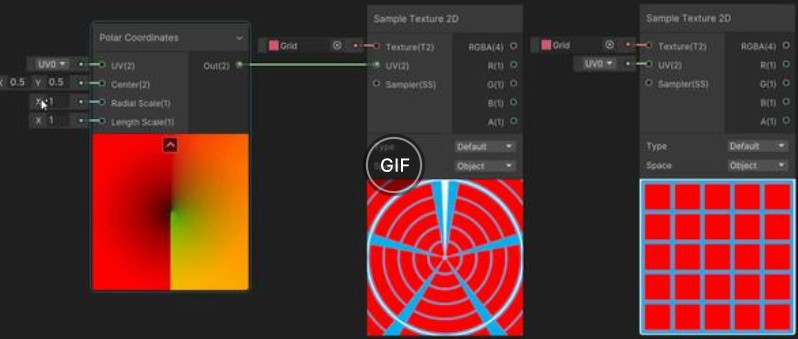
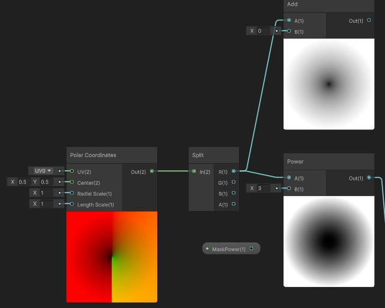
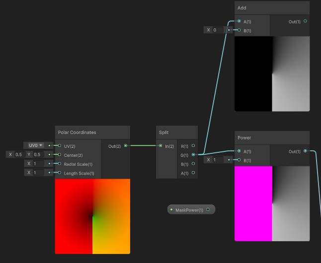
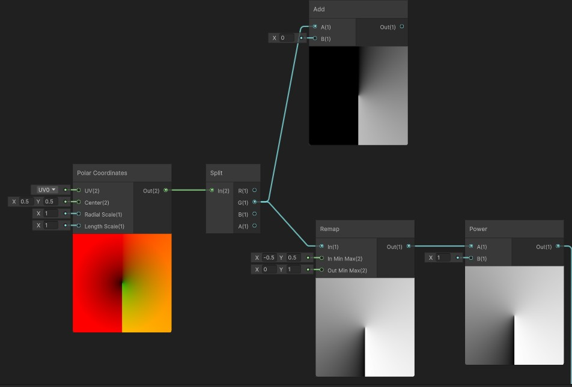

如图展示了极坐标uv变换的效果，即将直角坐标系下的 uv 坐标转换为极坐标系下的坐标；

他由两个值组成：（R = Radius 距离中心多远，G = Angle 绕中心转到哪个方向）；

我们可以将其分离出来看到更直观的效果

分离出的r直观显示distance属性，由内到外值逐步增加，如果接的幂运算（power），数值增长呈现凹曲线（0-1时），意味着黑色区域变大，我们可以用这种方式来做**圆形渐变**

分离出的g直观显示角度（Angle）属性，接add能直观看到其形态（颜色随角度改变，可以做雷达扫描，环绕），但是做幂运算（power）为何一半是紫色异常状态？（这里是做一次方，应该结果也是初始值）

原因在于这个Angle值可能是$-\pi到\pi$ ，而其幂运算用到了一个恒等式x^y = e^(y ln x)【e^(ln x) = x】，而ln x 的x不能为负数。

这样的运算是出于底层优化最求快速稳定的目的，代价是不能为负数。

我们可以通过Remap重映射，将其映射的正常值范围：

PS：逻辑是Out = OutMin + (In - InMin) * (OutMax - OutMin) / (InMax - InMin)，但不会截取范围请注意