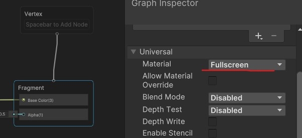
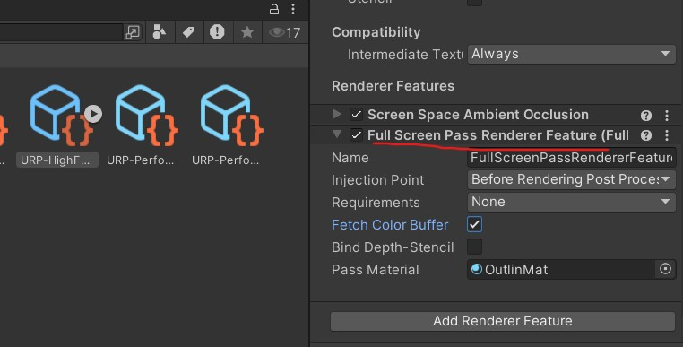
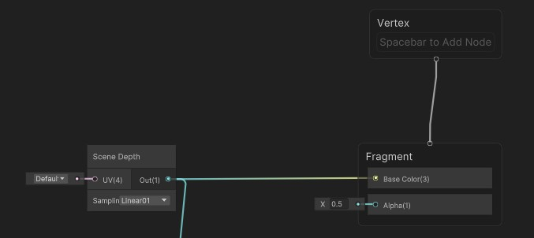
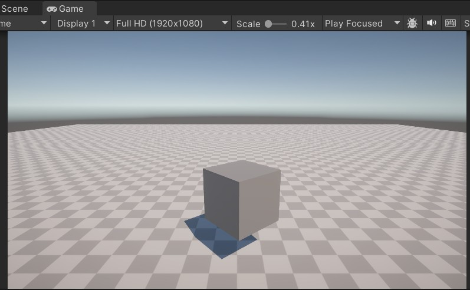
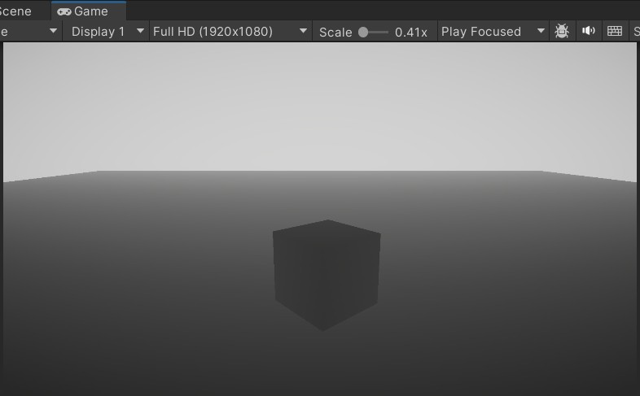
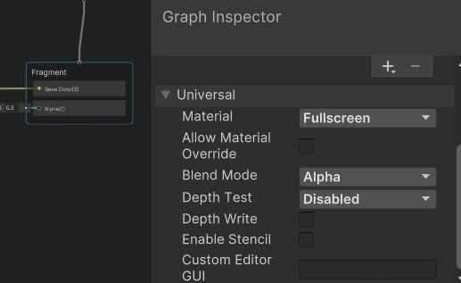

先创建一个shadergraph,直接选择创建full screen ShaderGraph

也可以在片源节点上直接修改为full screen:

然后在URP-Render.Asset上,点击Add Render Feature,添加一个full screen pass,将创建的shadow graph的材质添加到pass material上,注入点(Injection point),选择before render post process,表示我们要在后处理之前进行注入处理;

此时该材质处理的画面将覆盖在全屏;

将画面的深度图传给片源着色器,将在屏幕上看到如下效果

此时画面渲染被处理过后的深度图所覆盖

---

将节点的混合模式，先选择阿尔法，表示我们要根据透明度将其叠加在这个场景渲染图上,而不是像这样直接覆盖。

