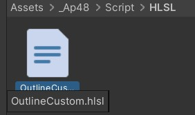
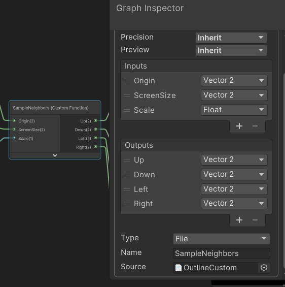
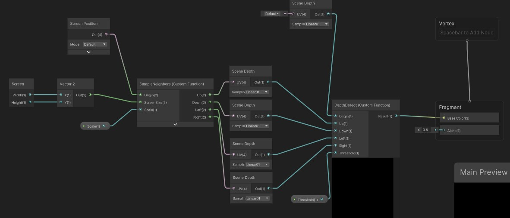
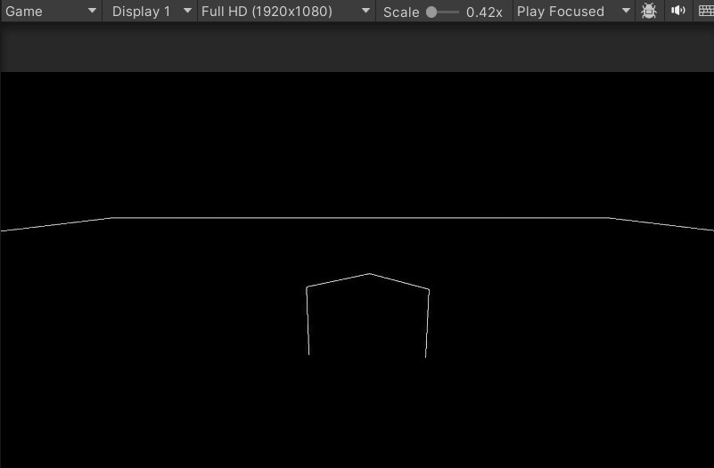
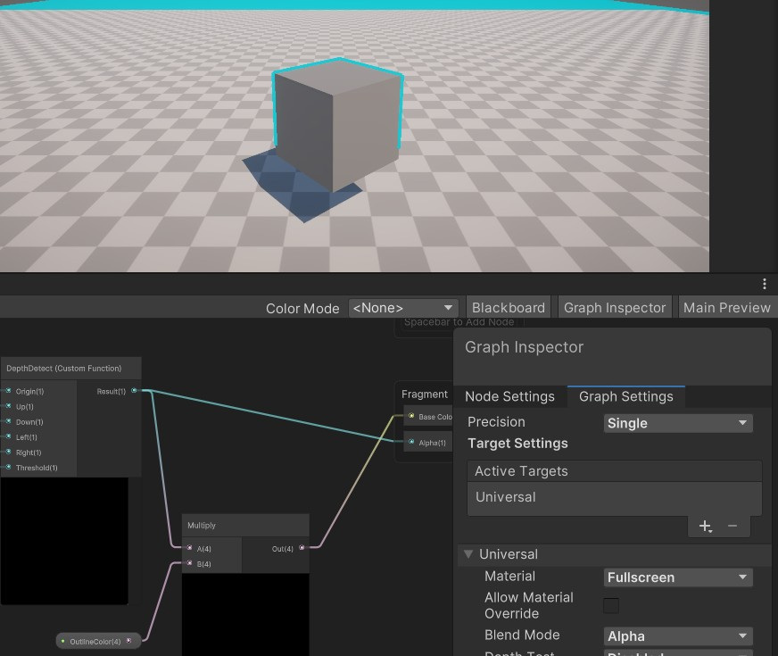
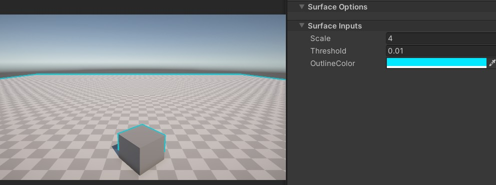

创建HLSL文件,编写我们的自定义边缘检测方法



```c#
// #ifndef OUTLINE_CUSTOM_INCLUDE 
// #define OUTLINE_CUSTOM_INCLUDE 
// ...
// #endif
//核心作用： 这三句组合起来叫做 “包含卫哨”（Include Guard）。在渲染管线编译着色器时，
//同一个 HLSL 文件可能会被多个不同的 Shader 间接引用。如果没有这个保护盾，代码就会被重复复制，
//导致编译器报错“变量/函数重复定义”。加上这段后，
//只有第一次遇到它时会执行内部代码，之后再遇到就会直接跳过。
#ifndef OUTLINE_CUSTOM_INCLUDE //告诉编译其如果没有定义
#define OUTLINE_CUSTOM_INCLUDE //则执行一次定义，避免重复调用定义

//为了解决 ShaderGraph 预览报错 做的兼容处理。在 ShaderGraph 的小窗口预览节点时，
//Unity 的底层全功能光照系统（Lighting.hlsl）并没有完全加载。
//如果不加这个判断，材质面板就会因为找不到依赖文件而报错变粉。
//只有当游戏真正运行、或者在材质球上渲染时，才会真正引入这个光照库。
#ifndef SHADERGRAPH_PREVIEW // shadergraph节点的预览效果
#include "Packages/com.unity.render-pipelines.universal/ShaderLibrary/Lighting.hlsl"//导入包
#endif 


void SampleNeighbors_float(//自定义hlsl函数(必须加上参数类型后缀)
    in float2 Origin,//in 表传入参数
    in float2 ScreenSize,
    in float Scale,
    out float2 Up,//out 表返回输出参数
    out float2 Down,
    out float2 Left,
    out float2 Right
)
{
    //#ifndef SHADERGRAPH_PREVIEW//同理也是为了处理兼容性问题
     Up=Origin+float2(0,1/ScreenSize.y*Scale);
    Down=Origin+float2(0,-1/ScreenSize.y*Scale);
    Left=Origin+float2(-1/ScreenSize.x*Scale,0);
    Right=Origin+float2(1/ScreenSize.x*Scale,0);
    // #else
    // Up=0;
    // Down=0;
    // Left=0;
    // Right=0;
    // #endif
        
}

void DepthDetect_float(//基于深度的边缘检测
    in float Origin,
    in float Up,
    in float Down,
    in float Left,
    in float Right,
    in float Threshold,
    out float Result
    )
{
    float maxDepth=max(Origin,max(Up,max(Down,max(Left,Right))));//这也属于一种非线性的卷积算法,缺点是只对十字方向进行采样，对45°的对角线边缘检测能力较弱。
    float minDepth=min(Origin,min(Up,min(Down,min(Left,Right))));
    float edge=maxDepth-minDepth;
    Result=step(Threshold,edge);//阶跃函数,大于阈值直接输出1,否则为0
}


#endif     
```

注意函数后面必须就在带上参数的类型

```
SampleNeighbors_float
```

---

## 将函数创建Custom function节点

现在我们可以在Shader graph创建custom function节点,类型选择file,指定我们的HLSL文件以及函数名,并手动添加配置好函数定义的输入输出参数,参数名和数据类型要一一对应,



我们将节点连起来,整个shadow graph节点连接如下图



首先通过传递一个屏幕画面的大小(用计算纹素大小),以及屏幕位置,通过sample neighbors函数得到当前像素坐标下,上下左右周边像素的UV坐标,再传递给屏幕深度图,以此采样当前像素周边像素深度值,最后计算出描边结果,传递给片元函数的base color,显示效果如下:



这里计算结果是一个一维值,超过预值范围就表示为边缘强制赋值1,否则为0,所以最后传递到片源函数,展示在屏幕上的是白色的边缘,黑色的底;

但是我们想要的是将这个描边效果叠加在渲染的画面上,于是我们将结果给到阿尔法通道,并与设定的轮廓颜色相乘给到片源节点的Base color,同时要注意片源节点的混合模式设置为Alpha;

效果如下,通过修改scale可以调整轮廓的粗细:



---

## 优化远端的描边轮廓

我们应该注意到了,上图远处的轮廓线异常的厚,这是由于透视镜头的远景空间压缩导致的,看似相邻的两个像素深度缺比近处相邻像素的深度差异扩大了数倍

为了解决这个问题,就需要动态地修改边缘检测的阈值,离得越远,阈值越大

```c#
float dynamicThreshold=Threshold*(Origin*10);//动态深度阈值,较远的物体,利用判定边缘阈值增大(远处透视空间压缩)
    Result=step(dynamicThreshold,edge);//阶跃函数,大于阈值直接输出1,否则为0
```

效果如下



当前只进行了简单的处理,顶端的空间压缩并非是线性增大的,该是需要一个抛物线方程来进行计算.以后再进行优化;
