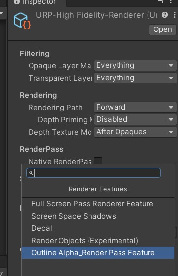
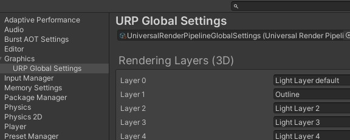
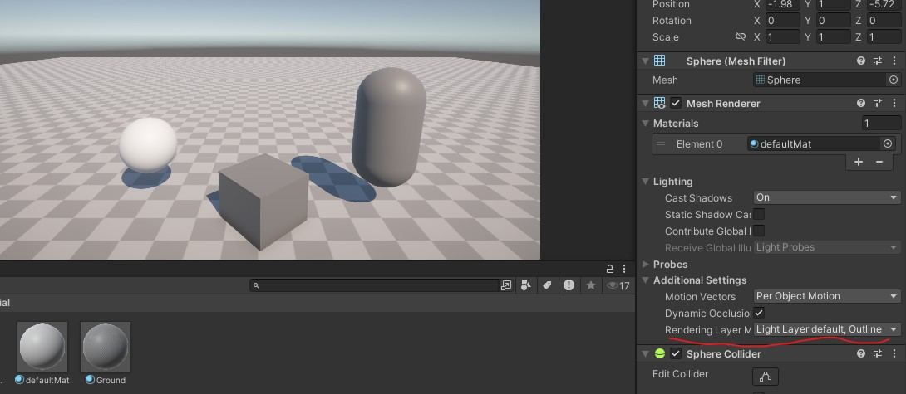
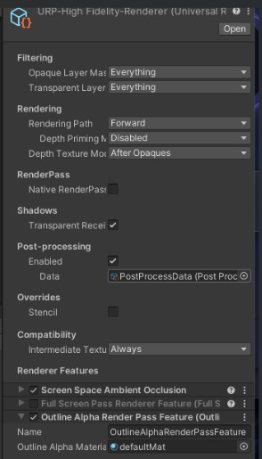
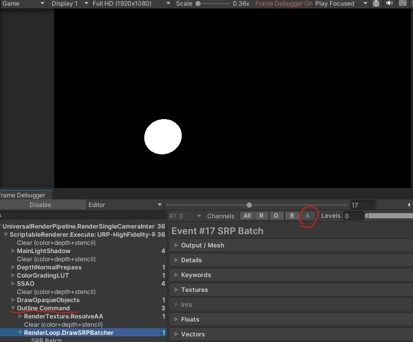

先通过create-Rendering-URP rerender feature,创建自定义的**render feature**脚本.

我们就能在Render asset下的Add render feature选项中找到这个自定义的render future



此脚本帮我们预生成了一个Render feature类,里面包含了一个默认的Render pass类

他们都是扩展自定义渲染流程的核心类;

**RendererFeature** 是一个**容器和配置器**。它本身不负责具体的渲染执行，而是作为一个**数据面板和生命周期管理器**，负责在运行时动态地向渲染管线中注入（Inject）一个或多个 `ScriptableRenderPass`。

### 关键函数

- `override void Create()`: 在初始化时调用,把feature配置的参数传递给render pass
- `override void AddRenderPasses(...)`: URP会在每一帧遍历激活的future,并调用此函数,根据自定义的判定是否需要将你的自定义 Pass 塞进 URP 的渲染队列。如果需要，就调用 `renderer.EnqueuePass(myRenderPass)`。

### 较少用到但重要的进阶函数

- `override void Dispose(bool disposing)`: Feature被移除时调用,手动清除一些无法自动释放的资源;
- `override void SetupRenderPasses(...)`: 每帧在 `AddRenderPasses`前触发。在确定要渲染之前，**配置渲染目标（Render Target）**.如果你的 Pass 需要知道当前相机的目标纹理（比如它是画到屏幕还是画到一张 RT），可以在这里提前调用 `pass.ConfigureTarget(...)`。不过在实际开发中，这个配置工作通常也直接在 Pass 内部的 `OnCameraSetup` 里完成，所以这个函数相对用得较少。

**RenderPass** 是真正的执行者。它负责在指定的渲染过程中的某个时机,要用指定的着色器渲染.

### 关键生命周期函数

- `ConfigureTarget(...)`: 设置渲染目标和清除颜色。
- `OnCameraSetup(...)`: 在渲染相机前调用，用于初始化相机相关的配置。
- `Execute(...)`: 最核心的方法，所有的渲染命令（CommandBuffer）都在这里组织并提交。
- `OnCameraCleanup(...)`: 渲染完成后清理临时生成的纹理或资源。

---

unity会为我们的脚本创建一个基础的render feature结构

我们额外添加一个Material属性,用于设置我们渲染需要的描边材质

```c#
[SerializeField] private Material m_OutlineAlphaMaterial;

    private bool IsMaterialValid => m_OutlineAlphaMaterial != null && m_OutlineAlphaMaterial.shader != null && m_OutlineAlphaMaterial.shader.isSupported;
```

并设置一个属性判定其是否可用

在Create和AddRenderPasses前,我们就需要去先判断一下所需的材质和pass是否合规或存在

```C#
  public override void Create()
    {
        if(!IsMaterialValid) return;
      	......
            
   public override void AddRenderPasses(ScriptableRenderer renderer, ref RenderingData renderingData)
    {
        if(m_OutlineAlphaPass == null) return;
        ......
            
```

---

### 编写RenderPass

首先,我们创建一个render pass构造函数,其带有一个需要赋值的材质参数,这里因为覆盖了默认构造函数,因此Render future的Create时,需要同步修改调用的构造函数.

同时我们把Create设置的Render pass event放到构造函数中来,

```c#
private readonly Material m_OutlineAlphaMaterial;

        public OutlineAlphaRenderPass(Material outlineAlphaMaterial)
        {
            renderPassEvent = RenderPassEvent.BeforeRenderingPostProcessing;//在后处理之前执行pass（记得删掉create里的renderevent设置，否则会把这里覆盖）
            
            m_OutlineAlphaMaterial = outlineAlphaMaterial;
        }
```

创建一张临时Render texture,用来绘制它们的画面

```c#
public RTHandle m_OutlineMaskRT;//管理临时渲染纹理（Render Texture）的系统/包装器
```

他将在OnCameraSetup函数,即相机渲染前初始化;

然后再函数Execute中创建并配置渲染命令,再交由渲染上下文执行,将画面绘制到我们的临时纹理上

代码如下:

```c#
class OutlineAlphaRenderPass : ScriptableRenderPass
    {
        private readonly Material m_OutlineAlphaMaterial;//构造函数中获取需要描边的材质

        private static readonly List<ShaderTagId> s_ShaderTagIds = new List<ShaderTagId>()//指定支持的 Shader Tag（例如 "UniversalForward" ），只有带有这些 Tag 的 Shader 材质才会被渲染
        {
            new ShaderTagId("SRPDefaultUnlit"),
            new ShaderTagId("UniversalForward"),
            new ShaderTagId("UniversalForwardOnly"),
        };
        
        public RTHandle m_OutlineMaskRT;//管理临时渲染纹理（Render Texture）的系统/包装器
        
        private FilteringSettings m_FilteringSettings;//渲染过滤器
        
        public OutlineAlphaRenderPass(Material outlineAlphaMaterial)
        {
            //renderPassEvent = RenderPassEvent.BeforeRenderingPostProcessing;//在后处理之前执行pass
            
            m_OutlineAlphaMaterial = outlineAlphaMaterial;
            
            m_FilteringSettings=new FilteringSettings(RenderQueueRange.all,renderingLayerMask:2);//语法糖,可选填参数
        }
        // This method is called before executing the render pass.
        // It can be used to configure render targets and their clear state. Also to create temporary render target textures.
        // When empty this render pass will render to the active camera render target.
        // You should never call CommandBuffer.SetRenderTarget. Instead call <c>ConfigureTarget</c> and <c>ConfigureClear</c>.
        // The render pipeline will ensure target setup and clearing happens in a performant manner.
        //每次相机开始渲染一帧之前，Unity 会自动调用这个函数。它专门用来配置该 Render Pass 渲染时所需的相机参数、渲染目标（Render Targets）以及清除状态
        public override void OnCameraSetup(CommandBuffer cmd, ref RenderingData renderingData)
        {
            ResetTarget();//重置渲染目标
            var desc = renderingData.cameraData.cameraTargetDescriptor;//获取当前相机的渲染目标描述符
            desc.msaaSamples = 1;//多重采样抗锯齿（MSAA）的采样数设为 1（即关闭 MSAA）
            desc.depthBufferBits = 0;//深度缓冲区的位数设为 0
            desc.colorFormat = RenderTextureFormat.ARGB32;//需要alpha通道来计算描边
            RenderingUtils.ReAllocateIfNeeded(ref m_OutlineMaskRT,desc,name:"_OutlineMaskRT");//安全分配临时渲染纹理,命名为_OutlineMaskRT(可在Frame Debuggerk查看)
        }

        // Here you can implement the rendering logic.
        // Use <c>ScriptableRenderContext</c> to issue drawing commands or execute command buffers
        // https://docs.unity3d.com/ScriptReference/Rendering.ScriptableRenderContext.html
        // You don't have to call ScriptableRenderContext.submit, the render pipeline will call it at specific points in the pipeline.
        public override void Execute(ScriptableRenderContext context, ref RenderingData renderingData) //context：底层渲染上下文。所有的渲染命令（比如画个物体、清除屏幕）最终都要提交给它，它才会发送给 GPU。renderingData：传入当前帧数据，用于初始化诸如主光源、雾效等全局 Shader 属性
        {
            var cmd = CommandBufferPool.Get("Outline Command");//创建渲染命令,名字可在frameDebug看到(从命令缓冲区池中借用一个 CommandBuffer 对象)
            
            //...cmd
            cmd.SetRenderTarget(m_OutlineMaskRT);//设置Rendertexture,告诉 GPU：“接下来所有的绘制操作，不要画到主屏幕上，而是画到我指定的这张 m_OutlineMaskRT 纹理上
            cmd.ClearRenderTarget(true,true,Color.clear);//清空render texture上面的旧信息
            
            var drawingSetting = CreateDrawingSettings(s_ShaderTagIds,ref renderingData,SortingCriteria.None);//配置物体应该“怎么画”,SortingCriteria.None：指定物体的排序方式。严格的前后透明排序，或者有特定的性能考量。
            var rendererListParams = new RendererListParams(renderingData.cullResults,drawingSetting,m_FilteringSettings);//把“裁剪结果（场景里哪些物体在视锥体内）”、“绘制设置”以及“过滤设置”打包成一个参数对象。
            var list = context.CreateRendererList(ref rendererListParams);//让上下文根据打包的参数，底层生成待渲染的列表。
            cmd.DrawRendererList(list);//向命令缓冲区中添加绘制指令
            
            context.ExecuteCommandBuffer(cmd);//线的绘制命令提交给 context（渲染上下文）去真正执行。
            cmd.Clear();//清空命令缓冲区指令，以便安全回收
            CommandBufferPool.Release(cmd);//把CommandBuffer对象还给对象池
        }

        // Cleanup any allocated resources that were created during the execution of this render pass.
        public override void OnCameraCleanup(CommandBuffer cmd)
        {
        }

        public void Dispose()//feature被销毁时调用
        {
            m_OutlineMaskRT?.Release();
            m_OutlineMaskRT = null;
        }
    }
```

在urp global setting设置我们的Rendering Layer,将Layer1重命名为outline,也就是我们的描边渲染层.



正好对应我们代码中设置的渲染过滤器

```C#
m_FilteringSettings=new FilteringSettings(RenderQueueRange.all,renderingLayerMask:2);
```

我们为球体模型创建一个新的默认材质(**Unity默认创建模型的默认材质设置rendering layer会报错**),并在Mesh render组件上设置我们新创建的renderingLayer

**注意:这里修改renderingLayer可能报错,查看控制台跟rider插件相关,Package manager升级插件重启ide后目前解决**



在Render asset上,启用我们新建的Render pass feature,暂时附上默认的材质



此时我们打开frame debugger,就能看到我们创建的渲染命令,选中他就能在游戏视图窗口中看到我们临时渲染的render texture的效果,并勾选阿尔法通道,这就是我们计算选中物体描边所需要的纹理.



因为只是绘制在一张临时的render texture上,我们并不能通过相机最终的渲染画面看到

