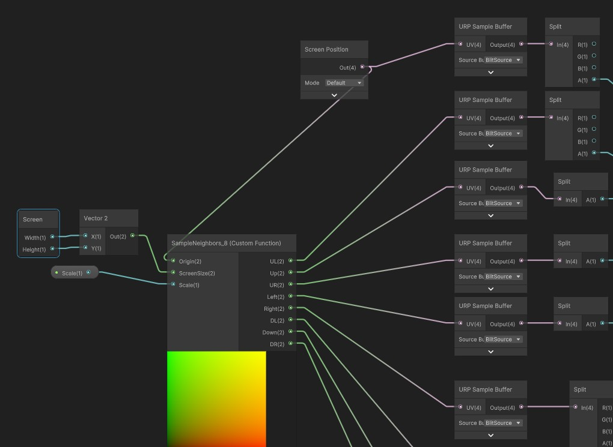
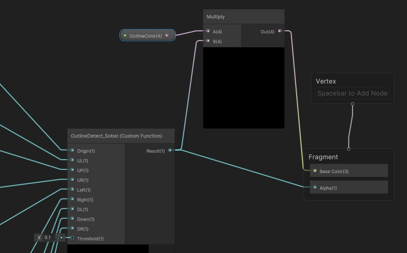
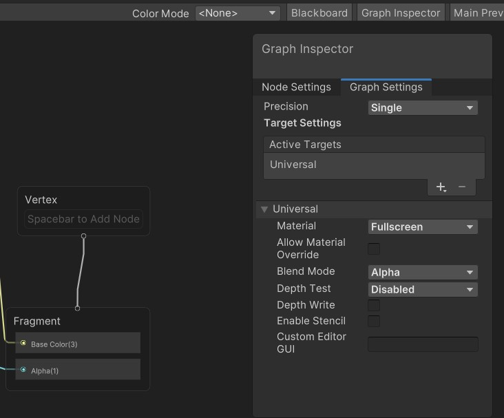

根据之前学到的shaderGraph自定义HLSL方法,我们扩展两个基于Alpha通道实现的边缘检测算法,但这次的SampleNeighbors采样的周边八个位置,边缘检测采用的sobel卷积核处理

```C#
#ifndef OUTLINE_CUSTOM_INCLUDE //告诉编译其如果没有定义
#define OUTLINE_CUSTOM_INCLUDE //则执行一次定义，避免重复调用定义

//为了解决 ShaderGraph 预览报错 做的兼容处理。在 ShaderGraph 的小窗口预览节点时，
//Unity 的底层全功能光照系统（Lighting.hlsl）并没有完全加载。
//如果不加这个判断，材质面板就会因为找不到依赖文件而报错变粉。
//只有当游戏真正运行、或者在材质球上渲染时，才会真正引入这个光照库。
#ifndef SHADERGRAPH_PREVIEW // shadergraph节点的预览效果
#include "Packages/com.unity.render-pipelines.universal/ShaderLibrary/Lighting.hlsl"//导入包
#endif 


void SampleNeighbors_8_float(//周边像素uv坐标，8方向
    in float2 Origin,//目标像素坐标
    in float2 ScreenSize,
    in float Scale,
    out float2 Up,//输出目标像素以及周边像素的UV值
    out float2 Down,
    out float2 Left,
    out float2 Right,
    out float2 UL,
    out float2 UR,
    out float2 DL,
    out float2 DR
)
{
    //#ifndef SHADERGRAPH_PREVIEW//同理也是为了处理兼容性问题
    float x_offset=1/ScreenSize.x*Scale;
    float y_offset=1/ScreenSize.y*Scale;
    Up=Origin+float2(0,y_offset);
    Down=Origin+float2(0,-y_offset);
    Left=Origin+float2(-x_offset,0);
    Right=Origin+float2(x_offset,0);
    UL=Origin+float2(-x_offset,y_offset);
    UR=Origin+float2(x_offset,y_offset);
    DL=Origin+float2(-x_offset,-y_offset);
    DR=Origin+float2(x_offset,-y_offset);
    // #else
    // Up=0;
    // Down=0;
    // Left=0;
    // Right=0;
    // #endif
        
}

void OutlineDetect_Sobel_float(//基于sobel卷积核的边缘检测
    in float Origin,//输入像素对应的单通道色彩值
    in float Up,
    in float Down,
    in float Left,
    in float Right,
    in float UL,
    in float UR,
    in float DL,
    in  float DR,
    in float Threshold,
    out float Result
    )
    {
        
        half Gx[9] = {-1,  0,  1,
                        -2,  0,  2,
                        -1,  0,  1};
        half Gy[9] = {-1, -2, -1,
                        0,  0,  0,
                        1,  2,  1};	
        half sampleColors[9]= {UL, Up, UR,
                        Left,  Origin,  Right,
                        DL,  Down,  DR};	
    
        half texColor;
        half edgeX = 0;
        half edgeY = 0;
        for (int it = 0; it < 9; it++) {
            texColor = sampleColors[it];
            edgeX += texColor * Gx[it];
            edgeY += texColor * Gy[it];
        }
        half edge =abs(edgeX) +abs(edgeY);//edge值越da,就越可能是边界
        Result=step(Threshold,edge);//阶跃函数,大于阈值直接输出1,否则为0
    }

#endif     

```

将我们的SampleNeighbors_8_float,以及OutlineDetect_Sobel_float制作成Shader graph的Custom function;

同样,我们传递一个屏幕的大小以计算纹素大小,配合上当前像素的坐标screen position,计算偏移值来得到周边像素的UV坐标,



根据这些纹理坐标去采样它们纹理上各自的像素值,我们会在render pass中使用Blitter.BlitTexture(cmd, 你的源RT, ...),将renderTexture传递给材质进行计算,官方提供了一个专门用来获取 Blit 源纹理的节点(URP Sample Buffer),注意节点source要选择blit source



最后将采样的alpha通道像素值与卷积核计算得到边缘结果



Fragment的Graph setting设置如下