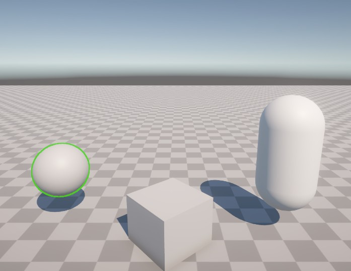

最后,在context.ExecuteCommandBuffer之前,我们将临时绘制的Rendertexture,经由指定的描边材质渲染,叠加到相机的画面上

```c#
RTHandle cameraTarget = renderingData.cameraData.renderer.cameraColorTargetHandle;
            //CoreUtils.SetRenderTarget(cmd,cameraTarget,RenderBufferLoadAction.Load,RenderBufferStoreAction.Store, ClearFlag.None, Color.clear);//设置渲染目标到相机的渲染目标
           // Blitter.BlitTexture(cmd, m_OutlineMaskRT, Vector4.one, m_OutlineAlphaMaterial, 0);//替代drawProcedural,会自动帮我们处理各个平台的差异
            Blitter.BlitCameraTexture(cmd,m_OutlineMaskRT,cameraTarget,m_OutlineAlphaMaterial,0);
```

最后为我们的shader创建材质,并指定到我们添加的render feature上,就能看到如下效果



后续只需要选中指定的物体,修改它的render layer,就能实现选中物体描边的效果;

```C#
  MeshRenderer renderer = hitObject.GetComponent<MeshRenderer>();
            if (renderer != null)
            {
                originalRenderingLayerMask = renderer.renderingLayerMask;
                // 将指定的渲染层级索引(Index)转换为Bitmask
                uint targetMask = (uint)(1 << outlineRenderingLayerIndex);
                renderer.renderingLayerMask = targetMask;
            }

```

---

现在我们重新梳理一下完整流程:

我们需要自定义一个render feature,它是一个渲染配置器,用于描述我们将在何时向渲染管线注入render pass,以及定义各种需要的渲染属性.

这里首先我们肯定需要暴露一个材质属性

```c#
[SerializeField] private Material m_OutlineAlphaMaterial;
private bool IsMaterialValid => m_OutlineAlphaMaterial != null && m_OutlineAlphaMaterial.shader != null &&
                                    m_OutlineAlphaMaterial.shader.isSupported;//判定是否可用
```

并且定义好我们的render pass类型

```c#
OutlineAlphaRenderPass m_OutlineAlphaPass;
```

运行时,Render feature先初始化创建我们自定义的render pass

```c#
 public override void Create()
    {
        if(!IsMaterialValid) return;
       
        m_OutlineAlphaPass = new OutlineAlphaRenderPass(m_OutlineAlphaMaterial);//创建pass
         //也可以在这里设置全局RenderPassEvent,这里挪到了RenderPass中
    }
```

添加到渲染队列中

```c#
public override void AddRenderPasses(ScriptableRenderer renderer, ref RenderingData renderingData)
    {
        if(m_OutlineAlphaPass == null) return;
        
        renderer.EnqueuePass(m_OutlineAlphaPass);//将该pass加入渲染队列
    }
```

并实现销毁处理

```c#
 protected override void Dispose(bool disposing)//feature被销毁时调用
    {
        m_OutlineAlphaPass?.Dispose();   
    }
```

---

再来看看我们真正的渲染执行者Render pass

在Render feature初始化的时候会调用render pass构造函数创建render pass对象

```C#
 public OutlineAlphaRenderPass(Material outlineAlphaMaterial)
        {
            renderPassEvent = RenderPassEvent.BeforeRenderingPostProcessing;//在后处理之前执行pass
            
            m_OutlineAlphaMaterial = outlineAlphaMaterial;
            
            m_FilteringSettings=new FilteringSettings(RenderQueueRange.all,renderingLayerMask:2);//渲染过滤器设置(语法糖,可选填参数)
            
        }
```

主要做了三件事,设置该render pass的插入执行时机,将描边材质传递到render pass中,以及配置了一个渲染过滤器;

然后在OnCameraSetup函数中(也就是每帧渲染之前),配一个临时的render texture

```C#
ResetTarget();//重置渲染目标
            var desc = renderingData.cameraData.cameraTargetDescriptor;//获取当前相机的渲染目标描述符
            desc.msaaSamples = 1;//多重采样抗锯齿（MSAA）的采样数设为 1（即关闭 MSAA）
            desc.depthBufferBits = 0;//深度缓冲区的位数设为 0
            desc.colorFormat = RenderTextureFormat.ARGB32;//需要alpha通道来计算描边
            RenderingUtils.ReAllocateIfNeeded(ref m_OutlineMaskRT,desc,name:"_OutlineMaskRT");//安全分配临时渲染纹理,命名为_OutlineMaskRT(可在Frame Debuggerk查看)
```

并将其指定为pass的渲染目标

```c#
/*RenderPass的声明配置，告诉URP渲染目标，统一流程，官方推荐方法，替代Execute函数的cmd.SetRenderTarget/cmd.ClearRenderTarget*/
            ConfigureTarget(m_OutlineMaskRT);//设置该pass输出目标。
            ConfigureClear(ClearFlag.Color, Color.clear);//pass开始前需要清理RT为透明黑色
```

进入执行函数Execute,创建(从池子里分配)并配置我们的渲染命令,配置参数生成待渲染列表,并将其添加到命令缓冲区

```c#
var cmd = CommandBufferPool.Get("Outline Command");//创建渲染命令,名字可在frameDebug看到(从命令缓冲区池中借用一个 CommandBuffer 对象)
            
            var drawingSetting = CreateDrawingSettings(s_ShaderTagIds,ref renderingData,SortingCriteria.None);//配置物体应该“怎么画”,SortingCriteria.None：指定物体的排序方式。严格的前后透明排序，或者有特定的性能考量。
            var rendererListParams = new RendererListParams(renderingData.cullResults,drawingSetting,m_FilteringSettings);//把“裁剪结果（场景里哪些物体在视锥体内）”、“绘制设置”以及“过滤设置”打包成一个参数对象。
            var list = context.CreateRendererList(ref rendererListParams);//让上下文根据打包的参数，底层生成待渲染的列表。
            cmd.DrawRendererList(list);//向命令缓冲区中添加绘制指令
```

然后将渲染的临时rendertexture通过指定的材质计算,绘制到我们的相机画面上

```c#
RTHandle cameraTarget = renderingData.cameraData.renderer.cameraColorTargetHandle;
Blitter.BlitCameraTexture(cmd,m_OutlineMaskRT,cameraTarget,m_OutlineAlphaMaterial,0);//更安全的方法,替代SetRenderTarget+BlitTexture
```

最后启用执行函数

```c#
context.ExecuteCommandBuffer(cmd);//线的绘制命令提交给 context（渲染上下文）去真正执行。
//cmd.Clear();//清空命令缓冲区指令，以便安全回收
CommandBufferPool.Release(cmd);//把CommandBuffer对象还给对象池,会自动clear
```

另外需要实现一个对象销毁时的处理,防止内存泄露

```C#
public void Dispose()//feature被销毁时调用
        {
            m_OutlineMaskRT?.Release();
            m_OutlineMaskRT = null;
        }
```

---

完整代码如下:

```C#
using System.Collections.Generic;
using UnityEngine;
using UnityEngine.Rendering;
using UnityEngine.Rendering.Universal;

public class OutlineAlpha_RenderPassFeature : ScriptableRendererFeature
{
    class OutlineAlphaRenderPass : ScriptableRenderPass
    {
        private readonly Material m_OutlineAlphaMaterial;//构造函数中获取需要描边的材质

        private static readonly List<ShaderTagId> s_ShaderTagIds = new List<ShaderTagId>()//指定支持的 Shader Tag（例如 "UniversalForward" ），只有带有这些 Tag 的 Shader 材质才会被渲染
        {
            new ShaderTagId("SRPDefaultUnlit"),
            new ShaderTagId("UniversalForward"),
            new ShaderTagId("UniversalForwardOnly"),
        };
        
        public RTHandle m_OutlineMaskRT;//管理临时渲染纹理（Render Texture）的系统/包装器
        
        private FilteringSettings m_FilteringSettings;//渲染过滤器
        
        public OutlineAlphaRenderPass(Material outlineAlphaMaterial)
        {
            renderPassEvent = RenderPassEvent.BeforeRenderingPostProcessing;//在后处理之前执行pass
            
            m_OutlineAlphaMaterial = outlineAlphaMaterial;
            
            m_FilteringSettings=new FilteringSettings(RenderQueueRange.all,renderingLayerMask:2);//渲染过滤器设置(语法糖,可选填参数)
            
        }
        // This method is called before executing the render pass.
        // It can be used to configure render targets and their clear state. Also to create temporary render target textures.
        // When empty this render pass will render to the active camera render target.
        // You should never call CommandBuffer.SetRenderTarget. Instead call <c>ConfigureTarget</c> and <c>ConfigureClear</c>.
        // The render pipeline will ensure target setup and clearing happens in a performant manner.
        //每次相机开始渲染一帧之前，Unity 会自动调用这个函数。它专门用来配置该 Render Pass 渲染时所需的相机参数、渲染目标（Render Targets）以及清除状态
        public override void OnCameraSetup(CommandBuffer cmd, ref RenderingData renderingData)
        {
            ResetTarget();//重置渲染目标
            var desc = renderingData.cameraData.cameraTargetDescriptor;//获取当前相机的渲染目标描述符
            desc.msaaSamples = 1;//多重采样抗锯齿（MSAA）的采样数设为 1（即关闭 MSAA）
            desc.depthBufferBits = 0;//深度缓冲区的位数设为 0
            desc.colorFormat = RenderTextureFormat.ARGB32;//需要alpha通道来计算描边
            RenderingUtils.ReAllocateIfNeeded(ref m_OutlineMaskRT,desc,name:"_OutlineMaskRT");//安全分配临时渲染纹理,命名为_OutlineMaskRT(可在Frame Debuggerk查看)
            /*RenderPass的声明配置，告诉URP渲染目标，统一流程，官方推荐方法，替代Execute函数的cmd.SetRenderTarget/cmd.ClearRenderTarget*/
            ConfigureTarget(m_OutlineMaskRT);//设置该pass输出目标。
            ConfigureClear(ClearFlag.Color, Color.clear);//pass开始前需要清理RT为透明黑色
        }

        // Here you can implement the rendering logic.
        // Use <c>ScriptableRenderContext</c> to issue drawing commands or execute command buffers
        // https://docs.unity3d.com/ScriptReference/Rendering.ScriptableRenderContext.html
        // You don't have to call ScriptableRenderContext.submit, the render pipeline will call it at specific points in the pipeline.
        public override void Execute(ScriptableRenderContext context, ref RenderingData renderingData) //context：底层渲染上下文。所有的渲染命令（比如画个物体、清除屏幕）最终都要提交给它，它才会发送给 GPU。renderingData：传入当前帧数据，用于初始化诸如主光源、雾效等全局 Shader 属性
        {
            var cmd = CommandBufferPool.Get("Outline Command");//创建渲染命令,名字可在frameDebug看到(从命令缓冲区池中借用一个 CommandBuffer 对象)
            
            //...cmd
            // cmd.SetRenderTarget(m_OutlineMaskRT);//设置Rendertexture,告诉 GPU：“接下来所有的绘制操作，不要画到主屏幕上，而是画到我指定的这张 m_OutlineMaskRT 纹理上
            // cmd.ClearRenderTarget(true,true,Color.clear);//清空render texture上面的旧信息
            
            var drawingSetting = CreateDrawingSettings(s_ShaderTagIds,ref renderingData,SortingCriteria.None);//配置物体应该“怎么画”,SortingCriteria.None：指定物体的排序方式。严格的前后透明排序，或者有特定的性能考量。
            var rendererListParams = new RendererListParams(renderingData.cullResults,drawingSetting,m_FilteringSettings);//把“裁剪结果（场景里哪些物体在视锥体内）”、“绘制设置”以及“过滤设置”打包成一个参数对象。
            var list = context.CreateRendererList(ref rendererListParams);//让上下文根据打包的参数，底层生成待渲染的列表。
            cmd.DrawRendererList(list);//向命令缓冲区中添加绘制指令
            
            //Draw Outline
            RTHandle cameraTarget = renderingData.cameraData.renderer.cameraColorTargetHandle;
            //CoreUtils.SetRenderTarget(cmd,cameraTarget,RenderBufferLoadAction.Load,RenderBufferStoreAction.Store, ClearFlag.None, Color.clear);//设置渲染目标到相机的渲染目标
           // Blitter.BlitTexture(cmd, m_OutlineMaskRT, Vector4.one, m_OutlineAlphaMaterial, 0);//替代drawProcedural,会自动帮我们处理各个平台的差异
           /*这里也是将blit命令录入到cmd,并不是执行*/
            Blitter.BlitCameraTexture(cmd,m_OutlineMaskRT,cameraTarget,m_OutlineAlphaMaterial,0);//更安全的方法,替代SetRenderTarget+BlitTexture
            
            context.ExecuteCommandBuffer(cmd);//线的绘制命令提交给 context（渲染上下文）去真正执行。
            //cmd.Clear();//清空命令缓冲区指令，以便安全回收
            CommandBufferPool.Release(cmd);//把CommandBuffer对象还给对象池,会自动clear
        }

        // Cleanup any allocated resources that were created during the execution of this render pass.
        public override void OnCameraCleanup(CommandBuffer cmd)
        {
        }

        public void Dispose()//feature被销毁时调用
        {
            m_OutlineMaskRT?.Release();
            m_OutlineMaskRT = null;
        }
    }

    [SerializeField] private Material m_OutlineAlphaMaterial;

    private bool IsMaterialValid => m_OutlineAlphaMaterial != null && m_OutlineAlphaMaterial.shader != null &&
                                    m_OutlineAlphaMaterial.shader.isSupported;//判定是否可用
    
    OutlineAlphaRenderPass m_OutlineAlphaPass;
    
    /// <inheritdoc/>
    public override void Create()
    {
        if(!IsMaterialValid) return;
        
        m_OutlineAlphaPass = new OutlineAlphaRenderPass(m_OutlineAlphaMaterial);//创建pass
        
    }

    // Here you can inject one or multiple render passes in the renderer.
    // This method is called when setting up the renderer once per-camera.
    public override void AddRenderPasses(ScriptableRenderer renderer, ref RenderingData renderingData)
    {
        if(m_OutlineAlphaPass == null) return;
        
        renderer.EnqueuePass(m_OutlineAlphaPass);//将该pass加入渲染队列
    }

    protected override void Dispose(bool disposing)//feature被销毁时调用
    {
        m_OutlineAlphaPass?.Dispose();   
    }
}

```

