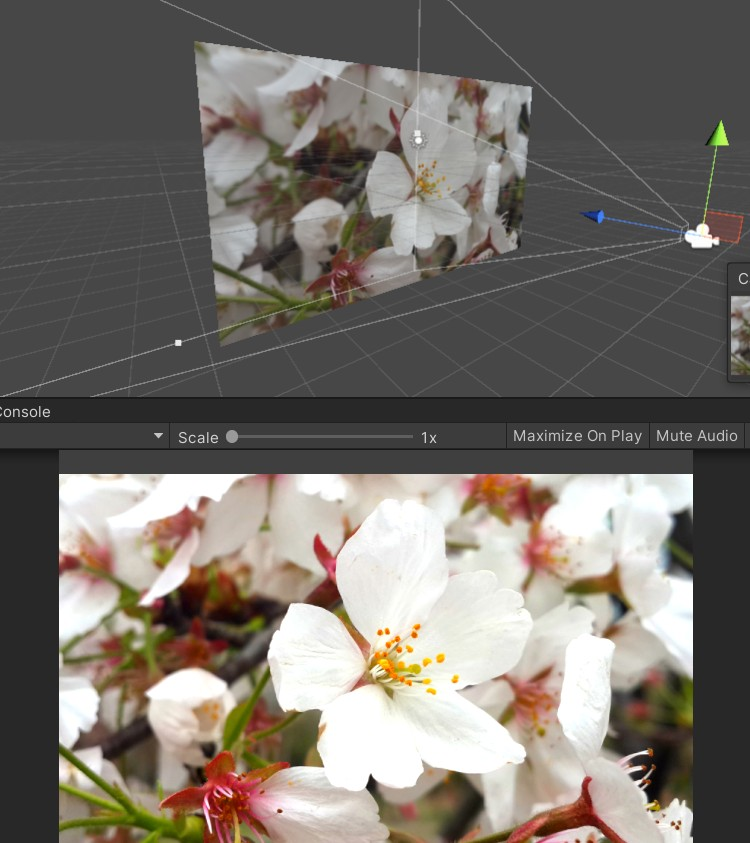

首先为场景创建一个spriteRender，附上想要的纹理，用一个相机对准其进行渲染



然后为我们的相机附加一个后处理脚本，继承之前所说的PostEffectsBase 类

```c#
public class BrightnessSaturationAndContrast : PostEffectsBase {

	public Shader briSatConShader;
	private Material briSatConMaterial;
	public Material material {  
		get {
			briSatConMaterial = CheckShaderAndCreateMaterial(briSatConShader, briSatConMaterial);
			return briSatConMaterial;
		}  
	}

	[Range(0.0f, 3.0f)]
	public float brightness = 1.0f;//亮度

	[Range(0.0f, 3.0f)]
	public float saturation = 1.0f;//饱和度

	[Range(0.0f, 3.0f)]
	public float contrast = 1.0f;//对比度

	void OnRenderImage(RenderTexture src, RenderTexture dest) {
		if (material != null) {//材质检测通过，则将src原图给材质进行后处理再返回给dest用于最终渲染输出到屏幕上
			material.SetFloat("_Brightness", brightness);
			material.SetFloat("_Saturation", saturation);
			material.SetFloat("_Contrast", contrast);

			Graphics.Blit(src, dest, material);
		} else {//如果检测材质为通过，输出渲染原图
			Graphics.Blit(src, dest);
		}
	}
}
```

创建后处理shader

```c#
// Upgrade NOTE: replaced 'mul(UNITY_MATRIX_MVP,*)' with 'UnityObjectToClipPos(*)'

Shader "Unity Shaders Book/Chapter 12/Brightness Saturation And Contrast" {
	Properties {
		_MainTex ("Base (RGB)", 2D) = "white" {}
		_Brightness ("Brightness", Float) = 1
		_Saturation("Saturation", Float) = 1
		_Contrast("Contrast", Float) = 1
	}
	SubShader {
		Pass {  
			ZTest Always Cull Off ZWrite Off  //关闭深度写入，否则如果在不透明Pass执行完就调用OnRenderImage，会影响后续透明Pass渲染
			
			CGPROGRAM  
			#pragma vertex vert  
			#pragma fragment frag  
			  
			#include "UnityCG.cginc"  
			  
			sampler2D _MainTex;  
			half _Brightness;
			half _Saturation;
			half _Contrast;
			  
			struct v2f {
				float4 pos : SV_POSITION;
				half2 uv: TEXCOORD0;
			};
			  
			v2f vert(appdata_img v) {//顶点着色器，计算正确的纹理坐标传递给片元着色器
				v2f o;
				
				o.pos = UnityObjectToClipPos(v.vertex);
				
				o.uv = v.texcoord;
						 
				return o;
			}
		
			fixed4 frag(v2f i) : SV_Target {
				fixed4 renderTex = tex2D(_MainTex, i.uv);  
				  
				// Apply brightness
				fixed3 finalColor = renderTex.rgb * _Brightness;//提升亮度，直接用乘法
				
				// Apply saturation 饱和度算法
				fixed luminance = 0.2125 * renderTex.r + 0.7154 * renderTex.g + 0.0721 * renderTex.b;//固定模型计算像素的亮度值
				fixed3 luminanceColor = fixed3(luminance, luminance, luminance);//基于上述亮度值计算一个饱和度为0的颜色
				finalColor = lerp(luminanceColor, finalColor, _Saturation);//进行插值得到想要的饱和度
				
				// Apply contrast 对比度算法
				fixed3 avgColor = fixed3(0.5, 0.5, 0.5);//与饱和度类似，创建一个0饱和度值（各分量均0.5）
				finalColor = lerp(avgColor, finalColor, _Contrast);//插值得到想要的对比度
				
				return fixed4(finalColor, renderTex.a);  
			}  
			  
			ENDCG
		}  
	}
	
	Fallback Off
}
```

