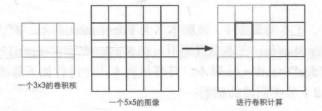
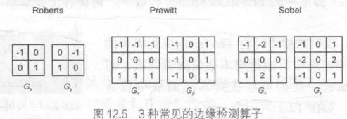
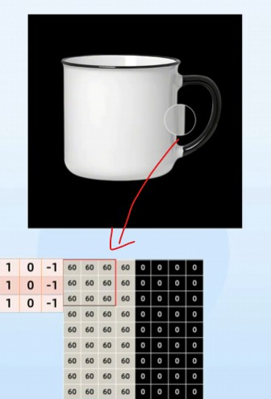
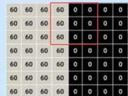
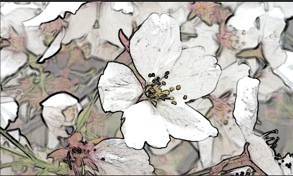
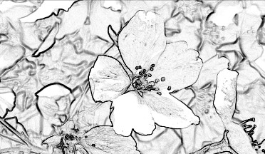

边缘检测的基本原理，通常是基于卷积来判定的



通常有一个卷积核，由3*3个像素组成，每个像素有不同系数，将其对齐到图像上，中心像素就是要计算的像素，以其为中心，对周边像素值进行采样，然后与对应系数做乘除求和等运算，就得到该像素卷积后的像素值。通常可以用来做边缘检测，图像模糊；

常用的边缘检测卷积核有如下几种（两个·一组·，分别对应左右，上下检测）：



以Prewitt为例



我们对图像上指定区域进行卷积（这里是左右卷积）
$$
1*60+1*60+1*60=180\\
0*60+0*60+0*60=0\\
-1*60-1*60-1*60=-180\\
180+0-180=0
$$
就表示该像素值没有梯度变化



如果我们对黑白交界处卷积，就会有：
$$
1*60+1*60+1*60=180\\
0*60+0*60+0*60=0\\
-1*0-1*0-1*0=0\\
180+0-0=180
$$
也就是说，卷积核中心对应的那个像素与其左右像素存在180的梯度变化，也就是说其处在边界上

将这个左右方向的梯度值，记作：$G_x=180$;

同理，对上下方向也要进行卷积，将上下方向的梯度值，记作：$G_y$;

整体梯度表示为$G=\sqrt{G_x^2+G_y^2}$,通常为了节省性能，用$G=\vert G_x \vert+\vert G_y \vert$代替

越大的G就代表此像素越可能是边界；

---

如果我们想采样临近周边的像素值，就需要搞清楚纹素的概念；它是纹理的最小单位，而像素指的是你的屏幕显示的最小单位，也就是分辨率。假如你的屏幕分辨率为1920×1080，我在上面全屏铺上一张1920×1080的图片，此时图片的每一个纹素就占用了显示器刚好一个像素，但如果我们把这张图缩小，假设把它缩小到屏幕上1280×720个像素范围显示，那么就会有图片上的多个纹素挤在屏幕上的同一个像素上；

此时的**纹素大小**，就是指图片的每个纹素所占用的屏幕显示像素的大小是多少，即[1280/1920,720/1080]

在shader中，UV坐标的范围永远是归一化的[0,1],无论纹理的实际分辨率是 $128 \times 128$ 还是 $4096 \times 4096$,它的纹素大小永远是:
$$
\text{纹素宽度} = \frac{1.0}{\text{纹理分辨率的宽度}}\\ \text{纹素高度} = \frac{1.0}{\text{纹理分辨率的高度}}
$$
通过对UV施加偏移，我们就可以得到周边纹理像素的uv值,以此采样到目标像素的领接周边像素的值。

```C#
o.uv[5] = uv + _MainTex_TexelSize.xy * half2(1, 0);
```

注意，这个星乘实际上是 shader 中的一种底层运算，通常叫它分量乘法。对应的X乘X,Y乘Y,它们是分别相乘的,注意：区别点乘和差乘.

然后对纹理的每个像素采用Sobel卷积核进行卷积处理

```C#
half Sobel(v2f i) {//Sobel卷积计算
				const half Gx[9] = {-1,  0,  1,
										-2,  0,  2,
										-1,  0,  1};
				const half Gy[9] = {-1, -2, -1,
										0,  0,  0,
										1,  2,  1};		
				
				half texColor;
				half edgeX = 0;
				half edgeY = 0;
				for (int it = 0; it < 9; it++) {
					texColor = luminance(tex2D(_MainTex, i.uv[it]));
					edgeX += texColor * Gx[it];
					edgeY += texColor * Gy[it];
				}
				
				half edge = 1 - abs(edgeX) - abs(edgeY);//edge值越小,就越可能是边界
				
				return edge;
			}
```

注意这里的luminance函数,作用是将一个**RGBA彩色像素值转换成灰度值（Luminance，亮度）**。

```c#
fixed luminance(fixed4 color) {//RGB转化为单通道灰度值
				return  0.2125 * color.r + 0.7154 * color.g + 0.0721 * color.b; 
			}
```

### 1. 为什么边缘检测需要先转灰度？

边缘检测（如 Sobel、Canny 算子）的基本原理是寻找图像中**亮度变化剧烈**的区域。

- **颜色是会骗人的：** 两个截然不同的颜色（比如某种深蓝色和某种深绿色）在RGB数值上可能差很多，但它们的明暗程度（亮度）可能非常接近。
- **简化计算：** 处理彩色图像需要同时计算 R、G、B 三个通道的梯度，计算量大且容易受到颜色色差的干扰。转换为单通道的灰度图后，Shader 只需要专注分析“明暗变化”，算法会更准确、更高效。

### 2. 为什么三个通道的权重（系数）不一样？

这其实是由**人类眼睛的生理结构**决定的：

- **人眼对绿色最敏感：** 我们的视网膜中感受绿光的锥体细胞最多，所以即使绿色和其他颜色的物理能量相同，我们也觉得绿色比其他颜色更亮。因此，绿色的权重最高，达到了 **71.54%**。
- 红色的权重占 **21.25%**。 蓝色的权重最低，只有 **7.21%**

这个公式被称为 **Luma 公式**（通常基于 ITU-R BT.709 标准），它能让转换出来的黑白图像在视觉上最符合人类对“明暗”的直观感受。

完整代码如下

```c#
// Upgrade NOTE: replaced 'mul(UNITY_MATRIX_MVP,*)' with 'UnityObjectToClipPos(*)'

Shader "Unity Shaders Book/Chapter 12/Edge Detection" {
	Properties {
		_MainTex ("Base (RGB)", 2D) = "white" {}
		_EdgeOnly ("Edge Only", Float) = 1.0
		_EdgeColor ("Edge Color", Color) = (0, 0, 0, 1)
		_BackgroundColor ("Background Color", Color) = (1, 1, 1, 1)
	}
	SubShader {
		Pass {  
			ZTest Always Cull Off ZWrite Off
			
			CGPROGRAM
			
			#include "UnityCG.cginc"
			
			#pragma vertex vert  
			#pragma fragment fragSobel
			
			sampler2D _MainTex;  
			uniform half4 _MainTex_TexelSize;//获取图像的纹素大小，这里应该给的是全屏画面的一张图像
			fixed _EdgeOnly;
			fixed4 _EdgeColor;
			fixed4 _BackgroundColor;
			
			struct v2f {
				float4 pos : SV_POSITION;
				half2 uv[9] : TEXCOORD0;
			};
			  
			v2f vert(appdata_img v) {//appdata_img 预制结构体包含传递的顶点坐标和对应的顶点UV坐标，没有法线或者深度数据,通常只用来服务Image，或在后处理特效中使用
				v2f o;
				o.pos = UnityObjectToClipPos(v.vertex);
				
				half2 uv = v.texcoord;
				
				o.uv[0] = uv + _MainTex_TexelSize.xy * half2(-1, -1);//计算各个方向上的邻接像素的UV，以此获取邻接像素值
				o.uv[1] = uv + _MainTex_TexelSize.xy * half2(0, -1);
				o.uv[2] = uv + _MainTex_TexelSize.xy * half2(1, -1);
				o.uv[3] = uv + _MainTex_TexelSize.xy * half2(-1, 0);
				o.uv[4] = uv + _MainTex_TexelSize.xy * half2(0, 0);//这个是中心本体像素uv，没有任何偏移
				o.uv[5] = uv + _MainTex_TexelSize.xy * half2(1, 0);
				o.uv[6] = uv + _MainTex_TexelSize.xy * half2(-1, 1);
				o.uv[7] = uv + _MainTex_TexelSize.xy * half2(0, 1);
				o.uv[8] = uv + _MainTex_TexelSize.xy * half2(1, 1);
						 
				return o;
			}
			
			fixed luminance(fixed4 color) {//RGB转化为单通道灰度值
				return  0.2125 * color.r + 0.7154 * color.g + 0.0721 * color.b; 
			}
			
			half Sobel(v2f i) {//Sobel卷积计算
				const half Gx[9] = {-1,  0,  1,
										-2,  0,  2,
										-1,  0,  1};
				const half Gy[9] = {-1, -2, -1,
										0,  0,  0,
										1,  2,  1};		
				
				half texColor;
				half edgeX = 0;
				half edgeY = 0;
				for (int it = 0; it < 9; it++) {
					texColor = luminance(tex2D(_MainTex, i.uv[it]));
					edgeX += texColor * Gx[it];
					edgeY += texColor * Gy[it];
				}
				
				half edge = 1 - abs(edgeX) - abs(edgeY);//edge值越小,就越可能是边界
				
				return edge;
			}
			
			fixed4 fragSobel(v2f i) : SV_Target {//片元函数
				half edge = Sobel(i);
				
				fixed4 withEdgeColor = lerp(_EdgeColor, tex2D(_MainTex, i.uv[4]), edge);//用获取的边缘系数edge,对描边颜色和原始像素颜色进行插值,edge值越小,就越可能是边界;得到的是在原始图像上叠加的描边效果
				fixed4 onlyEdgeColor = lerp(_EdgeColor, _BackgroundColor, edge);//在纯色背景与描边之间进行插值,得到的是纯色上的描边效果
				return lerp(withEdgeColor, onlyEdgeColor, _EdgeOnly);//在原始图像上的描边与纯色背景上的描边画面之间进行插值。
 			}
			
			ENDCG
		} 
	}
	FallBack Off
}

```

最终的片元着色器中,我们实现了两种效果,一种是原始画面上叠加的描边,另一种是在纯色背景上的描边效果;最后通过_EdgeOnly差值,可以在两种效果之间自由过渡切换;





