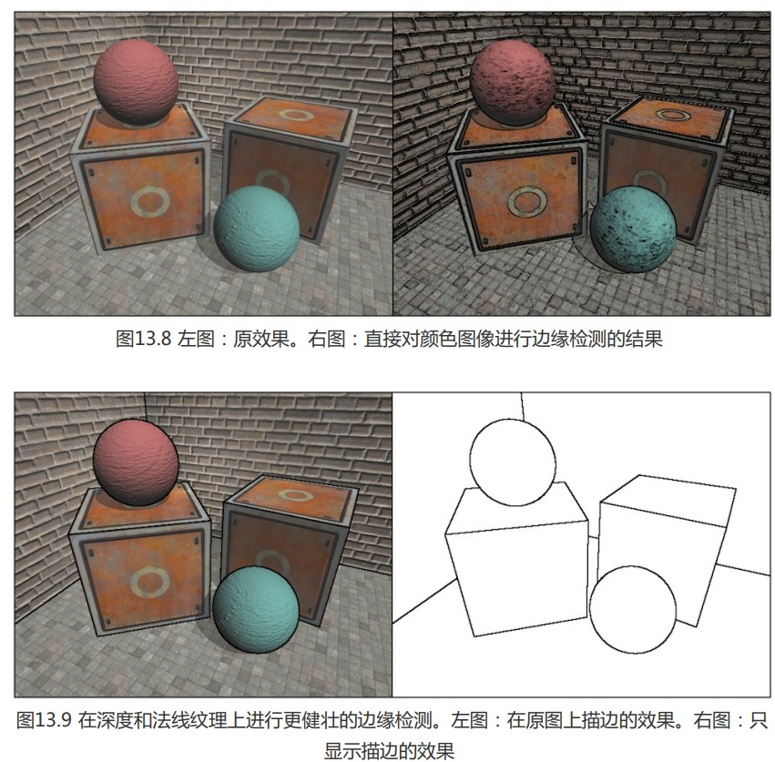
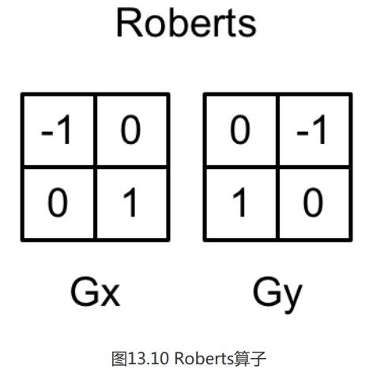

12章中我们学习了后期处理的描边，但是这是一种利用颜色信息进行的边缘检测，会产生很多不希望得到的边缘；





本次将使用Roberts算子进行边缘检测

```
// Upgrade NOTE: replaced 'mul(UNITY_MATRIX_MVP,*)' with 'UnityObjectToClipPos(*)'

Shader "Unity Shaders Book/Chapter 13/Edge Detection Normals And Depth" {
	Properties {
		_MainTex ("Base (RGB)", 2D) = "white" {}
		_EdgeOnly ("Edge Only", Float) = 1.0
		_EdgeColor ("Edge Color", Color) = (0, 0, 0, 1)
		_BackgroundColor ("Background Color", Color) = (1, 1, 1, 1)
		_SampleDistance ("Sample Distance", Float) = 1.0
		_Sensitivity ("Sensitivity", Vector) = (1, 1, 1, 1)
	}
	SubShader {
		CGINCLUDE /*CGINCLUDEENDCG//表示当前 SubShader 里声明一段可被多个 Pass 共享的 CG/HLSL 代码块。*/
		
		#include "UnityCG.cginc"
		
		sampler2D _MainTex;
		half4 _MainTex_TexelSize;
		fixed _EdgeOnly;
		fixed4 _EdgeColor;
		fixed4 _BackgroundColor;
		float _SampleDistance;//控制深度+法线的采样距离（越大描边越宽）
		half4 _Sensitivity;//合并 法线深度灵敏度参数，x对应法线灵敏度，y对应深度灵敏度，zw忽略
		
		sampler2D _CameraDepthNormalsTexture;//深度法线纹理
		
		struct v2f {
			float4 pos : SV_POSITION;
			half2 uv[5]: TEXCOORD0;
		};
		  
		v2f vert(appdata_img v) {
			v2f o;
			o.pos = UnityObjectToClipPos(v.vertex);
			
			half2 uv = v.texcoord;
			o.uv[0] = uv;
			
			#if UNITY_UV_STARTS_AT_TOP
			if (_MainTex_TexelSize.y < 0)
				uv.y = 1 - uv.y;
			#endif
			
			o.uv[1] = uv + _MainTex_TexelSize.xy * half2(1,1) * _SampleDistance;
			o.uv[2] = uv + _MainTex_TexelSize.xy * half2(-1,-1) * _SampleDistance;
			o.uv[3] = uv + _MainTex_TexelSize.xy * half2(-1,1) * _SampleDistance;
			o.uv[4] = uv + _MainTex_TexelSize.xy * half2(1,-1) * _SampleDistance;
					 
			return o;
		}
		
		half CheckSame(half4 center, half4 sample) {
			half2 centerNormal = center.xy;//xy为纹理（并没有转换成真正的法线值，因为只需要比较采样值之间的差异度）
			float centerDepth = DecodeFloatRG(center.zw);//zw为深度值
			half2 sampleNormal = sample.xy;
			float sampleDepth = DecodeFloatRG(sample.zw);
			
			// difference in normals 比较两点的法线差异度*灵敏值
			// do not bother decoding normals - there's no need here
			half2 diffNormal = abs(centerNormal - sampleNormal) * _Sensitivity.x;
			int isSameNormal = (diffNormal.x + diffNormal.y) < 0.1;//差异大于0.1是1否则是0
			// difference in depth 比较两点的深度差异度*灵敏值
			float diffDepth = abs(centerDepth - sampleDepth) * _Sensitivity.y;
			// scale the required threshold by the distance
			int isSameDepth = diffDepth < 0.1 * centerDepth;//差异大于0.1是1否则是0，深度越大，距离越远（基于相机），允许的深度差阈值就越大；透视投影下，远处物体的深度精度和屏幕表现都不一样。如果用固定阈值，远处很容易因为一点深度浮动就被误判成边缘，或者近处边缘不够敏感。
			
			// return:
			// 1 - if normals and depth are similar enough
			// 0 - otherwise
			return isSameNormal * isSameDepth ? 1.0 : 0.0;//isSameNormal&&isSameDepth，两者都有足够大的差值，才能判定为有边，返回0，否则返回1
		}
		
		fixed4 fragRobertsCrossDepthAndNormal(v2f i) : SV_Target {
			half4 sample1 = tex2D(_CameraDepthNormalsTexture, i.uv[1]);//采样该ux坐标下的法线和深度
			half4 sample2 = tex2D(_CameraDepthNormalsTexture, i.uv[2]);
			half4 sample3 = tex2D(_CameraDepthNormalsTexture, i.uv[3]);
			half4 sample4 = tex2D(_CameraDepthNormalsTexture, i.uv[4]);
			
			half edge = 1.0;
			
			edge *= CheckSame(sample1, sample2);
			edge *= CheckSame(sample3, sample4);
			
			fixed4 withEdgeColor = lerp(_EdgeColor, tex2D(_MainTex, i.uv[0]), edge);
			fixed4 onlyEdgeColor = lerp(_EdgeColor, _BackgroundColor, edge);
			
			return lerp(withEdgeColor, onlyEdgeColor, _EdgeOnly);
		}
		
		ENDCG
		
//将函数和属性写在外面，所有可用Pass，而pass才是执行核心
		Pass { 
			ZTest Always Cull Off ZWrite Off
			
			CGPROGRAM      
			
			#pragma vertex vert  
			#pragma fragment fragRobertsCrossDepthAndNormal
			
			ENDCG  
		}
	} 
	FallBack Off
}

```

