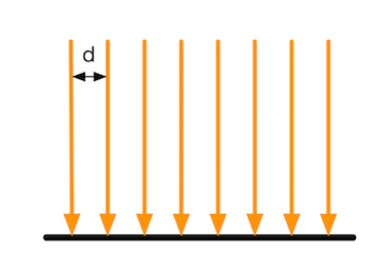
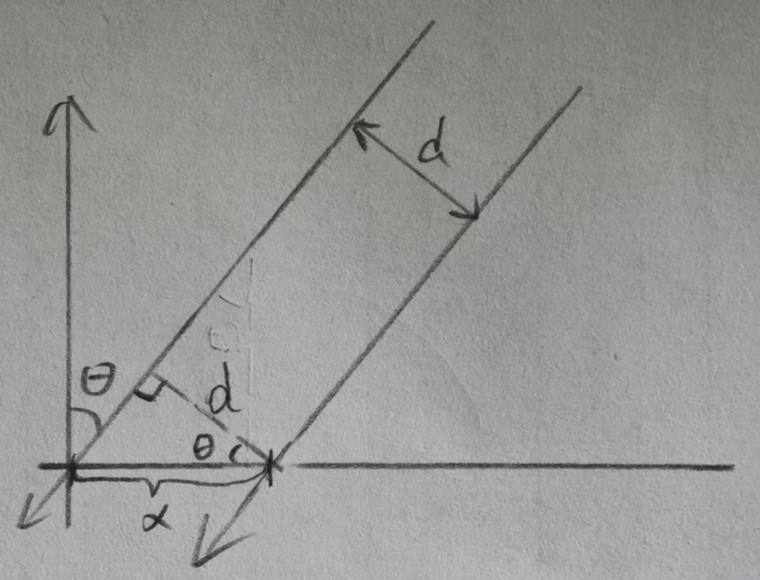
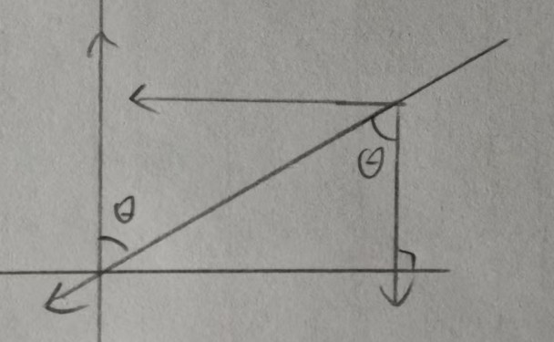
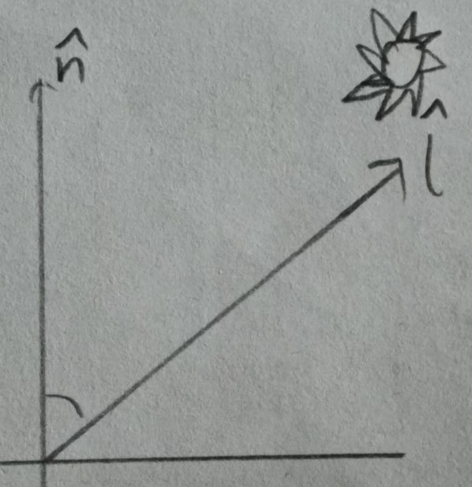
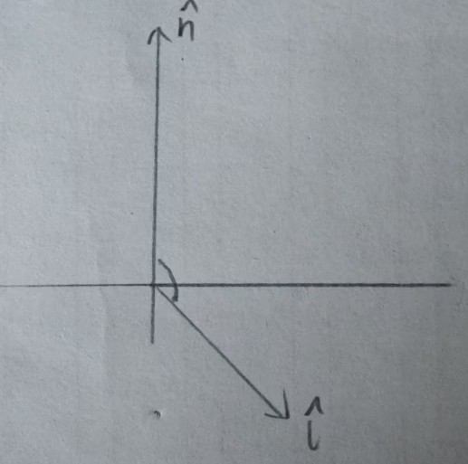

漫反射光照模型也被称为兰伯特光照模型,即符合兰伯特光照定理:在平面某点漫反射光强与该点的法向量和入射光角度的余弦值成正比.

在光学里,使用辐照度来量化光.对于平行光,通过计算垂直于照射表面的单位面积上单位时间穿过的能量来表示.



我们用一个光线间隔距离为d的多束光线来表示一个标准能量密度的平行光,



若此时光线入射与法线呈$\theta$夹角,会发现实际照射在平面上的光线密度变小了(x>d),此时光线间隔距离为$x=\frac{d}{\cos \theta}$,当$\theta =90\degree$时,x=d,此时平面每个单位均接受一个标准能量密度强度的光照,$x$越大,单位面积接受的光照强度越小,假定为 $1\cdot\frac{d}{x}=cos \theta$,所以单位面积光照强度与$\cos \theta$呈正比.



同时我们也可以通过向量的分量来理解,将光线分解为垂直水平的分量,只有垂直平面的分量才是实际表面接受到的光线强度,结果为:$l(单位光照强度)\cdot \cos \theta$



通过**单位法向量**$\hat n$与**指向光源的单位矢量**$\hat l$点积,我们就能得到:$\hat n \cdot \hat l=\vert \hat n \vert \cdot \vert \hat l \vert \cdot \cos \theta=\cos \theta$



最后需要注意,当表面法线与指向光源的向量之间夹角大于$90\degree$时,$\hat n \cdot \hat l$结果为负数,这就表明光是从物体表面的背面照过来,此时物体表面不应该接收光照值,小于0的一切$\cos$值都要归0.

最终,漫反射计算公式为:$C_{diffuse}=(C_{light}\cdot m_{diffuse})\cdot max(0,\hat n \cdot \hat l)$,其中$C_{light}:光照颜色强度, m_{diffuse}:材质漫反射系数$

### 逐顶点光照

```
Shader "Unity Shaders Book/Chapter 6/Diffuse Vertex-Level" {
	Properties {
		_Diffuse ("Diffuse", Color) = (1, 1, 1, 1)
	}
	SubShader {
		Pass { 
			Tags { "LightMode"="ForwardBase" }//设置标签:光照模式为ForwardBase
		
			CGPROGRAM
			
			#pragma vertex vert
			#pragma fragment frag
			
			#include "Lighting.cginc"\\该内置文件提供了"UNITY_LIGHTMODEL_AMBIENT"等变量,用于获取环境光部分
			
			fixed4 _Diffuse;
			
			struct a2v {
				float4 vertex : POSITION;
				float3 normal : NORMAL;
			};
			
			struct v2f {
				float4 pos : SV_POSITION;
				fixed3 color : COLOR;
			};
			
			v2f vert(a2v v) {
				v2f o;

				o.pos = UnityObjectToClipPos(v.vertex);
				
	//获取环境光照
				fixed3 ambient = UNITY_LIGHTMODEL_AMBIENT.xyz;
				//法线从模型空间转换到世界空间
				fixed3 worldNormal = normalize(mul(v.normal, (float3x3)unity_WorldToObject));//转换法线到世界坐标
				fixed3 worldLight = normalize(_WorldSpaceLightPos0.xyz);
				fixed3 diffuse = _LightColor0.rgb * _Diffuse.rgb * saturate(dot(worldNormal, worldLight));//cg函数saturate截取[0-1]
				
				o.color = ambient + diffuse;
				
				return o;
			}
			
			fixed4 frag(v2f i) : SV_Target {
				return fixed4(i.color, 1.0);
			}
			
			ENDCG
		}
	}
	FallBack "Diffuse"
}
```

需要注意:法线转换,参考基础计算的法向量变换章节,我们求得,法向量的变换矩阵为空间变换矩阵的逆矩阵的转置;我们要将模型空间法向量转换到世界空间,空间变换矩阵为_Object2World,逆矩阵就是_World2Object,然后矩阵的转置我们通过向量右乘变左乘解决.最终变换法向量到世界空间的乘法就变成了:**mul(v.normal, (float3x3)unity_WorldToObject)**.

### 逐像素光照

顶点函数vert 只参与顶点以及法向量空间计算,最终颜色计算移至片元着色函数frag

```
Shader "Unity Shaders Book/Chapter 6/Diffuse Pixel-Level" {
	Properties {
		_Diffuse ("Diffuse", Color) = (1, 1, 1, 1)
	}
	SubShader {
		Pass { 
			Tags { "LightMode"="ForwardBase" }
		
			CGPROGRAM
			
			#pragma vertex vert
			#pragma fragment frag
			
			#include "Lighting.cginc"
			
			fixed4 _Diffuse;
			
			struct a2v {
				float4 vertex : POSITION;
				float3 normal : NORMAL;
			};
			
			struct v2f {
				float4 pos : SV_POSITION;
				float3 worldNormal : TEXCOORD0;
			};
			
			v2f vert(a2v v) {
				v2f o;
				// Transform the vertex from object space to projection space
				o.pos = UnityObjectToClipPos(v.vertex);

				// Transform the normal from object space to world space
				o.worldNormal = mul(v.normal, (float3x3)unity_WorldToObject);

				return o;
			}
			
			fixed4 frag(v2f i) : SV_Target {
				// 获取环境光
				fixed3 ambient = UNITY_LIGHTMODEL_AMBIENT.xyz;
				
				// Get the normal in world space
				fixed3 worldNormal = normalize(i.worldNormal);
				// Get the light direction in world space
				fixed3 worldLightDir = normalize(_WorldSpaceLightPos0.xyz);
				
				// Compute diffuse term
				fixed3 diffuse = _LightColor0.rgb * _Diffuse.rgb * saturate(dot(worldNormal, worldLightDir));
				
				fixed3 color = ambient + diffuse;
				
				return fixed4(color, 1.0);
			}
			
			ENDCG
		}
	} 
	FallBack "Diffuse"
}
```

