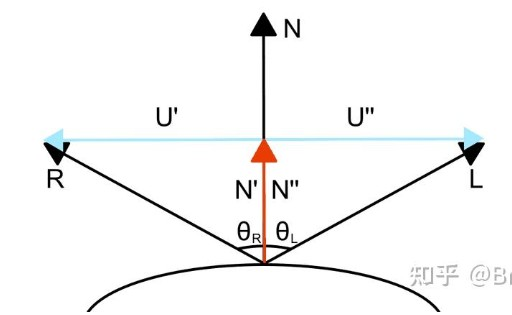
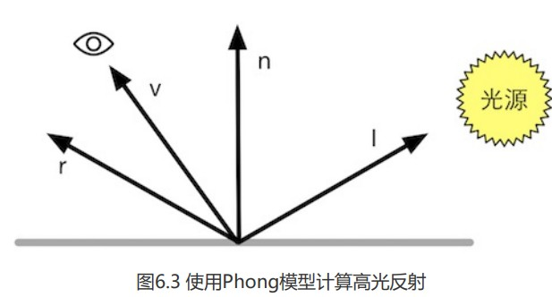

首先我们通过向量来求得反射向量



如图,N为法向量,L为反射点指向光源的向量,R为反射向量,根据反射原理,R,L对N是一个镜像关系,因此$\theta_R=\theta_L$;

已知单位向量点乘$\hat a \cdot \hat b=\vert a\vert \vert b \vert\cos \theta=\cos \theta$,且点乘的几何意义是a在b上的投影长度(单位向量下,这个长度值就能理解为 a在b上的投影是b的$\cos \theta$倍);

将N,R,L都归一化,就可得:$N'=N''=(\hat R\cdot \hat N)\hat N=(\hat L \cdot \hat N)\hat N$;且$U'=\hat R-N',U''=\hat L-N''$

又$\because U'=-U''$,就有
$$
\hat R-(\hat R\cdot \hat N)\hat N=-(\hat L-(\hat L \cdot \hat N)\hat N)\\
\hat R=(\hat R\cdot \hat N)\hat N-\hat L+(\hat L \cdot \hat N)\hat N=(\hat L \cdot \hat N)\hat N-\hat L+(\hat L \cdot \hat N)\hat N\\
=2(\hat L \cdot \hat N)\hat N-\hat L
$$
$\therefore$  **反射单位向量**: $ \hat R=2(\hat L \cdot \hat N)\hat N-\hat L$

---

### Phone 模型高光反射




我们可以认为,在理想情况下,光线进入表面会完全沿着r反射,而人眼(或相机)观察方向跟反射向量r有一定角度,因此眼睛无法完全接受反射的光线,所以眼睛接受的反射光强度,应该是r在v上的分量,同样利用单位向量点乘$\hat r \cdot \hat v$,求得r在v上的投影长度,也就是r方向的反射光在v上分量的强度占比,因此,高光反射最终公式为:
$$
c_{specular}=(c_{light}\cdot m_{specular})max(0,\hat v \cdot \hat r)^{m_{gloss}}
$$
其中$c_{light}$为光源颜色强度,$m_{specular}$为高光反射颜色,$m_{gloss}$为材质反射度(与高光区域亮点大小正比),同样需要防止结果为负数(这里是否应该判定n,r,而不是v,r?)

---

### 逐像素高光反射代码

```
Shader "Unity Shaders Book/Chapter 6/Specular Pixel-Level" {
	Properties {
		_Diffuse ("Diffuse", Color) = (1, 1, 1, 1)
		_Specular ("Specular", Color) = (1, 1, 1, 1)
		_Gloss ("Gloss", Range(8.0, 256)) = 20
	}
	SubShader {
		Pass { 
			Tags { "LightMode"="ForwardBase" }
		
			CGPROGRAM
			
			#pragma vertex vert
			#pragma fragment frag

			#include "Lighting.cginc"
			
			fixed4 _Diffuse;
			fixed4 _Specular;
			float _Gloss;
			
			struct a2v {
				float4 vertex : POSITION;
				float3 normal : NORMAL;
			};
			
			struct v2f {
				float4 pos : SV_POSITION;
				float3 worldNormal : TEXCOORD0;
				float3 worldPos : TEXCOORD1;
			};
			
			v2f vert(a2v v) {
				v2f o;
				// Transform the vertex from object space to projection space
				o.pos = UnityObjectToClipPos(v.vertex);
				
				// Transform the normal from object space to world space
				o.worldNormal = mul(v.normal, (float3x3)unity_WorldToObject);
				// Transform the vertex from object spacet to world space
				o.worldPos = mul(unity_ObjectToWorld, v.vertex).xyz;
				
				return o;
			}
			
			fixed4 frag(v2f i) : SV_Target {
				// Get ambient term
				fixed3 ambient = UNITY_LIGHTMODEL_AMBIENT.xyz;
				
				fixed3 worldNormal = normalize(i.worldNormal);
				fixed3 worldLightDir = normalize(_WorldSpaceLightPos0.xyz);
				
				// Compute diffuse term
				fixed3 diffuse = _LightColor0.rgb * _Diffuse.rgb * saturate(dot(worldNormal, worldLightDir));
				
				// // 内置函数直接获取世界空间的反射向量
				fixed3 reflectDir = normalize(reflect(-worldLightDir, worldNormal));
				// 反射点指向相机的向量
				fixed3 viewDir = normalize(_WorldSpaceCameraPos.xyz - i.worldPos.xyz);
				// Compute specular term
				fixed3 specular = _LightColor0.rgb * _Specular.rgb * pow(saturate(dot(reflectDir, viewDir)), _Gloss);
				
				return fixed4(ambient + diffuse + specular, 1.0);
			}
			
			ENDCG
		}
	} 
	FallBack "Specular"
}

```

