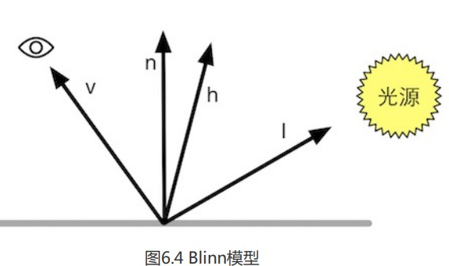

Blinn提出一个简单修改得到了类似的效果,其不再需要计算反射方向,而是对$v,l$取一个中间值$h(h=v+l)$



然后用$n,h$的夹角计算点乘;
$$
c_{specular}=(c_{light}\cdot m_{specular})max(0,\hat n \cdot \hat h)^{m_{gloss}}
$$
其中$c_{light}$为光源颜色强度,$m_{specular}$为高光反射颜色,$m_{gloss}$为材质反射度(与高光区域亮点大小正比),同样需要防止结果为负数;

这里我们可以想象到,当v与反射方向r一致是时,h将会与n对其,此时点乘结果为1,强度最大,当图上的v逐渐旋转(顺逆均可),h与n出现夹角,反射强度也将逐渐减小

### 优缺点

在硬件实现上,如果摄像机与光源距离物体足够远,v,l将会被认为是个定值,h也将变成一个常量,这样可以加快运算;但当v,l不为常量时,Phone模型更快

---

### Blinn模型光照逐像素代码

```
Shader "Unity Shaders Book/Chapter 6/Blinn-Phong" {
	Properties {
		_Diffuse ("Diffuse", Color) = (1, 1, 1, 1)
		_Specular ("Specular", Color) = (1, 1, 1, 1)
		_Gloss ("Gloss", Range(8.0, 256)) = 20
	}
	SubShader {
		Pass { 
			Tags { "LightMode"="ForwardBase" }
		
			CGPROGRAM
			
			#pragma vertex vert
			#pragma fragment frag
			
			#include "Lighting.cginc"
			
			fixed4 _Diffuse;
			fixed4 _Specular;
			float _Gloss;
			
			struct a2v {
				float4 vertex : POSITION;
				float3 normal : NORMAL;
			};
			
			struct v2f {
				float4 pos : SV_POSITION;
				float3 worldNormal : TEXCOORD0;
				float3 worldPos : TEXCOORD1;
			};
			
			v2f vert(a2v v) {
				v2f o;
				// Transform the vertex from object space to projection space
				o.pos = UnityObjectToClipPos(v.vertex);
				
				// Transform the normal from object space to world space
				o.worldNormal = mul(v.normal, (float3x3)unity_WorldToObject);
				
				// Transform the vertex from object spacet to world space
				o.worldPos = mul(unity_ObjectToWorld, v.vertex).xyz;
				
				return o;
			}
			
			fixed4 frag(v2f i) : SV_Target {
				// Get ambient term
				fixed3 ambient = UNITY_LIGHTMODEL_AMBIENT.xyz;
				
				fixed3 worldNormal = normalize(i.worldNormal);
				fixed3 worldLightDir = normalize(_WorldSpaceLightPos0.xyz);
				
				// Compute diffuse term
				fixed3 diffuse = _LightColor0.rgb * _Diffuse.rgb * max(0, dot(worldNormal, worldLightDir));
				
				// Get the view direction in world space
				fixed3 viewDir = normalize(_WorldSpaceCameraPos.xyz - i.worldPos.xyz);
				// 两单位向量相加,即得到中间向量h
				fixed3 halfDir = normalize(worldLightDir + viewDir);
				// Compute specular term
				fixed3 specular = _LightColor0.rgb * _Specular.rgb * pow(max(0, dot(worldNormal, halfDir)), _Gloss);
				
				return fixed4(ambient + diffuse + specular, 1.0);
			}
			
			ENDCG
		}
	} 
	FallBack "Specular"
}
```

