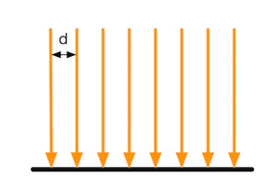
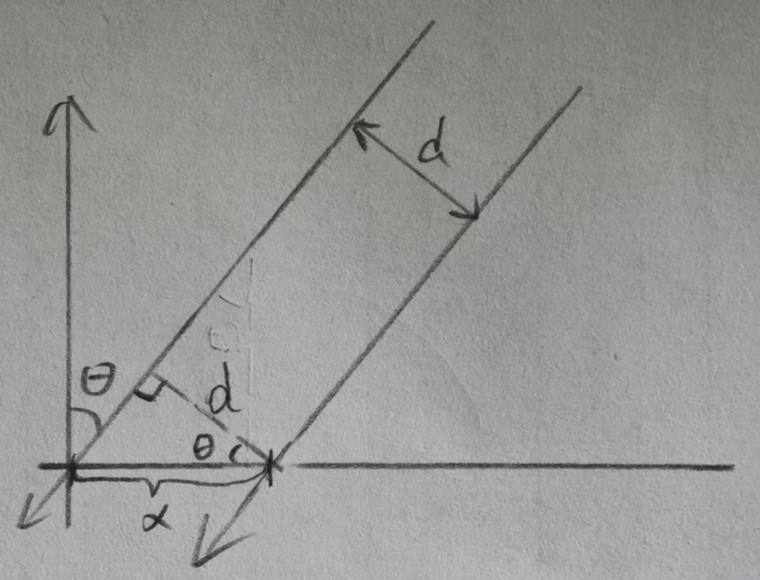
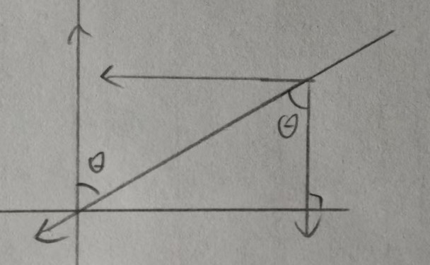
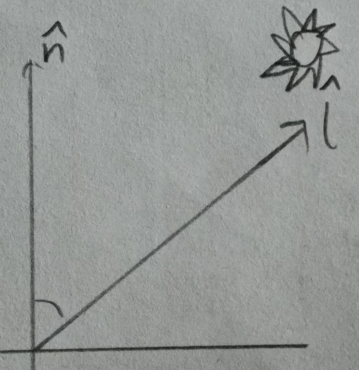
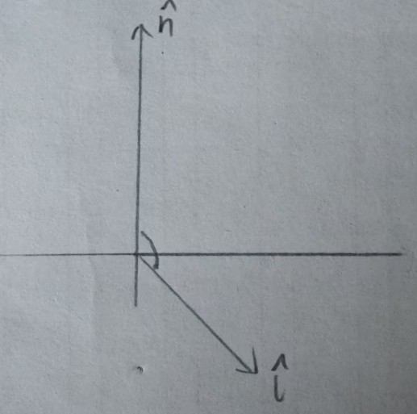

在光学里,使用辐照度来量化光.对于平行光,通过计算垂直于照射表面的单位面积上单位时间穿过的能量来表示.



我们用一个光线间隔距离为d的多束光线来表示一个标准能量密度的平行光,



若此时光线入射与法线呈$\theta$夹角,会发现实际照射在平面上的光线密度变小了(x>d),此时光线间隔距离为$x=\frac{d}{\cos \theta}$,当$\theta =90\degree$时,x=d,此时平面每个单位均接受一个标准能量密度强度的光照,$x$越大,单位面积接受的光照强度越小,假定为 $1\cdot\frac{d}{x}=cos \theta$,所以单位面积光照强度与$\cos \theta$呈正比.



同时我们也可以通过向量的分量来理解,将光线分解为垂直水平的分量,只有垂直平面的分量才是实际表面接受到的光线强度,结果为:$l(单位光照强度)\cdot \cos \theta$



通过**单位法向量**$\hat n$与**指向光源的单位矢量**$\hat l$点积,我们就能得到:$\hat n \cdot \hat l=\vert \hat n \vert \cdot \vert \hat l \vert \cdot \cos \theta=\cos \theta$



最后需要注意,当表面法线与指向光源的向量之间夹角大于$90\degree$时,$\hat n \cdot \hat l$结果为负数,这就表明光是从物体表面的背面照过来,此时物体表面不应该接收光照值,小于0的一切$\cos$值都要归0.

最终,漫反射计算公式为:$C_{diffuse}=(C_{light}\cdot m_{diffuse})\cdot max(0,\hat n \cdot \hat l)$,其中$C_{light}:光照颜色, m_{diffuse}:材质漫反射颜色$

```

```

