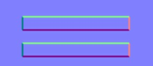
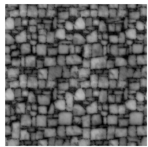
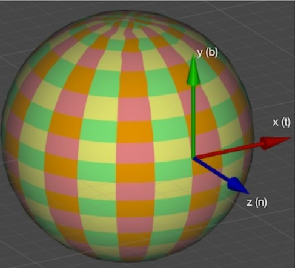
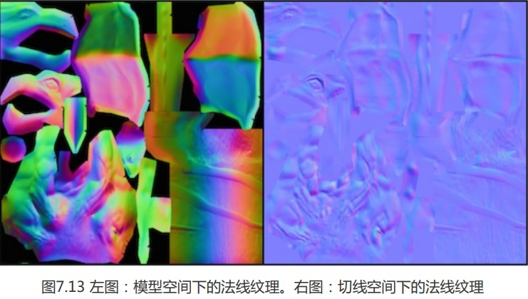
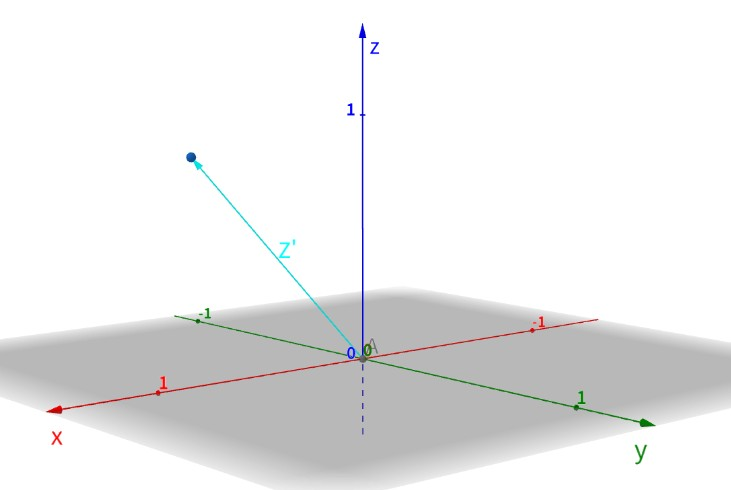

光照到物体上再通过反射光到人眼，当有凹凸面时，反射的光线会产生明暗变换，从而产生凹凸感。而反射光线计算跟物体的法线有关，如果我们修改法线方向，那么反射的光线也会随之改变，便会产生凹凸的感觉，也就模拟了凹凸物体。



如图就是一张凹凸贴图,这本身是个平面,但我们可以很明显感受到凹凸感觉.

凹凸映射有两种,一种是高度纹理,另一种是法线纹理,他们是不同的技术,不要混为一谈;

### 高度纹理

高度图存储的是强度值(intensity),用于表示模型表面局部的海拔高度.颜色越浅表面越向外凸,越深则越向里凹.这种方法可以从纹理上非常直观的看出一个模型表面的凹凸情况.缺点是计算更复杂,不能直接得到表面法线,而需要由像素的灰度值计算得出,消耗更多的性能.



### 法线纹理


法线纹理存储的是表面法线方向.因为法线范围是[-1,1],像素范围是[0,1],我们需要做一个映射:
$$
normal=pixel\times2-1
$$
通常情况下,我们会想到将模型空间中修改后的表面法线存储在一张纹理中,我们称之为模型空间的法线纹理;

然而,实际制作中,我们采用的是模型顶点的切线空间来存储法线数据.



如图,对于模型每个顶点,他都有自己的一个切线空间,其中原点为顶点本身,x为切线方向,z为法线,y为z与x的叉积所得,称为副切线或副法线.



如上图可以看出,模型空间下法线纹理是五颜六色的,这是因为在模型空间中,各个顶点法线方向都是各异的,映射到纹理上就会形成此效果;

而切线空间的法线几乎是蓝紫色,这是因为各个点切线空间不同,在法线方向没有改变情况下,其值均为z轴本身(0,0,1),映射到纹理中就对应(0.5,0.5,1)颜色,唯有彩色的区域,才是修改过的法线(如上图右).

##### 模型空间法线纹理优点

* 简单直观,生成也十分简单,只需要获取当前顶点法线即可;
* 纹理坐标缝合处和尖锐边角部分,可见突变(缝隙)较少,即提供平滑的边界.这是因为这些法线数据均是同一坐标空间下,边界可直接通过插值平滑.

##### 切线空间的法线纹理优点

* 自由度高:切线空间下法线纹理记录的是相对法线信息,可以应用到不同模型网格上,来得到一个合理结果.
* 可进行UV动画,在通过移动纹理uv坐标来实现凹凸效果移动时(如水体效果),模型空间下的法线纹理会是错误的结果.
* 可重用法线纹理.如一块砖的六个面,仅使用一张法线纹理即可.
* 可压缩.由于切线空间下的法线纹理中法线Z方向总是正方向,因此仅存储XY就能推导Z方向,

综合上诉优点,一般情况下采用切线空间法线.

---

### 关键光照计算的两种方案

由于是在切线空间存储法线纹理,我们需要考虑在什么统一空间计算光照:

1. 切线空间计算光照(将光照矢量,视角方向统一变换到切线空间)

   此方案效率更高,在顶点着色器中就完成了光照,视角向量的变换.

2. 世界空间计算光照(将纹理采样的法线矢量变换到世界空间)

   通用性更高,但由于要先采样法线纹理,所以变换过程必须要片元着色器实现,意味着需要在片元着色器进行矩阵操作.

---

### 切线空间计算光照实现

首先我们需要知道从**模型空间到切线空间的变换矩阵**,以此变换视角方向和光照方向等到切线空间.

这里的切线空间,就是以切线为X轴,副切线为Y轴,法线为Z轴的空间,我们很简单的就能获取模型空间下切线,副切线,法线的向量,他们的数值均是在模型空间下的表示,也就是说,将其按列放入矩阵,就组成了切线空间到模型空间的变换矩阵,又因为其满足正交矩阵,根据正交矩阵的性质(逆矩阵等于其转置矩阵),我们直接将其转置,就获得了**模型空间到切线空间的变换矩阵**.

再来看看采样法线的计算:



如图为一个切线空间,Z为其原式法线,Z'为采样修改后的法线,Z'与Z的夹角越大,就说明凹凸程度会越大;

且法线为单位矢量,长度恒为1(满足公式$x_{z'}^2+y_{z'}^2+z_{z'}^2=1$ ),且z分量恒为正数.因此,我们仅需知道Z'的$x_{z'},y_{z'}$分量就能求出$z_{z'}$的大小.

同时,我们还能通过一个系数,同时增大(缩小)x,y分量,根据单位矢量长度恒定的原则,这样计算出来的z分量就会自然变小(大),Z'与Z的角度变大,从而进一步增强凹凸程度;

实现代码:

```
Shader "Unity Shaders Book/Chapter 7/Normal Map In Tangent Space" {
	Properties {
		_Color ("Color Tint", Color) = (1, 1, 1, 1)
		_MainTex ("Main Tex", 2D) = "white" {}
		_BumpMap ("Normal Map", 2D) = "bump" {}
		_BumpScale ("Bump Scale", Float) = 1.0
		_Specular ("Specular", Color) = (1, 1, 1, 1)
		_Gloss ("Gloss", Range(8.0, 256)) = 20
	}
	SubShader {
		Pass { 
			Tags { "LightMode"="ForwardBase" }
		
			CGPROGRAM
			
			#pragma vertex vert
			#pragma fragment frag
			
			#include "Lighting.cginc"
			
			fixed4 _Color;
			sampler2D _MainTex;
			float4 _MainTex_ST;
			sampler2D _BumpMap;
			float4 _BumpMap_ST;
			float _BumpScale;
			fixed4 _Specular;
			float _Gloss;
			
			struct a2v {
				float4 vertex : POSITION;
				float3 normal : NORMAL;
				float4 tangent : TANGENT;//切线除了xyz,需要第四分量w确定副切线方向
				float4 texcoord : TEXCOORD0;
			};
			
			struct v2f {
				float4 pos : SV_POSITION;
				float4 uv : TEXCOORD0;//定义一个float4 的uv,xy存储maintex的,zw存储bumpmap的,减少插值寄存器的使用数目
				float3 lightDir: TEXCOORD1;
				float3 viewDir : TEXCOORD2;
			};
			
			v2f vert(a2v v) {
				v2f o;
				o.pos = UnityObjectToClipPos(v.vertex);
				
				o.uv.xy = v.texcoord.xy * _MainTex_ST.xy + _MainTex_ST.zw;
				o.uv.zw = v.texcoord.xy * _BumpMap_ST.xy + _BumpMap_ST.zw;
				
				// Compute the binormal 叉乘计算副切线(法线)
//				float3 binormal = cross( normalize(v.normal), normalize(v.tangent.xyz) ) * v.tangent.w;
//				// Construct a matrix which transform vectors from object space to tangent space
//				float3x3 rotation = float3x3(v.tangent.xyz, binormal, v.normal);
				// Or just use the built-in macro
				TANGENT_SPACE_ROTATION;//内置宏,创建出模型空间到法线空间的变换矩阵rotation 等同上述代码,实现可查看(Unity-Built-in-Shaders/CGIncludes/UnityCG.glslinc)
				
				// Transform the light direction from object space to tangent space 法线空间的光照方向
				o.lightDir = mul(rotation, ObjSpaceLightDir(v.vertex)).xyz;
				// Transform the view direction from object space to tangent space 法线空间的视角方向
				o.viewDir = mul(rotation, ObjSpaceViewDir(v.vertex)).xyz;
				
				return o;
			}
			
			fixed4 frag(v2f i) : SV_Target {				
				fixed3 tangentLightDir = normalize(i.lightDir);
				fixed3 tangentViewDir = normalize(i.viewDir);
				
				// Get the texel in the normal map,获取纹理对应uv的色彩法线数据(0-1)
				fixed4 packedNormal = tex2D(_BumpMap, i.uv.zw);
				fixed3 tangentNormal;

				//因为是切线空间下的纹理,法线z必为正数,且法线永远是归一化的单位向量,满足x^2+y^2+z^2=1,且dot(xy,xy)=x*x+y*y
				// If the texture is not marked as "Normal map" 手动将纹理的色彩法线数据映射到真正的法线值范围(-1,1),在没有修改纹理类型为normal map时使用
//				tangentNormal.xy = (packedNormal.xy * 2 - 1) * _BumpScale;
//				tangentNormal.z = sqrt(1.0 - saturate(dot(tangentNormal.xy, tangentNormal.xy)));
				
				// Or mark the texture as "Normal map", and use the built-in funciton
				tangentNormal = UnpackNormal(packedNormal);//内置函数,替代手动映射法线纹理值到正确的法线向量值(标记纹理为NormalMap后纹理会根据不同平台压缩,使用此函数才能得到正确法线色彩数据)
				tangentNormal.xy *= _BumpScale;//凹凸强度
				tangentNormal.z = sqrt(1.0 - saturate(dot(tangentNormal.xy, tangentNormal.xy)));
				
				fixed3 albedo = tex2D(_MainTex, i.uv).rgb * _Color.rgb;
				
				fixed3 ambient = UNITY_LIGHTMODEL_AMBIENT.xyz * albedo;
				
				fixed3 diffuse = _LightColor0.rgb * albedo * max(0, dot(tangentNormal, tangentLightDir));

				fixed3 halfDir = normalize(tangentLightDir + tangentViewDir);
				fixed3 specular = _LightColor0.rgb * _Specular.rgb * pow(max(0, dot(tangentNormal, halfDir)), _Gloss);
				
				return fixed4(ambient + diffuse + specular, 1.0);
			}
			
			ENDCG
		}
	} 
	FallBack "Specular"
}
```

---

### 在世界空间的光照计算

基本思想是:在顶点着色器中计算切线空间到世界空间的变换矩阵,最后在片元着色器中将法线纹理采样的法线数据从切线空间变换到世界空间.

此方法计算更多,但在诸如需要使用cubemap进行环境映射等情况下,需要使用此方法.

实现代码:

```
// Upgrade NOTE: replaced '_Object2World' with 'unity_ObjectToWorld'
// Upgrade NOTE: replaced 'mul(UNITY_MATRIX_MVP,*)' with 'UnityObjectToClipPos(*)'

Shader "Unity Shaders Book/Chapter 7/Normal Map In World Space" {
	Properties {
		_Color ("Color Tint", Color) = (1, 1, 1, 1)
		_MainTex ("Main Tex", 2D) = "white" {}
		_BumpMap ("Normal Map", 2D) = "bump" {}
		_BumpScale ("Bump Scale", Float) = 1.0
		_Specular ("Specular", Color) = (1, 1, 1, 1)
		_Gloss ("Gloss", Range(8.0, 256)) = 20
	}
	SubShader {
		Pass { 
			Tags { "LightMode"="ForwardBase" }
		
			CGPROGRAM
			
			#pragma vertex vert
			#pragma fragment frag
			
			#include "Lighting.cginc"
			
			fixed4 _Color;
			sampler2D _MainTex;
			float4 _MainTex_ST;
			sampler2D _BumpMap;
			float4 _BumpMap_ST;
			float _BumpScale;
			fixed4 _Specular;
			float _Gloss;
			
			struct a2v {
				float4 vertex : POSITION;
				float3 normal : NORMAL;
				float4 tangent : TANGENT;
				float4 texcoord : TEXCOORD0;
			};
			
			struct v2f {
				float4 pos : SV_POSITION;
				float4 uv : TEXCOORD0;
				float4 TtoW0 : TEXCOORD1;  
				float4 TtoW1 : TEXCOORD2;  
				float4 TtoW2 : TEXCOORD3; 
			};
			
			v2f vert(a2v v) {
				v2f o;
				o.pos = UnityObjectToClipPos(v.vertex);
				
				o.uv.xy = v.texcoord.xy * _MainTex_ST.xy + _MainTex_ST.zw;
				o.uv.zw = v.texcoord.xy * _BumpMap_ST.xy + _BumpMap_ST.zw;
				
				float3 worldPos = mul(unity_ObjectToWorld, v.vertex).xyz;  
				fixed3 worldNormal = UnityObjectToWorldNormal(v.normal);  
				fixed3 worldTangent = UnityObjectToWorldDir(v.tangent.xyz);  
				fixed3 worldBinormal = cross(worldNormal, worldTangent) * v.tangent.w; 
				
				// Compute the matrix that transform directions from tangent space to world space 计算切线空间到世界空间变换矩阵(向量按列放入)(寄存器最大支持float4,需要三个存储,每个表示一行)
				// Put the world position in w component for optimization 世界坐标存入第四分量,节省空间
				o.TtoW0 = float4(worldTangent.x, worldBinormal.x, worldNormal.x, worldPos.x);
				o.TtoW1 = float4(worldTangent.y, worldBinormal.y, worldNormal.y, worldPos.y);
				o.TtoW2 = float4(worldTangent.z, worldBinormal.z, worldNormal.z, worldPos.z);
				
				return o;
			}
			
			fixed4 frag(v2f i) : SV_Target {
				// Get the position in world space		
				float3 worldPos = float3(i.TtoW0.w, i.TtoW1.w, i.TtoW2.w);
				// Compute the light and view dir in world space
				fixed3 lightDir = normalize(UnityWorldSpaceLightDir(worldPos));
				fixed3 viewDir = normalize(UnityWorldSpaceViewDir(worldPos));
				
				// Get the normal in tangent space
				fixed3 bump = UnpackNormal(tex2D(_BumpMap, i.uv.zw));//对法线纹理解码和采样
				bump.xy *= _BumpScale;
				bump.z = sqrt(1.0 - saturate(dot(bump.xy, bump.xy)));
				// Transform the normal from tangent space to world space变换法线到世界空间(点乘dot相当于 x*x+y*y+z*z)
				bump = normalize(half3(dot(i.TtoW0.xyz, bump), dot(i.TtoW1.xyz, bump), dot(i.TtoW2.xyz, bump)));
				
				fixed3 albedo = tex2D(_MainTex, i.uv).rgb * _Color.rgb;
				
				fixed3 ambient = UNITY_LIGHTMODEL_AMBIENT.xyz * albedo;
				
				fixed3 diffuse = _LightColor0.rgb * albedo * max(0, dot(bump, lightDir));

				fixed3 halfDir = normalize(lightDir + viewDir);
				fixed3 specular = _LightColor0.rgb * _Specular.rgb * pow(max(0, dot(bump, halfDir)), _Gloss);
				
				return fixed4(ambient + diffuse + specular, 1.0);
			}
			
			ENDCG
		}
	} 
	FallBack "Specular"
}

```

