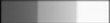
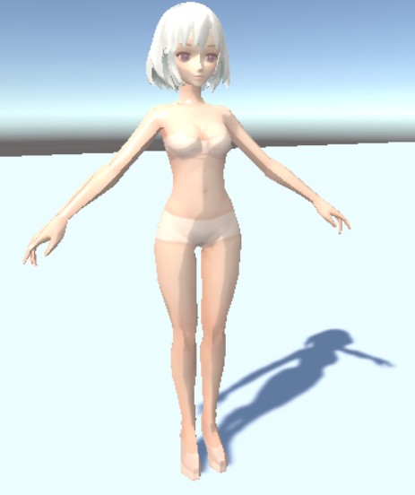
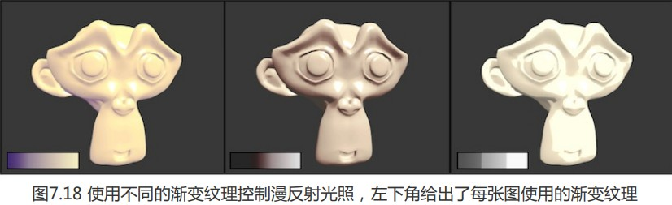
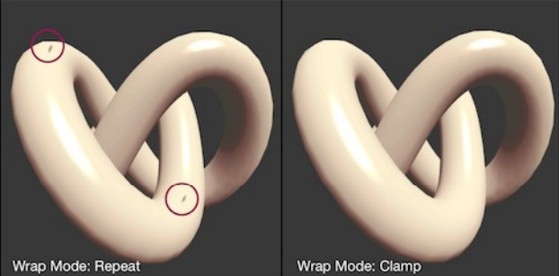

渐变纹理是一种可以用来实现卡通渲染效果的技术，其原理十分简单，使用光照模型计算结果，在一个一维的渐变纹理上进行采样.

以半兰伯特模型为例，其表达式为 0.5 * ( Normal **·** LightDirection) + 0.5，可以看到如果光照方向对于某顶点越接近于直射，其半兰伯特模型计算结果越大，越接近1

将这个模型计算结果作为u,v纹理坐标,在以下渐变纹理上进行采样(渐变纹理实际是个一维纹理,纵向颜色不变).



如上图,连续的半兰伯特光照模型计算结果,与纹理采样结果相乘叠加,会使得输出的颜色值离散化,形成卡通风格的块状阴影和高光;

通俗来说,就是半兰伯特模型计算结果分隔为了不同区间,每个区间采样一个固定的值,相乘叠加到漫反射颜色上,这样就是在实际模型渲染上,在不同的光照角度表面范围,产生明显的分界;






### 实现代码

```
// Upgrade NOTE: replaced '_Object2World' with 'unity_ObjectToWorld'
// Upgrade NOTE: replaced 'mul(UNITY_MATRIX_MVP,*)' with 'UnityObjectToClipPos(*)'

Shader "Unity Shaders Book/Chapter 7/Ramp Texture" {
	Properties {
		_Color ("Color Tint", Color) = (1, 1, 1, 1)
		_RampTex ("Ramp Tex", 2D) = "white" {}
		_Specular ("Specular", Color) = (1, 1, 1, 1)
		_Gloss ("Gloss", Range(8.0, 256)) = 20
	}
	SubShader {
		Pass { 
			Tags { "LightMode"="ForwardBase" }
		
			CGPROGRAM
			
			#pragma vertex vert
			#pragma fragment frag

			#include "Lighting.cginc"
			
			fixed4 _Color;
			sampler2D _RampTex;
			float4 _RampTex_ST;
			fixed4 _Specular;
			float _Gloss;
			
			struct a2v {
				float4 vertex : POSITION;
				float3 normal : NORMAL;
				float4 texcoord : TEXCOORD0;
			};
			
			struct v2f {
				float4 pos : SV_POSITION;
				float3 worldNormal : TEXCOORD0;
				float3 worldPos : TEXCOORD1;
				float2 uv : TEXCOORD2;
			};
			
			v2f vert(a2v v) {
				v2f o;
				o.pos = UnityObjectToClipPos(v.vertex);
				
				o.worldNormal = UnityObjectToWorldNormal(v.normal);
				
				o.worldPos = mul(unity_ObjectToWorld, v.vertex).xyz;
				
				o.uv = TRANSFORM_TEX(v.texcoord, _RampTex);//内置宏计算平铺偏移后的实际纹理坐标
				
				return o;
			}
			
			fixed4 frag(v2f i) : SV_Target {
				fixed3 worldNormal = normalize(i.worldNormal);
				fixed3 worldLightDir = normalize(UnityWorldSpaceLightDir(i.worldPos));
				
				fixed3 ambient = UNITY_LIGHTMODEL_AMBIENT.xyz;
				
				// Use the texture to sample the diffuse color
				fixed halfLambert  = 0.5 * dot(worldNormal, worldLightDir) + 0.5;
				fixed3 diffuseColor = tex2D(_RampTex, fixed2(halfLambert, halfLambert)).rgb * _Color.rgb;//将半兰伯特光照值作为uv坐标,采样渐变纹理
				
				fixed3 diffuse = _LightColor0.rgb * diffuseColor;
				
				fixed3 viewDir = normalize(UnityWorldSpaceViewDir(i.worldPos));
				fixed3 halfDir = normalize(worldLightDir + viewDir);
				fixed3 specular = _LightColor0.rgb * _Specular.rgb * pow(max(0, dot(worldNormal, halfDir)), _Gloss);
				
				return fixed4(ambient + diffuse + specular, 1.0);
			}
			
			ENDCG
		}
	} 
	FallBack "Specular"
}
```

### 一些问题

##### 为什么要使用半兰伯特模型而不是兰伯特模型？

因为兰伯特模型会出现死黑问题，对于卡通渲染这种颜色鲜艳的风格，死黑问题十分致命

##### 为什么渐变纹理是一维的，却需要二维的UV坐标去采样？

因为渐变纹理虽然是一维的，但还是按照二维来存储的（可参考Part2给出的样例渐变纹理），但Y维度上取值是完全相同的，因此在Y维度上的采样实际上是没有意义的，代码中简单使用UV相同的采样点采样即可

### WrapMode限制为 Clamp

因为浮点精度纹理,halfLambert值可能会超过1(如0.00001),如果是Repeat模式,会舍弃正数部分,采样值变成了0.00001,这样会采样到渐变图最左边,也就是渐变图最暗的区域,这样会在渲染中出现黑点.

