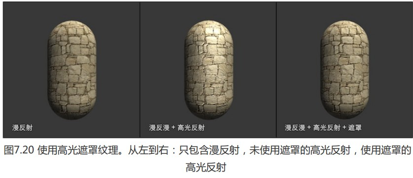

在一般实现中,我们把高光反射应用到模型表面所有区域,,即所有的像素都使用同样大小的高光强度系数.但有时,我们希望模型表面某些区域的反光更强一些,而某些区域弱一些.为了得到更加细腻的效果,我们就使用一张遮罩纹理来控制光照.

另外,在材质需要混合多张图片时(如草地和表现裸露土地的纹理),使用遮罩纹理可以控制如何混合这些纹理.

使用遮罩一般流程为:通过采样得到某点遮罩纹理像素值,然后使用其某个通道值(r,g,b),与表面属性相乘.



### 实现代码

```
// Upgrade NOTE: replaced 'mul(UNITY_MATRIX_MVP,*)' with 'UnityObjectToClipPos(*)'

Shader "Unity Shaders Book/Chapter 7/Mask Texture" {
	Properties {
		_Color ("Color Tint", Color) = (1, 1, 1, 1)
		_MainTex ("Main Tex", 2D) = "white" {}
		_BumpMap ("Normal Map", 2D) = "bump" {}
		_BumpScale("Bump Scale", Float) = 1.0
		_SpecularMask ("Specular Mask", 2D) = "white" {}
		_SpecularScale ("Specular Scale", Float) = 1.0
		_Specular ("Specular", Color) = (1, 1, 1, 1)
		_Gloss ("Gloss", Range(8.0, 256)) = 20
	}
	SubShader {
		Pass { 
			Tags { "LightMode"="ForwardBase" }
		
			CGPROGRAM
			
			#pragma vertex vert
			#pragma fragment frag
			
			#include "Lighting.cginc"
			
			fixed4 _Color;
			sampler2D _MainTex;
			float4 _MainTex_ST;
			sampler2D _BumpMap;
			float _BumpScale;
			sampler2D _SpecularMask;//遮罩图
			float _SpecularScale;
			fixed4 _Specular;
			float _Gloss;
			
			struct a2v {
				float4 vertex : POSITION;
				float3 normal : NORMAL;
				float4 tangent : TANGENT;
				float4 texcoord : TEXCOORD0;
			};
			
			struct v2f {
				float4 pos : SV_POSITION;
				float2 uv : TEXCOORD0;
				float3 lightDir: TEXCOORD1;
				float3 viewDir : TEXCOORD2;
			};
			
			v2f vert(a2v v) {
				v2f o;
				o.pos = UnityObjectToClipPos(v.vertex);
				
				o.uv.xy = v.texcoord.xy * _MainTex_ST.xy + _MainTex_ST.zw;
				
				TANGENT_SPACE_ROTATION;//预制宏,求世界到切线空间变换矩阵
				o.lightDir = mul(rotation, ObjSpaceLightDir(v.vertex)).xyz;
				o.viewDir = mul(rotation, ObjSpaceViewDir(v.vertex)).xyz;
				
				return o;
			}
			
			fixed4 frag(v2f i) : SV_Target {
			 	fixed3 tangentLightDir = normalize(i.lightDir);
				fixed3 tangentViewDir = normalize(i.viewDir);

				fixed3 tangentNormal = UnpackNormal(tex2D(_BumpMap, i.uv));
				tangentNormal.xy *= _BumpScale;
				tangentNormal.z = sqrt(1.0 - saturate(dot(tangentNormal.xy, tangentNormal.xy)));

				fixed3 albedo = tex2D(_MainTex, i.uv).rgb * _Color.rgb;
				
				fixed3 ambient = UNITY_LIGHTMODEL_AMBIENT.xyz * albedo;
				
				fixed3 diffuse = _LightColor0.rgb * albedo * max(0, dot(tangentNormal, tangentLightDir));
				
			 	fixed3 halfDir = normalize(tangentLightDir + tangentViewDir);
			 	// Get the mask value
			 	fixed specularMask = tex2D(_SpecularMask, i.uv).r * _SpecularScale;//通过采样遮罩,对不同区域的高光系数进行调整
			 	// Compute specular term with the specular mask
			 	fixed3 specular = _LightColor0.rgb * _Specular.rgb * pow(max(0, dot(tangentNormal, halfDir)), _Gloss) * specularMask;
			
				return fixed4(ambient + diffuse + specular, 1.0);
			}
			
			ENDCG
		}
	} 
	FallBack "Specular"
}

```

这里主纹理_MainTex,法线纹理 _ BumpMap和遮罩纹理 _SpecularMask定义了共同的纹理属性变量 _MainTex_ST.意味着,材质面板修改主纹理的偏移平铺系数会同时影响3个纹理采样.使用这种方式可以让我们节省存储的插值寄存器.且大多时候,我们也不需要单独对遮罩纹理进行位移平铺操作,都是跟随主纹理同步平铺位移.

同时**需要说明**,这个遮罩纹理的rgb分量存储的都是一样的值,这样会造成空间浪费,.实际制作中,我们会充分利用遮罩纹理中每一个色彩通道来存储不同的表面属性;