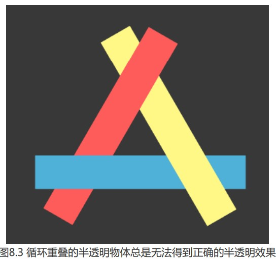
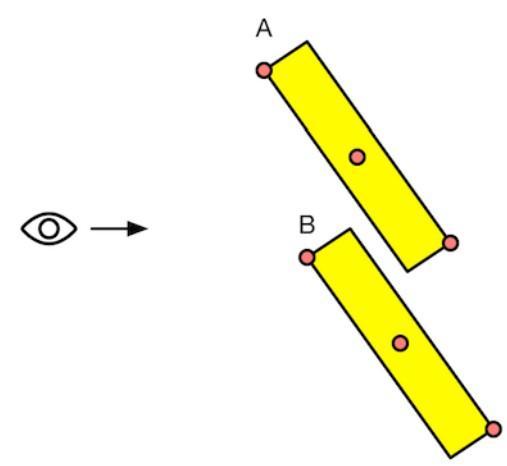

### 非透明物体渲染逻辑

对于非透明物体,我们主要依赖于强大的**深度缓冲**(depth buffer也称z-buffer)解决可见性问题.它决定哪个物体哪个部分会被渲染在前面,哪些部分会被其他物体遮挡.其基本思想是:当渲染一个片元时,将它的深度值和已经**存在于深度缓冲的值**进行比较(如果开启了**深度测试**),如果它的值距离摄像进更远,说明这个片元被遮挡了,否则,这个片元会覆盖掉**颜色缓冲**中的像素值,并把它的深度值更新到**深度缓冲**(如果开启了**深度测试**)

**深度缓冲**可以不用关心不透明物体的渲染顺序,例如A挡住B,即便我们选渲染A,再渲染B,也不用担心B会遮盖掉A,因为进行**深度测试**时会判断出B距离摄像机更远,就不会写入到颜色缓冲中.

### 透明物体渲染

如果想要实现透明效果,就需要在透明度混合时,关闭**深度写入(**ZWrite).事情就不像非透明物体渲染那么简单了.

实现透明效果方式有两种,一种是透明度测试(Alpha Test),一种是透明度混合(Alpha Blending).

* **透明度测试**:该方案无需关闭深度写入,其原理是当片元透明度小于某个设定阈值,就会被舍弃,而在阈值范围内的片元就当做不透明物体处理(准确来说应该叫裁剪,如一片叶片纹理,需要裁剪掉方形纹理图上非叶片的部分)

* **透明度混合**:此方案需要关闭**深度写入**,能得到真正半透明效果,它会用片元透明度作为混合因子,与颜色缓冲中的颜色值进行混合.需要注意的是,方案并没有关闭**深度测试**,当该片元深度值离摄像机比其他非透明片元更远时,就不混进行色彩混合.(也就是说,深度缓冲对透明度混合是只读的)

### 透明的渲染顺序

首先,我们为什么要关闭**深度写入**?如果不关闭,一个半透明物体,先进行了测试,将深度值写入了深度缓冲,之后又深度测试了另一个离摄像机更远的非透明物体,那么其片元就会被剔除.也就是一个非透明物体,会被一个半透明物体遮挡.而实际应该是我们可以透过半透明物体看到后面的物体.

但关闭深入写入后,就破坏了深度缓冲的工作机制,这是非常糟糕的事情.

**关闭深度写入,将使得渲染顺序变得非常重要**

现在假设有半透明物体A与不透明物体B,对于摄像机方向,A挡在B前面;

* 假设先渲染B,再渲染A,由于B开启了**深度写入和深度测试**,假设此时深度缓冲没有任何数据,因此B会经过深度测试后写入深度缓冲和颜色缓冲.随后渲染A,经过深度测试发现A距离摄像机更近(不会写入深度缓冲),此时我们使用A的透明度与颜色缓冲中的色彩进行混合,得到正确半透明效果;

* 假设先渲染A,深度测试时深度缓冲没有任何数据,A写入颜色缓冲.再渲染B时,B发现深度缓冲也没有数据,随后进行深度写入和颜色缓冲写入,结果就是B直接覆盖了A,得到错误的覆盖效果.

如果A,B都是半透明物体,同样也如此,因为A对B混合,跟B对A混合,因为两者相互覆盖的半透明混合效果是不一样的.

因此,渲染引擎一般会**先对物体进行排序,再进行渲染**,一般步骤为:

1. 先渲染所有不透明物体(**开启深度测试和深度写入**);
2. 再将半透明物体按离摄像机距离进行排序,再由远及近渲染(**开启深度测试,关闭深度写入**);

但要注意,这里是**对物体进行的排序**,并非片元逐像素级别的,假设物体存在相互重叠的情况,将无法得到正确的结果:



一般这时候,我们通常会把物体拆分在进行正确排序,但仍然存在其他问题;



我们知道,一个物体是由顶点网格构成的,每个顶点深度值不同,我们应该选择哪个点的深度值作为物体深度值参与排序呢?是网格中点还是近点或远点?实际上,在上图情况下无论选择哪种判断方式,都会得到错误的的结果.无论按照远点还是近点作为判定,A都会认为是在前面,而实际上A的一部分是被B遮挡的;

但一般情况下,上述方案是足够有效且容易实现的.我们还可以通过其他方法,如让模型是凸面体,将复杂模型拆分等,减少排序错误,就算些许错误也不会表现很糟糕.这大概就是技术的妥协吧...

---

### UnityShader的渲染顺序

unity为了解决渲染顺序问题,提供了**渲染队列(RenderQueue)**这一方案,在内部使用了一系列整数索引表示每个渲染队列,索引号越小表示越早被渲染.

|        名称        | 索引 |                             描述                             |
| :----------------: | :--: | :----------------------------------------------------------: |
|     Background     | 1000 |    此渲染队列在任何其他渲染队列之前渲染。通常渲染背景物体    |
|      Geometry      | 2000 |                   不透明几何体使用此队列。                   |
|     AlphaTest      | 2450 |            经过 Alpha 测试的几何体将使用此队列。             |
| GeometryLast(新增) |      |                视为“不透明”的最后的渲染队列。                |
|    Transparent     | 3000 | 此渲染队列在 Geometry 和 AlphaTest 之后渲染，按照从后到前的顺序。 |
|      Overlay       | 4000 |                 此渲染队列旨在获得覆盖效果。                 |

用SuberShader的Queue标签来决定我们的渲染队列

```
SubShader {
		Tags {"Queue"="AlphaTest" }
		Pass{
		ZWrite Off // 关闭深度写入(用于透明度混合)
		...
		}
```

ZWrite Off 也可以写在subShader中,这样会影响所有Pass

