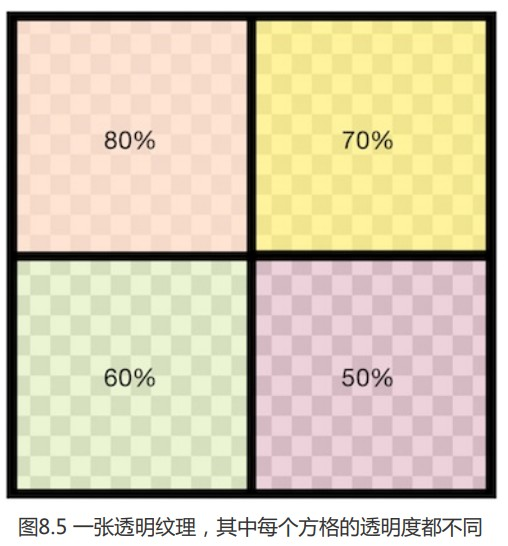
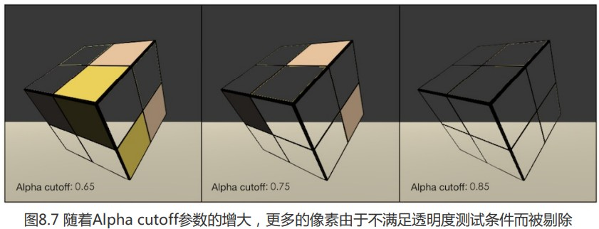

### 透明度测试

我们已经知道了其原理很简单,只要不在设定透明度阈值范围的片元透明度都将被舍弃;符合阈值范围的按照不透明物体处理;

我们使用cg函数clip(接受float-float4作为参数)进行透明度测试,功能是如果给定一个分量为负数,就会舍弃当前像素

```
// Alpha test
				clip (texColor.a - _Cutoff);
				// 等价于
//				if ((texColor.a - _Cutoff) < 0.0) {
//					discard;
//				}
```



使用如图纹理来测试透明度测试的效果



可以看到在阈值范围内的部分直接被裁剪(挖空)了

```
// Upgrade NOTE: replaced '_Object2World' with 'unity_ObjectToWorld'
// Upgrade NOTE: replaced 'mul(UNITY_MATRIX_MVP,*)' with 'UnityObjectToClipPos(*)'

Shader "Unity Shaders Book/Chapter 8/Alpha Test" {
	Properties {
		_Color ("Color Tint", Color) = (1, 1, 1, 1)
		_MainTex ("Main Tex", 2D) = "white" {}
		_Cutoff ("Alpha Cutoff", Range(0, 1)) = 0.5//定义了透明度测试的阈值
	}
	SubShader {
		Tags {"Queue"="AlphaTest" "IgnoreProjector"="True" "RenderType"="TransparentCutout"}//添加渲染队列(透明度测试)标签,不受投影器影响("IgnoreProjector"="True")
		
		Pass {
			Tags { "LightMode"="ForwardBase" }//定义该Pass在光照流水线中的角色
			
			CGPROGRAM
			
			#pragma vertex vert
			#pragma fragment frag
			
			#include "Lighting.cginc"
			
			fixed4 _Color;
			sampler2D _MainTex;
			float4 _MainTex_ST;
			fixed _Cutoff;
			
			struct a2v {
				float4 vertex : POSITION;
				float3 normal : NORMAL;
				float4 texcoord : TEXCOORD0;
			};
			
			struct v2f {
				float4 pos : SV_POSITION;
				float3 worldNormal : TEXCOORD0;
				float3 worldPos : TEXCOORD1;
				float2 uv : TEXCOORD2;
			};
			
			v2f vert(a2v v) {
				v2f o;
				o.pos = UnityObjectToClipPos(v.vertex);
				
				o.worldNormal = UnityObjectToWorldNormal(v.normal);
				
				o.worldPos = mul(unity_ObjectToWorld, v.vertex).xyz;
				
				o.uv = TRANSFORM_TEX(v.texcoord, _MainTex);
				
				return o;
			}
			
			fixed4 frag(v2f i) : SV_Target {
				fixed3 worldNormal = normalize(i.worldNormal);
				fixed3 worldLightDir = normalize(UnityWorldSpaceLightDir(i.worldPos));
				
				fixed4 texColor = tex2D(_MainTex, i.uv);
				
				// Alpha test
				clip (texColor.a - _Cutoff);//alpha值小于cutoff的直接丢弃
				// Equal to 
//				if ((texColor.a - _Cutoff) < 0.0) {
//					discard;//舍弃该片元输出,后面不在执行
//				}
				
				fixed3 albedo = texColor.rgb * _Color.rgb;
				
				fixed3 ambient = UNITY_LIGHTMODEL_AMBIENT.xyz * albedo;
				
				fixed3 diffuse = _LightColor0.rgb * albedo * max(0, dot(worldNormal, worldLightDir));
				
				return fixed4(ambient + diffuse, 1.0);
			}
			
			ENDCG
		}
	} 
	FallBack "Transparent/Cutout/VertexLit"
}

```

