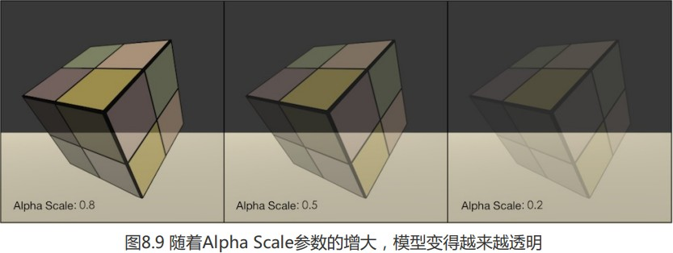
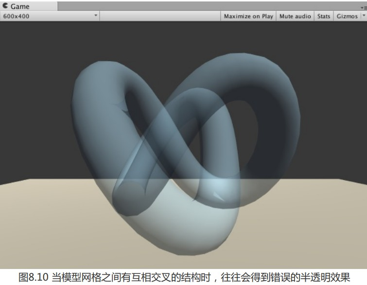
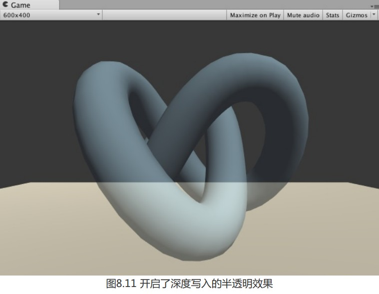

透明度混合运用当前片元的透明度作为混合因子,与颜色缓冲的颜色进行混合,得到真正的半透明效果.

但需要关闭深度写入,且必须小心处理物体的渲染顺序;

我们需要使用unity的混合命令-Blend来进行与颜色缓冲的混合.

| 语法                                                         | 示例                         | 功能                                                         |
| ------------------------------------------------------------ | ---------------------------- | ------------------------------------------------------------ |
| `Blend <state>`                                              | `Blend Off`                  | 禁用默认渲染目标的混合。这是默认值。                         |
| `Blend <render target> <state>`                              | `Blend 1 Off`                | 如上，但针对给定的渲染目标。(1)                              |
| `Blend <source factor> <destination factor>`                 | `Blend One Zero`             | 启用默认渲染目标的混合。设置 RGBA 值的混合系数。             |
| `Blend <render target> <source factor> <destination factor>` | `Blend 1 One Zero`           | 如上，但针对给定的渲染目标。(1)                              |
| `Blend <source factor RGB> <destination factor RGB>, <source factor alpha> <destination factor alpha>` | `Blend One Zero, Zero One`   | 启用默认渲染目标的混合。为 RGB 和 Alpha 值设置单独的混合系数。(2) |
| `Blend <render target> <source factor RGB> <destination factor RGB>, <source factor alpha> <destination factor alpha>` | `Blend 1 One Zero, Zero One` | 如上，但针对给定的渲染目标。(1) (2)                          |

这里我们需要使用`Blend <source factor> <destination factor>`语义来进行混合,且此命令在设置混合因子的同时也会自动开启混合模式,**source factor**代表源颜色混合因子,我们将其设置为ScrAlpha,**destination factor**则是目标颜色混合因子,我们将其设为OneMinusSrcAlpha,计算公式为:
$$
DstColor_{new}=ScrAlpha\times SrcColor+(1-SrcAlpha)\times DstColor_{old}
$$
当然这只是其中一个语法,后面我们会展示其他混合语法.

---

### 实现代码

```
// Upgrade NOTE: replaced '_Object2World' with 'unity_ObjectToWorld'
// Upgrade NOTE: replaced 'mul(UNITY_MATRIX_MVP,*)' with 'UnityObjectToClipPos(*)'

Shader "Unity Shaders Book/Chapter 8/Alpha Blend" {
	Properties {
		_Color ("Color Tint", Color) = (1, 1, 1, 1)
		_MainTex ("Main Tex", 2D) = "white" {}
		_AlphaScale ("Alpha Scale", Range(0, 1)) = 1//用于控制整体透明度
	}
	SubShader {
		Tags {"Queue"="Transparent" "IgnoreProjector"="True" "RenderType"="Transparent"}//通常使用透明度混合都需要这三个标签:设置渲染队列为Transparent(透明度混合需要在此渲染队列);忽略投影器影响;RenderType用于将此Shader归入提前定义的组(这里是Transparent组)
		
		Pass {
			Tags { "LightMode"="ForwardBase" }

			ZWrite Off//关闭深度写入
			Blend SrcAlpha OneMinusSrcAlpha//设置该Pass混合模式,得到合适的半透明效果
			
			CGPROGRAM
			
			#pragma vertex vert
			#pragma fragment frag
			
			#include "Lighting.cginc"
			
			fixed4 _Color;
			sampler2D _MainTex;
			float4 _MainTex_ST;
			fixed _AlphaScale;
			
			struct a2v {
				float4 vertex : POSITION;
				float3 normal : NORMAL;
				float4 texcoord : TEXCOORD0;
			};
			
			struct v2f {
				float4 pos : SV_POSITION;
				float3 worldNormal : TEXCOORD0;
				float3 worldPos : TEXCOORD1;
				float2 uv : TEXCOORD2;
			};
			
			v2f vert(a2v v) {
				v2f o;
				o.pos = UnityObjectToClipPos(v.vertex);
				
				o.worldNormal = UnityObjectToWorldNormal(v.normal);
				
				o.worldPos = mul(unity_ObjectToWorld, v.vertex).xyz;
				
				o.uv = TRANSFORM_TEX(v.texcoord, _MainTex);
				
				return o;
			}
			
			fixed4 frag(v2f i) : SV_Target {
				fixed3 worldNormal = normalize(i.worldNormal);
				fixed3 worldLightDir = normalize(UnityWorldSpaceLightDir(i.worldPos));
				
				fixed4 texColor = tex2D(_MainTex, i.uv);
				
				fixed3 albedo = texColor.rgb * _Color.rgb;
				
				fixed3 ambient = UNITY_LIGHTMODEL_AMBIENT.xyz * albedo;
				
				fixed3 diffuse = _LightColor0.rgb * albedo * max(0, dot(worldNormal, worldLightDir));
				
				return fixed4(ambient + diffuse, texColor.a * _AlphaScale);//增加了透明通道(注意只有Blend命令打开透明混合后才有意义)
			}
			
			ENDCG
		}
	} 
	FallBack "Transparent/VertexLit"
}

```

---



---

### 开启深度写入的半透明效果

由于关闭了深度写入,我们无法对模型进行像素级别的深度排序,对于一些本身有比较复杂遮挡关系(包含了复杂的非凸网格)的模型,就会因为排序错误产生错误的透明效果,比如下面的Knot模型:



为此我们使用两个Pass来渲染模型,第一个Pass开启深度写入,但不输出颜色;第二个Pass进行透明度混合;这样就能得到逐像素的正确深度信息,并按像素级别的深度排序进行透明渲染;缺点是多个Pass会对性能造成影响.



如上图,该方法虽然得到了正确的遮挡关系,保留了与它后面背景的混合效果,但模型内部之间不会有任何真正的半透明效果

### 实现代码

与之前的透明混合实现基本相同,只是新增了一个深度写入Pass

```


Shader "Unity Shaders Book/Chapter 8/Alpha Blending With ZWrite" {
	Properties {
		_Color ("Color Tint", Color) = (1, 1, 1, 1)
		_MainTex ("Main Tex", 2D) = "white" {}
		_AlphaScale ("Alpha Scale", Range(0, 1)) = 1
	}
	SubShader {
		Tags {"Queue"="Transparent" "IgnoreProjector"="True" "RenderType"="Transparent"}
		
		// Extra pass that renders to depth buffer only
		Pass {//新增Pass将深度信息写入深度缓冲中
			ZWrite On
			ColorMask 0//设置颜色通道写掩码(可以阻止RGBA任意组合的颜色通道的输出),设为0表示该Pass不写入任何颜色通道,即不输出颜色
		}
		
		Pass {
			Tags { "LightMode"="ForwardBase" }
			
			ZWrite Off
			Blend SrcAlpha OneMinusSrcAlpha
			
			CGPROGRAM
			
			#pragma vertex vert
			#pragma fragment frag
			
			#include "Lighting.cginc"
			
			fixed4 _Color;
			sampler2D _MainTex;
			float4 _MainTex_ST;
			fixed _AlphaScale;
			
			struct a2v {
				float4 vertex : POSITION;
				float3 normal : NORMAL;
				float4 texcoord : TEXCOORD0;
			};
			
			struct v2f {
				float4 pos : SV_POSITION;
				float3 worldNormal : TEXCOORD0;
				float3 worldPos : TEXCOORD1;
				float2 uv : TEXCOORD2;
			};
			
			v2f vert(a2v v) {
				v2f o;
				o.pos = UnityObjectToClipPos(v.vertex);
				
				o.worldNormal = UnityObjectToWorldNormal(v.normal);
				
				o.worldPos = mul(unity_ObjectToWorld, v.vertex).xyz;
				
				o.uv = TRANSFORM_TEX(v.texcoord, _MainTex);
				
				return o;
			}
			
			fixed4 frag(v2f i) : SV_Target {
				fixed3 worldNormal = normalize(i.worldNormal);
				fixed3 worldLightDir = normalize(UnityWorldSpaceLightDir(i.worldPos));
				
				fixed4 texColor = tex2D(_MainTex, i.uv);
				
				fixed3 albedo = texColor.rgb * _Color.rgb;
				
				fixed3 ambient = UNITY_LIGHTMODEL_AMBIENT.xyz * albedo;
				
				fixed3 diffuse = _LightColor0.rgb * albedo * max(0, dot(worldNormal, worldLightDir));
				
				return fixed4(ambient + diffuse, texColor.a * _AlphaScale);
			}
			
			ENDCG
		}
	} 
	FallBack "Transparent/VertexLit"
}
```

