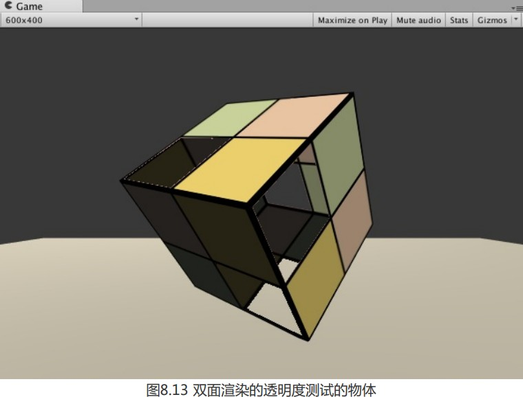
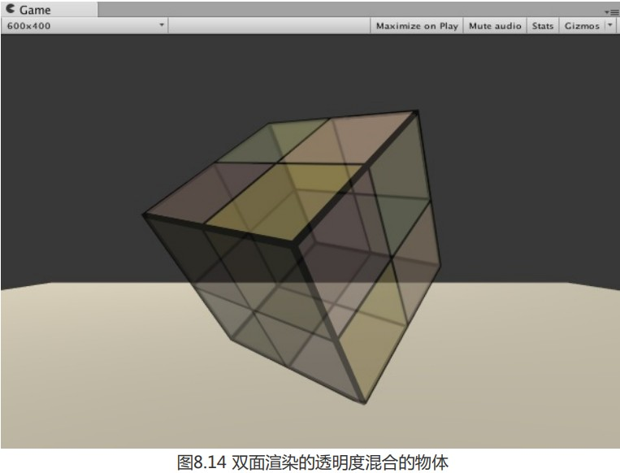

现实中,如果一个物体是透明的,我们不仅能透过它看到其他物体,还能看到他内部结构.但之前的效果,无论是透明度测试还是透明度混合,都无法看到其内部.这是因为默认情况下渲染引擎提出了物体背面(相对于摄像机方向)的渲染图元.我们需要使用**Cull**指令来控制需要剔除那个面的渲染图元:

Cull Back|Front|Off

设置Back,那么剔除背面的图元,Front则剔除前面的图元,Off表示关闭剔除,双面所有图元都会被渲染.

---

### 透明度测试的双面渲染 

我们对之前Alpha测试的案例进行修改,只添加一行代码 :

```
Pass{
	Tags{...}
	Cull Off
}
```

这样我们就能透过镂空区域看到内部



---

### 透明度混合的双面渲染

由于关闭了深度写入,我们无法逐像素排序渲染顺序,也就无法保证物体正面和背面的渲染顺序;

为此,我们将双面渲染分成两个Pass,第一个Pass渲染背面,第二个Pass渲染正面,因为Pass是顺序执行的,这样我们就总能保证背面在正面之前渲染了,从而保证了正确的深度渲染关系.

```
// Upgrade NOTE: replaced '_Object2World' with 'unity_ObjectToWorld'
// Upgrade NOTE: replaced 'mul(UNITY_MATRIX_MVP,*)' with 'UnityObjectToClipPos(*)'

Shader "Unity Shaders Book/Chapter 8/Alpha Blend With Both Side" {
	Properties {
		_Color ("Color Tint", Color) = (1, 1, 1, 1)
		_MainTex ("Main Tex", 2D) = "white" {}
		_AlphaScale ("Alpha Scale", Range(0, 1)) = 1
	}
	SubShader {
		Tags {"Queue"="Transparent" "IgnoreProjector"="True" "RenderType"="Transparent"}
		
		Pass {
			Tags { "LightMode"="ForwardBase" }
			
			// First pass renders only back faces 
			Cull Front
			
			ZWrite Off
			Blend SrcAlpha OneMinusSrcAlpha
			
			CGPROGRAM
			
			#pragma vertex vert
			#pragma fragment frag
			
			#include "Lighting.cginc"
			
			fixed4 _Color;
			sampler2D _MainTex;
			float4 _MainTex_ST;
			fixed _AlphaScale;
			
			struct a2v {
				float4 vertex : POSITION;
				float3 normal : NORMAL;
				float4 texcoord : TEXCOORD0;
			};
			
			struct v2f {
				float4 pos : SV_POSITION;
				float3 worldNormal : TEXCOORD0;
				float3 worldPos : TEXCOORD1;
				float2 uv : TEXCOORD2;
			};
			
			v2f vert(a2v v) {
				v2f o;
				o.pos = UnityObjectToClipPos(v.vertex);
				
				o.worldNormal = UnityObjectToWorldNormal(v.normal);
				
				o.worldPos = mul(unity_ObjectToWorld, v.vertex).xyz;
				
				o.uv = TRANSFORM_TEX(v.texcoord, _MainTex);
				
				return o;
			}
			
			fixed4 frag(v2f i) : SV_Target {
				fixed3 worldNormal = normalize(i.worldNormal);
				fixed3 worldLightDir = normalize(UnityWorldSpaceLightDir(i.worldPos));
				
				fixed4 texColor = tex2D(_MainTex, i.uv);
				
				fixed3 albedo = texColor.rgb * _Color.rgb;
				
				fixed3 ambient = UNITY_LIGHTMODEL_AMBIENT.xyz * albedo;
				
				fixed3 diffuse = _LightColor0.rgb * albedo * max(0, dot(worldNormal, worldLightDir));
				
				return fixed4(ambient + diffuse, texColor.a * _AlphaScale);
			}
			
			ENDCG
		}
		
		Pass {
			Tags { "LightMode"="ForwardBase" }
			
			// Second pass renders only front faces 
			Cull Back
			
			ZWrite Off
			Blend SrcAlpha OneMinusSrcAlpha
			
			CGPROGRAM
			
			#pragma vertex vert
			#pragma fragment frag
			
			#include "Lighting.cginc"
			
			fixed4 _Color;
			sampler2D _MainTex;
			float4 _MainTex_ST;
			fixed _AlphaScale;
			
			struct a2v {
				float4 vertex : POSITION;
				float3 normal : NORMAL;
				float4 texcoord : TEXCOORD0;
			};
			
			struct v2f {
				float4 pos : SV_POSITION;
				float3 worldNormal : TEXCOORD0;
				float3 worldPos : TEXCOORD1;
				float2 uv : TEXCOORD2;
			};
			
			v2f vert(a2v v) {
				v2f o;
				o.pos = UnityObjectToClipPos(v.vertex);
				
				o.worldNormal = UnityObjectToWorldNormal(v.normal);
				
				o.worldPos = mul(unity_ObjectToWorld, v.vertex).xyz;
				
				o.uv = TRANSFORM_TEX(v.texcoord, _MainTex);
				
				return o;
			}
			
			fixed4 frag(v2f i) : SV_Target {
				fixed3 worldNormal = normalize(i.worldNormal);
				fixed3 worldLightDir = normalize(UnityWorldSpaceLightDir(i.worldPos));
				
				fixed4 texColor = tex2D(_MainTex, i.uv);
				
				fixed3 albedo = texColor.rgb * _Color.rgb;
				
				fixed3 ambient = UNITY_LIGHTMODEL_AMBIENT.xyz * albedo;
				
				fixed3 diffuse = _LightColor0.rgb * albedo * max(0, dot(worldNormal, worldLightDir));
				
				return fixed4(ambient + diffuse, texColor.a * _AlphaScale);
			}
			
			ENDCG
		}
	} 
	FallBack "Transparent/VertexLit"
}
```

