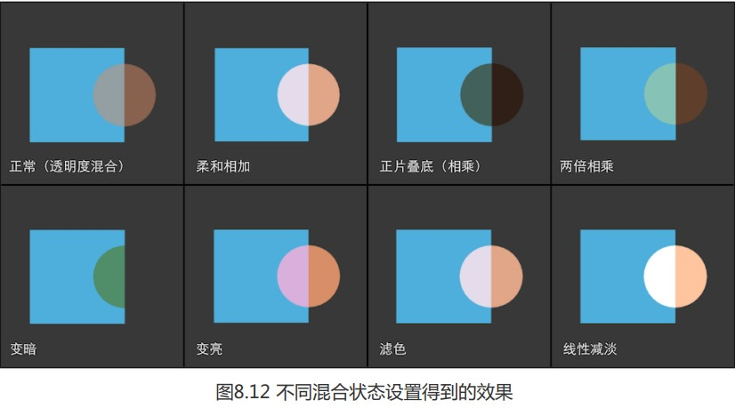

混合与两个参数有关:

* 源颜色(SourceColor),指片元产生的颜色,我们用S表示
* 目标颜色(DestinationColor),指颜色缓冲读取的颜色,我们用D表示.

对其混合后得到输出颜色,用O表示;

unity中,当我们使用Blend命令后,便自动开启了混合(Blend Off除外).

| 语法                                                         | 示例                         | 功能                                                         |
| ------------------------------------------------------------ | ---------------------------- | ------------------------------------------------------------ |
| `Blend <state>`                                              | `Blend Off`                  | 禁用默认渲染目标的混合。这是默认值。                         |
| `Blend <render target> <state>`                              | `Blend 1 Off`                | 如上，但针对给定的渲染目标。(1)                              |
| `Blend <source factor> <destination factor>`                 | `Blend One Zero`             | 启用默认渲染目标的混合。设置 RGBA 值的混合系数。             |
| `Blend <render target> <source factor> <destination factor>` | `Blend 1 One Zero`           | 如上，但针对给定的渲染目标。(1)                              |
| `Blend <source factor RGB> <destination factor RGB>, <source factor alpha> <destination factor alpha>` | `Blend One Zero, Zero One`   | 启用默认渲染目标的混合。为 RGB 和 Alpha 值设置单独的混合系数。(2) |
| `Blend <render target> <source factor RGB> <destination factor RGB>, <source factor alpha> <destination factor alpha>` | `Blend 1 One Zero, Zero One` | 如上，但针对给定的渲染目标。(1) (2)                          |

这只混合因子的命令主要是`Blend <source factor> <destination factor>`与`Blend <source factor RGB> <destination factor RGB>, <source factor alpha> <destination factor alpha>`两种,第一个命令提供两个因子,意味着使用同样的因子混合RGB通道和A通道,如在他们进行加法混合时(默认状态,混合操作都为加法操作),公式如下:
$$
O_{rgb}=SrcFactor\times S_{rgb}+DstFactor\times D_{rgb}\\
O_{A}=SrcFactor\times S_{a}+DstFactor\times D_{a}
$$
而第二种命令,有四个因子,就可以使用不同的参数混合A通道:
$$
O_{rgb}=SrcFactor_{rgb}\times S_{rgb}+DstFactor_{rgb}\times D_{rgb}\\
O_{A}=SrcFactor_{a}\times S_{a}+DstFactor_{a}\times D_{a}
$$
Blend的混合因子如下:

| 参数               | 描述                                                         |
| :----------------- | :----------------------------------------------------------- |
| `One`              | 此输入的值是 one。该值用于使用源或目标的颜色的值。           |
| `Zero`             | 此输入的值是 zero。该值用于删除源或目标值。                  |
| `SrcColor`         | GPU 将输入的值乘以源颜色值。(当输入为$S_{rgb}$时,使用$S_{rgb}$作为混合因子,当输入为$S_a$时,使用$S_a$作为混合因子) |
| `SrcAlpha`         | GPU 将输入的值乘以源 Alpha 值。                              |
| `SrcAlphaSaturate` | The GPU multiplies the value of this input by the minimum value of `source alpha` and `(1 - destination alpha)` |
| `DstColor`         | GPU 将输入的值乘以帧缓冲区的源颜色值。                       |
| `DstAlpha`         | GPU 将输入的值乘以帧缓冲区的源 Alpha 值。                    |
| `OneMinusSrcColor` | GPU 将输入的值乘以（1 - 源颜色）。                           |
| `OneMinusSrcAlpha` | GPU 将输入的值乘以（1 - 源 Alpha）。                         |
| `OneMinusDstColor` | GPU 将输入的值乘以（1 - 目标颜色）。                         |
| `OneMinusDstAlpha` | GPU 将输入的值乘以（1 - 目标 Alpha）。                       |

### 例子 

当我们想要混合后,输出颜色的透明度值就是源颜色的透明度,就使用如下命令:

Blend ScrAlpha OneMinusSrcAlpha,One Zero,计算公式(默认混合操作加法)为:
$$
O_{rgb}=S_{a}\times S_{rgb}+(1-S_{a})\times D_{rgb}\\
O_{A}=1\times S_{a}+0\times D_{a}
$$

---

### 混合操作

默认情况下,混合的计算都是把源颜色和目标颜色与他们对应的混合因子相乘后,再相加起来作为输出颜色.这是一个默认的操作.但除此之外,我们可以使用BlendOperation命令,即混合操作命令,将其改为相减等,以下是支持的混合操作:

| 操作         | 说明                                                         |
| ------------ | ------------------------------------------------------------ |
| **Add**      | 将源和目标相加。                                             |
| **Sub**      | 从源减去目标。($SrcFactor\times S_{rgb}-DstFactor\times D_{rgb}$) |
| **RevSub**   | 从目标减去源。($DstFactor\times D_{rgb}-SrcFactor\times S_{rgb}$) |
| **Min**      | 使用源和目标中的较小者。(RGBA各通道逐分量比较,取最小值,没有混合因子参与) |
| **Max**      | 使用源和目标中的较大者。(RGBA各通道逐分量比较,取最大值,没有混合因子参与) |
| 其他逻辑操作 | 仅在dx11.1支持,详情请参考文档                                |

### 一些常用混合组合

通过混合操作和混合因子的组合命令,我们可以得到类似Photoshop混合模式中的混合效果:

```
// Normal,即透明度混合
//Blend SrcAlpha OneMinusSrcAlpha

// Soft Additive 柔和相加
//Blend OneMinusDstColor One

// Multiply 正片叠底
Blend DstColor Zero
	
// 2x Multiply 两倍相乘
//Blend DstColor SrcColor

// Darken 变暗
//BlendOp Min
//Blend One One	// When using Min operation, these factors are ignored

//Lighten 变亮
//BlendOp Max
//Blend One One // When using Max operation, these factors are ignored
		
//Screen 滤色
//Blend OneMinusDstColor One
// Or
//Blend One OneMinusSrcColor

// Linear Dodge 线性减淡
Blend One One
```

