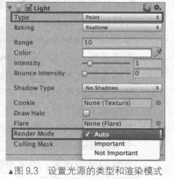
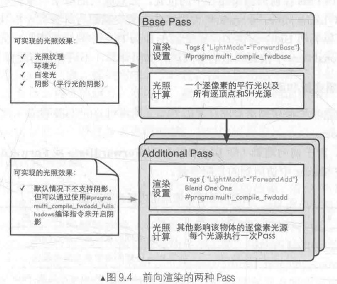

渲染路径(RenderingPath)决定了光照是如何应用到UnityShader中的,为此,我们需要为每个Pass指定它使用的渲染路径,这样光源和处理后的光照信息才会放在对应内置变量中，该Shader的光照计算才能被正确执行.

渲染路径主要有三种:前向渲染路径(Forward Rendering Path)、延迟渲染路径(Deferred Rendering Path)和顶点照明渲染路径(Vertex LitRendering Path)。其中顶点渲染已经被抛弃

大多数情况下，一个项目只使用一种渲染路径，我们可以通3过在 Unity的Edit→ProjectSettings→Player→Other Settings→ RenderingPath中选择项目所需的渲染路径,为整个项目设置渲染时的渲染路径。

有时,我们希望使用多个渲染路径(大量光照场景下,部分半透明物体如水体需要向前渲染,而其余非透明物体用延迟渲染节省性能),例如摄像机A渲染的物体使用前向渲染路径,而摄像机B渲染的物体使用延迟渲染路径。这时,我们可以在每个摄像机的渲染路径设置中设置该摄像机使用的渲染路径,以覆盖Project Settings中的设置。

注意,如果摄像机渲染设置选择了Use Player Settings,那么这个摄像机会使用Project Settings 中的设置;否则就会覆盖掉Project Settings中的设置。如果当前的显卡并不支持所选择的渲染路径,Unity会自动使用更低一级的渲染路径。例如,如果一个GPU不支持延迟渲染,那么Unity 就会使用前向渲染。

完成了上面的设置后,我们就可以在每个Pass中使用标签来指定该Pass使用的渲染路径。这是通过设置Pass的LightMode标签实现的。

```
Pass{
	Tags {"LightMode"="ForwardBase"}
...
```

上面的代码将告诉Unity,该Pass使用前向渲染路径中的ForwardBase路径。而前向渲染路径还有一种路径叫做ForwardAdd.

|             标签             | 描述                                                         |
| :--------------------------: | ------------------------------------------------------------ |
|            Always            | 不管使用哪种渲染路径,该Pass总是会被渲染,但不会计算任何光照   |
|         ForwardBase          | 用于前向渲染。该Pass会计算环境光、最重要的平行光、逐顶点/SH光源和Lightmaps |
|          ForwardAdd          | 用于前向渲染。该Pass会计算额外的逐像素光源,每个Pass对应一个光源 |
|           Deferred           | 用于延迟渲染。该Pass会渲染G缓冲(G-buffer)                    |
|         ShadowCaster         | 把物体的深度信息渲染到阴影映射纹理(shadowmap)或一张深度纹理中 |
|         PrepassBase          | 用于遗留的延迟渲染。该Pass会渲染法线和高光反射的指数部分     |
|         PrepassFinal         | 用于遗留的延迟渲染。该Pass通过合并纹理、光照和自发光来渲染得到最后的颜色 |
| Vertex,VertexLMRGBM,VertexLM | 用于遗留的顶点照明渲染                                       |

当一个Pass设置好渲染路径标签后,Unity会根据设置将需要的数据放入对应的内置光照变量中,后续才能通过这些变量获取正确的光照数据进行计算,从而得到正确的渲染结果

---

### 向前渲染路径

1. 向前渲染原理 

    前向渲染路径是传统的渲染方式,每进行一次完整的前向渲染,我们需要渲染该对象的渲染图元,并计算两个缓冲区的信息:一个是颜色缓冲区,一个是深度缓冲区。我们利用深度缓冲来决定一个片元是否可见,如果可见就更新颜色缓冲区中的颜色值。下面是这一过程的伪代码:

```
Pass {
	for (each primitive in this model) {
		for (each fragment covered by this primitive) {
			if (failed in depth test) {
			//如果没有通过深度测试,说明该片元是不可见的
				discard;
			} else {
					// 如果该片元可见
					// 就进行光照计算
					float4 color = Shading (materialInfo, pos, normal, lightDir, viewDir);
					// 更新帧缓冲
					writeFrameBuffer (fragment, color);
			}
		}
 }
```

对于每个逐像素光源,我们都需要进行上面一次完整的渲染流程。如果一个物体在多个逐像 素光源的影响区域内,那么该物体就需要执行多个 Pass,每个 Pass 计算一个逐像素光源的光照结 果,然后在帧缓冲中把这些光照结果混合起来得到最终的颜色值。假设,场景中有N个物体,每 个物体受 M个光源的影响,那么要渲染整个场景一共需要N*M个 Pass。可以看出,如果有大量 逐像素光照,那么需要执行的 Pass 数目也会很大。

2. unity中的向前渲染

   一个Pass 不仅仅可以用来计算逐像素光照,它也可以用来计算逐顶点等其他光照。 这取决于光照计算所处流水线阶段以及计算时使用的数学模型。当我们渲染一个物体时,Unity 会计算哪些光源照亮了它,以及这些光源照亮该物体的方式。

   在 Unity 中,前向渲染路径有3种处理光照(即照亮物体)的方式:**逐顶点处理**、**逐像素处理**,**球谐函数(Spherical Harmonics, SH)处理**。而决定一个光源使用哪种处理模式取决于它的类型和渲染模式。**光源类型**指的是该光源是平行光还是其他类型的光源,而**光源的渲染模式**指的 是该光源是否是重要的(Important)。如果我们把一个光照的模式设置为 Important,意味着我们告诉Unity,他很重要,把它当成一个逐像素光源来处理.



在前向渲染中,当我们渲染一个物体时,Unity 会根据场景中各个光源的设置以及这些光源对物体的影响程度(如,距离该物体的远近、光源强度等)对这些光源进行一个重要度排序。其中,一定数目的光源会按逐像素的方式处理, 然后最多有4个光源按逐顶点的方式处理,剩下的光源可以按SH方式处理。Unity使用的判断规则如下:

* 场景中最亮的平行光总是按逐像素处理的。
* 渲染模式被设置成 Not Important 的光源,会按逐顶点或者SH处理。
* 渲染模式被设置成 Important 的光源,会按逐像素处理。
* 如果根据以上规则得到的逐像素光源数量小于Quality Setting中的逐像素光源数量(Pixel Light Count),会有更多的光源以逐像素的方式进行渲染。

我们需要在两种Pass中计算光照,Base Pass 和 Additional Pass,其标签和渲染设置如图:



其中有几点需要说明的:

* 除了设置了 Pass 的标签外,还使用了**#pragma multi_compile_fwdbase** 和**#pragma multi_compile_fwdadd** 这样的编译指令。分别为Bass Pass 和 Additional Pass 使用这两个编译指令,我们才可以在相关的 Pass 中得到一些正确 的光照变量,例如光照衰减值等。
* 旁边的注释给出了Base Pass 中支持的一些光照特性。例如在Base Pass 中,我 们可以访问光照纹理(lightmap)。
* ,而 Additional Pass 中渲染的光源在默认情况下是没有阴影效果的,即便我们在它的Light 组件中设置了 有阴影的 Shadow Type。但我们可以在 Additional Pass 中使用 #pragma multi_compile fwdadd_fullshadows 代替#pragma multi_compile_fwdadd 编译指令,为点光源和聚光灯开启 阴影效果,但这需要 Unity 在内部使用更多的 Shader 变种。
* 环境光和自发光也是在 Base Pass 中计算的。这是因为,对于一个物体来说,环境光和自 发光我们只希望计算一次即可.
* 在Additional Pass 的渲染设置中,我们还开启和设置了混合模式。这是因为,我们希望每个 Additional Pass 可以与上一次的光照结果在帧缓存中进行叠加,从而得到最终的有多个 光照的渲染效果。通常情况下,我们选择 的混合模式是 Blend One One.
* 对于前向渲染来说,一个 Unity Shader 通常会定义一个Base Pass(Base Pass 也可以定义 多次,例如需要双面渲染等情况)以及一个 Additional Pass。一个 Base Pass 仅会执行一 次(定义了多个 Base Pass 的情况除外),而一个 Additional Pass 会根据影响该物体的其他 逐像素光源的数目被多次调用,即每个逐像素光源会执行一次 Additional Pass。

上图给出的光照计算是通常情况下我们在每种 Pass 中进行的计算。实际上,渲染路径的设置用于告诉Unity该Pass在前向渲染路径中的位置,然后底层的渲染引擎会进行相关计算并填充一些内置变量(如 LightColor0 等),如何使用这些内置变量进行计算完全取决于开发者的选择。如,我们完全可以利用 Unity 提供的内置变量在 Base Pass 中只进行逐顶点光照;同样,我们也完全可以在 Additional Pass 中按逐顶点的方式进行光照计算,不进行任何逐像素光照计算。

3. 内置光照变量和函数

   前面说过,根据我们使用的渲染路径(即 Pass 标签中 LightMode 的值), Unity 会把不同的光 照变量传递给 Shader。

   对于前向渲染(即LightMode 为 ForwardBase 或 ForwardAdd)来说,

   下面给出了我们可以在Shader 中访问到的光照变量:

   |                          名称                          |   类型   |                             描述                             |
   | :----------------------------------------------------: | :------: | :----------------------------------------------------------: |
   |                      _LightColor0                      |  float4  |                该 Pass 处理的逐像素光源的颜色                |
   |                  _WorldSpaceLightPos0                  |  float4  | WorldSpaceLightPos0.xyz 是该 Pass 处理的逐像素光源的位置。如果该光源是平行光,那么_WorldSpaceLightPos0.w 是 0, 其他光源类型w值为1 |
   |                     _LightMatrix0                      | float4x4 | 从世界空间到光源空间的变换矩阵。可以用于采样 cookie 和光强衰减(attenuation)纹理 |
   | unity_4LightPosX0,unity_4LightPos Y0,unity_4LightPosZ0 |  float4  |   仅用于 Base Pass。前4个非重要的点光源在世界空间中的位置    |
   |                   unity_4LightAtten0                   |  float4  |    仅用于 Base Pass。存储了前4个非重要的点光源的衰减因子     |
   |                    unity_LightColor                    | half4[4] |      仅用于 Base Pass。存储了前4个非重要的点光源的颜色       |
   |                                                        |          |                                                              |

   前向渲染可以使用的内置光照函数:

|                  函数名                   |                             描述                             |
| :---------------------------------------: | :----------------------------------------------------------: |
|   float3 WorldSpaceLightDir (float4 v)    | 仅可用于前向渲染中。输入一个模型空间中的顶点位置,返回世界空间中从该点到光源的光照方向。内部实现使用了 UnityWorld SpaceLightDir 函数。没有被归一化 |
| float3 UnityWorldSpaceLightDir (float4 v) | 仅可用于前向渲染中。输入一个世界空间中的顶点位置,返回世界空间中从该点到光源的光照方向。没有被归一化 |
|   float3 ObjSpaceLightDir    (float4 v)   | 仅可用于前向渲染中。输入一个模型空间中的顶点位置,返回模型空间中从该点到光源的光照方向。没有被归一化 |
|      float3 Shade4PointLights (...)       | 仅可用于前向渲染中。计算四个点光源的光照,它的参数是已经打包进矢量的光照数 据,通常就是上表的内置变量,如 unity 4LightPosX0, unity 4LightPos Y0, unity_4LightPosZ0、unity_LightColor 和 unity_4LightAtten0 等。前向渲染通常会使用这个函数来计算逐顶点光照 |

上面给出的变量和函数并不是完整的,一些前向渲染可以使用的内置变量和函数官方文档中并没有给出说明。在后面使用到一些不在这些表中的变量和函数时,我们会特别说明。

---

### 顶点照明渲染路径

顶点照明渲染路径是对硬件配置要求最少、运算性能最高,但同时也是得到的效果最差的一 种类型,它不支持那些逐像素才能得到的效果,例如阴影、法线映射、高精度的高光反射等。实际上,它仅仅是前向渲染路径的一个子集,所有可以在顶点照明渲染路径中实现的功能都可以在前向渲染路径中完成。就如它的名字一样,顶点照明渲染路径只是使用了逐顶点的方式来计算光照。实际上,我们在上面的前向渲染路径中也可以计算一些 逐顶点的光源。但如果选择使用顶点照明渲染路径,那么Unity会只填充那些逐顶点相关的光源变量,意味着我们不可以使用一些逐像素光照变量。

... 忽略,使用时在学习

---

### 延迟渲染路径

当场景中包含大量实时光源时,前向渲染的性能会急速下降。我们就需要为区域内的每个物体执行多个 Pass 来计算不同光源对该物体的光照结果,然后在颜色缓存中把这些结果混合起来得到最终的光照。然而,每执行一个 Pass我们都需要 重新渲染一遍物体,但很多计算实际上是重复的。

延迟渲染是一种更古老的渲染方法,但由于上述前向渲染可能造成的瓶颈问题,近几年又流行起来。除了前向渲染中使用的颜色缓冲和深度缓冲外,延迟渲染还会利用额外的缓冲区,这些缓冲区也被统称为 G 缓冲(G-buffer),其中 G 是英文 Geometry 的缩写。G 缓冲区存储了我们所关心的表面(通常指的是离摄像机最近的表面)的其他信息,例如该表面的法线、位置、用于光照计算的材质属性等。

1. 延迟渲染原理

   延迟渲染主要包含了两个 Pass。在第一个 Pass 中,我们不进行任何光照计算,而是仅仅计算 哪些片元是可见的,这主要是通过深度缓冲技术来实现,当发现一个片元是可见的,我们就把它 的相关信息存储到G缓冲区中。然后,在第二个 Pass 中,我们利用 G 缓冲区的各个片元信息, 例如表面法线、视角方向、漫反射系数等,进行真正的光照计算。

   延迟渲染使用的 Pass 数目通常就是两个,这跟场景中包含的光源数目是没有关系的。换句话说,延迟渲染的效率不依赖于场景的复杂度,而是和我们使用的屏幕空间的大小有关。 这是因为,我们需要的信息都存储在缓冲区中,而这些缓冲区可以理解成是一张张2D 图像,我们的计算实际上就是在这些图像空间中进行的。

2. Unity 中的延迟渲染

   Unity 有两种延迟渲染路径,一种是遗留的延迟渲染路径,即Unity 5之前使用的延迟渲染路径,而另一种是 Unity5.x 中使用的延迟渲染路径。新旧延迟渲染路径之间的差别很小,只是使用了不同的技术来权衡不同的需求。例如,较旧版本的延迟渲染路径不支持 Unity 5 的基于物理的Standard Shader.以下我们仅讨论 Unity 5后使用的延迟渲染路径.

   对于延迟渲染路径来说,它最适合在场景中光源数目很多、如果使用前向渲染会造成性能瓶 颈的情况下使用。而且,延迟渲染路径中的每个光源都可以按逐像素的方式处理。但是,延迟渲染也有一些缺点。

* 不支持真正的抗锯齿(anti-aliasing) 功能。
* 不能处理半透明物体。
* 对显卡有一定要求。如果要使用延迟渲染的话,显卡必须支持 MRT (Multiple Render Targets)、Shader Mode 3.0 及以上、深度渲染纹理以及双面的模板缓冲。

当使用延迟渲染时,Unity 要求我们提供两个 Pass。

(1))第一个 Pass 用于渲染 G 缓冲。在这个 Pass 中,我们会把物体的漫反射颜色、高光反射 颜色、平滑度、法线、自发光和深度等信息渲染到屏幕空间的G缓冲区中。对于每个物体来说, 这个Pass 仅会执行一次。

(2))第二个 Pass 用于计算真正的光照模型。这个Pass 会使用上一个 Pass 中渲染的数据来计 算最终的光照颜色,再存储到帧缓冲中。

默认的G缓冲区(注意,不同 Unity 版本的渲染纹理存储内容会有所不同)包含了以下几个 渲染纹理(Render Texture,RT)。

* RT0:格式是ARGB32,RGB 通道用于存储漫反射颜色,A通道没有被使用。
* RT1:格式是ARGB32, RGB 通道用于存储高光反射颜色,A通道用于存储高光反射的指数部分。
* RT2:格式是ARGB2101010, RGB 通道用于存储法线,A通道没有被使用。
* RT3:格式是 ARGB32 (非HDR)或 ARGBHalf (HDR),用于存储自发光+lightmap+反射探针(reflection probes)。
* 深度缓冲和模板缓冲。

当在第二个 Pass 中计算光照时,默认情况下仅可以使用 Unity 內置的 Standard 光照模型。如 果我们想要使用其他的光照模型,就需要替换掉原有的 Internal-DeferredShading.shader 文件。更详细的信息可以访问官方文档(http://docs.unity3d.com/Manual/RenderTech-DeferredShading.html)。

3. 可访问的内置变量和函数

这里出了处理延迟渲染路径可以使用的光照变量。这些变量都可以在 UnityDeferredLibrary.cginc 文件中找到它们的声明。

|     名称      |   类型   |                             描述                             |
| :-----------: | :------: | :----------------------------------------------------------: |
|  _LightColor  |  float4  |                           光源颜色                           |
| _LightMatrix0 | float4x4 | 从世界空间到光源空间的变换矩阵。可以用于采样 cookie 和光强衰减纹理 |

---

###  选择哪种渲染路径

Unity 的官方文档(http://docs.unity3d.com/Manual/RenderingPaths.html)中给出了4种渲染路 径(前向渲染路径、延迟渲染路径、遗留的延迟渲染路径和顶点照明渲染路径)的详细比较,包 括它们的特性比较(是否支持逐像素光照、半透明物体、实时阴影等)、性能比较以及平台支持。 总体来说,我们需要根据游戏发布的目标平台来选择渲染路径。如果当前显卡不支持所选渲 染路径,那么 Unity 会自动使用比其低一级的渲染路径。