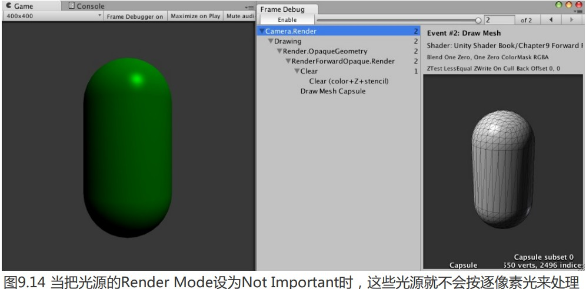

Unity一共支持4种光源类型:平行光、点光源、聚光灯和面光源(area light)。面光源仅在烘焙时才可发挥作用,因此不在本节讨论范围内。每种光源的几何定义不同,因此它们对应的光源属性也就各不相同。这就要求我们要区别对待它们。

最常使用的光源属性有光源的**位置、方向(更具体说就是,到某点的方向)、颜色、强度以及衰减**(更具体说就是,到某点的衰减,与该点到光源的距离有关)这5个属性。而这些属性和它们的几何定义息息相关。

1. 平行光

   它的几何定义是最简单的,因为它没有唯一的位置,也就是说,它可以放在场景中的任意位置.它的几何属性只有方向,且平行光到场景中 所有点的方向都是一样的,这也是平行光名字的由来。除此之外,由于平行光没有一个具体的位置,因此也没有衰减的概念,也就是说,光照强度不会随着距离而发生改变。

2. 点光源

   点光源的照亮空间则是有限的,它是由空间中的一个球体定义的。点光源可以表示由一个点发出的、向所有方向延伸的光.。它有位置属性的,它是由点光源的 Transform 组件中的Position 属性定义的。对于方向属性,我们需要用点光源的位置减去某点的位置来得到它到该点的方向。而点光源的颜色和强度可以在Light 组件面板中调整。同时,点光源也是会衰 减的,随着物体逐渐远离点光源,它接收到的光照强度也会逐渐减小。点光源球心处的光照强度最强,球体边界处的最弱,值为0。其中间的衰减值可以由一个函数定义。

3. 聚光灯

   聚光灯是这3种光源类型中最复杂的一种。它的照亮空间同样是有限的,但不再是简单的球体,而是由空间中的一块锥形区域定义的。聚光灯可以用于表示由一个特定位置出发、向特定方向延伸的光。这块锥形区域的半径由面板中的 Range 属性决定,而锥体的张开角度由 Spot Angle 属性决定。聚光灯的位置同样是由 Transform 组件中的 Position 属性定义的。对于方向属性,我们需要用聚光灯的位置减去某点的位置来得到它到该点的方向。聚光灯的衰减也是随着物体逐渐远离点光源而逐渐减小,在锥形的顶点处光照强度最强,在锥形的边界处强度为0. 其中间的衰减值可以由一个函数定义,这个函数相对于点光源衰减计算公式要更加复杂,因为我们需要判断一个点是否在锥体的范围内。

### 向前渲染中处理不同光源类型

1. 实践

​	我们来看一下如何在 Unity Shader 中访问它们的5个属性: **位置、方向、颜色、强度以及衰减**。

​	需要注意下面代码只为讲解处理其他类型光源的实际原理,并不会真正运用到项目中:

```
// Upgrade NOTE: replaced '_LightMatrix0' with 'unity_WorldToLight'
// Upgrade NOTE: replaced '_Object2World' with 'unity_ObjectToWorld'
// Upgrade NOTE: replaced 'mul(UNITY_MATRIX_MVP,*)' with 'UnityObjectToClipPos(*)'

Shader "Unity Shaders Book/Chapter 9/Forward Rendering" {
	Properties {
		_Diffuse ("Diffuse", Color) = (1, 1, 1, 1)
		_Specular ("Specular", Color) = (1, 1, 1, 1)
		_Gloss ("Gloss", Range(8.0, 256)) = 20
	}
	SubShader {
		Tags { "RenderType"="Opaque" }
		
		Pass {//Base Pass 计算渲染环境光和平行光
			// Pass for ambient light & first pixel light (directional light)
			Tags { "LightMode"="ForwardBase" }
		
			CGPROGRAM
			
			// Apparently need to add this declaration 
			#pragma multi_compile_fwdbase	
			
			#pragma vertex vert
			#pragma fragment frag
			
			#include "Lighting.cginc"
			
			fixed4 _Diffuse;
			fixed4 _Specular;
			float _Gloss;
			
			struct a2v {
				float4 vertex : POSITION;
				float3 normal : NORMAL;
			};
			
			struct v2f {
				float4 pos : SV_POSITION;
				float3 worldNormal : TEXCOORD0;
				float3 worldPos : TEXCOORD1;
			};
			
			v2f vert(a2v v) {
				v2f o;
				o.pos = UnityObjectToClipPos(v.vertex);
				
				o.worldNormal = UnityObjectToWorldNormal(v.normal);
				
				o.worldPos = mul(unity_ObjectToWorld, v.vertex).xyz;
				
				return o;
			}
			
			fixed4 frag(v2f i) : SV_Target {
				fixed3 worldNormal = normalize(i.worldNormal);
				fixed3 worldLightDir = normalize(_WorldSpaceLightPos0.xyz);
				
				fixed3 ambient = UNITY_LIGHTMODEL_AMBIENT.xyz;
				
			 	fixed3 diffuse = _LightColor0.rgb * _Diffuse.rgb * max(0, dot(worldNormal, worldLightDir));

			 	fixed3 viewDir = normalize(_WorldSpaceCameraPos.xyz - i.worldPos.xyz);
			 	fixed3 halfDir = normalize(worldLightDir + viewDir);
			 	fixed3 specular = _LightColor0.rgb * _Specular.rgb * pow(max(0, dot(worldNormal, halfDir)), _Gloss);

				fixed atten = 1.0;
				
				return fixed4(ambient + (diffuse + specular) * atten, 1.0);
			}
			
			ENDCG
		}
	
		Pass {//Additional Pass 处理其他逐像素光照(根据光源数量多次调用)
			// Pass for other pixel lights
			Tags { "LightMode"="ForwardAdd" }
			
			Blend One One //混合叠加该Pass的光照
		
			CGPROGRAM
			
			// Apparently need to add this declaration
			#pragma multi_compile_fwdadd
			
			#pragma vertex vert
			#pragma fragment frag
			
			#include "Lighting.cginc"
			#include "AutoLight.cginc"
			
			fixed4 _Diffuse;
			fixed4 _Specular;
			float _Gloss;
			
			struct a2v {
				float4 vertex : POSITION;
				float3 normal : NORMAL;
			};
			
			struct v2f {
				float4 pos : SV_POSITION;
				float3 worldNormal : TEXCOORD0;
				float3 worldPos : TEXCOORD1;
			};
			
			v2f vert(a2v v) {
				v2f o;
				o.pos = UnityObjectToClipPos(v.vertex);
				
				o.worldNormal = UnityObjectToWorldNormal(v.normal);
				
				o.worldPos = mul(unity_ObjectToWorld, v.vertex).xyz;
				
				return o;
			}
			
			fixed4 frag(v2f i) : SV_Target {
				fixed3 worldNormal = normalize(i.worldNormal);
				#ifdef USING_DIRECTIONAL_LIGHT //判定不同的光照类型,获取它的光源方向
					fixed3 worldLightDir = normalize(_WorldSpaceLightPos0.xyz);//平行光 lightPos0的xyz就直接代表了光源方向
				#else
					fixed3 worldLightDir = normalize(_WorldSpaceLightPos0.xyz - i.worldPos.xyz);//非平行光lightPos0的xyz表示光源位置
				#endif
				
				fixed3 diffuse = _LightColor0.rgb * _Diffuse.rgb * max(0, dot(worldNormal, worldLightDir));
				
				fixed3 viewDir = normalize(_WorldSpaceCameraPos.xyz - i.worldPos.xyz);
				fixed3 halfDir = normalize(worldLightDir + viewDir);
				fixed3 specular = _LightColor0.rgb * _Specular.rgb * pow(max(0, dot(worldNormal, halfDir)), _Gloss);
				
				#ifdef USING_DIRECTIONAL_LIGHT//处理不同光源衰减值
					fixed atten = 1.0;//平行光没有衰减,所以为1
				#else
					#if defined (POINT)//点光源
				        float3 lightCoord = mul(unity_WorldToLight, float4(i.worldPos, 1)).xyz;//将当前点的世界坐标,转换为光源空间下的坐标
				        fixed atten = tex2D(_LightTexture0, dot(lightCoord, lightCoord).rr).UNITY_ATTEN_CHANNEL;//通过一张纹理作为查找表(LUT),采样获取对应的衰减值,节省计算性能
				    #elif defined (SPOT)
				        float4 lightCoord = mul(unity_WorldToLight, float4(i.worldPos, 1));
				        fixed atten = (lightCoord.z > 0) * tex2D(_LightTexture0, lightCoord.xy / lightCoord.w + 0.5).w * tex2D(_LightTextureB0, dot(lightCoord, lightCoord).rr).UNITY_ATTEN_CHANNEL;
				    #else
				        fixed atten = 1.0;
				    #endif
				#endif

				return fixed4((diffuse + specular) * atten, 1.0);
			}
			
			ENDCG
		}
	}
	FallBack "Specular"
}
```

在**Base Pass**中,们除了设置渲染路径外,还使用了#pragma 编译指令。#pragma multi_compile_fwdbase 指令可以保证我们在Shader中使用光照衰减等光照变量可以被正确赋值。这是不可缺少的。

环境光计算一次即可,因此在后面的 Additional Pass 中就不会再计算这个部分。与之类似,还有物体的自发光.

然后,我们在Base Pass 中处理了场景中的最重要的平行光。在这个例子中,场景中只有一个平行光。如果场景中包含了多个平行光,Unity 会选择最亮的平行光传递给 Base Pass 进行逐 像素处理,其他平行光会按照逐顶点或在 Additional Pass 中按逐像素的方式处理。如果场景中没有任何平行光,那么Base Pass 会当成全黑的光源处理。我们提到过,每一个光源有5个属性:位 置、方向、颜色、强度以及衰减。对于 Base Pass 来说,它处理的逐像素光源类型一定是平行光。 我们可以使用_WorldSpaceLightPos0 来得到这个平行光的方向(位置对平行光来说没有意义), 使用 LightColor0 来得到它的颜色和强度(LightColor0 已经是颜色和强度相乘后的结果),由于 平行光可以认为是没有衰减的,因此这里我们直接令衰减值为1.0。

接下来,我们需要为场景中其他逐像素光源定义 **Additional Pass.**

同样使用了#pragma multi_compile_fwdadd 指令,如前面所 说,这个指令可以保证我们在Additional Pass 中访问到正确的光照变量。与 Base Pass 不同的是, 我们还使用 Blend 命令开启和设置了混合模式。这是因为,我们希望 Additional Pass 计算得到的 光照结果可以在帧缓存中与之前的光照结果进行叠加。如果没有使用 Blend 命令的话,Additional Pass 会直接覆盖掉之前的光照结果。

我们首先判断了当前处理的逐像素光源的类型,这是通过使用#ifdef 指令 判断是否定义了 USING DIRECTIONAL LIGHT 来得到的。如果当前前向渲染 Pass 处理的光源 类型是平行光,那么 Unity 的底层渲染引擎就会定义 USING DIRECTIONAL LIGHT。如果判断 得知是平行光的话,光源方向可以直接由_WorldSpaceLightPos0.xyz 得到;如果是点光源或聚光灯, 那么_WorldSpaceLightPos0.xyz 表示的是世界空间下的光源位置,而想要得到光源方向的话,我们 就需要用这个位置减去世界空间下的顶点位置。

我们同样通过判断是否定义了 USING_DIRECTIONAL_LIGHT 来决定当前处理的光源类型。 如果是平行光的话,衰减值为1.0。如果是其他光源类型,那么处理更复杂一些。尽管我们可以使用数学表达式来计算给定点相对于点光源和聚光灯的衰减,但这些计算往往涉及开根号、除法等计算量相对较大的操作,因此 Unity 选择了使用一张纹理作为查找表(Lookup Table,**LUT**),以 在片元着色器中得到光源的衰减。我们首先得到光源空间下的坐标,然后使用该坐标对衰减纹理 进行采样得到衰减值。关于 Unity 中衰减纹理的细节可以参见9.3节。

2. Base Pass 和 Additional Pass 的调用

   之前给出了前向渲染中 Unity 是如何决定哪些光源是逐像素光,而哪些是逐顶点 或SH 光。为了让读者有更加直观的理解,我们可以在 Unity 中进行一个实验。

   (1) 在Unity 中新建一个场景, 默认情况下场景将包含一个摄像机和一个平行光,并且使用了內置的天空盒子。在 Window -> Lighting -> Skybox 中去掉场景中的天空盒子。

    (2)调整平行光的颜色为绿色。 

   (3)在场景中创建一个胶囊体,并把上一节中的 ForwardRenderingMat 材质赋给该胶囊体。 

   (4)新建4个点光源,调整它们的颜色为相同的红色。

   

   当我们创建一个光源时,默认情况下它的Render Mode (可以在 Light 组件中设置)是 Auto。这意味着,Unity 会在背后为我们判断哪些光源会按逐像素处 理,而哪些按逐顶点或 SH 的方式处理。由于我们没有更改 Edit → Project Settings → Quality Pixel Light Count 中的数值,因此默认情况下一个物体可以接收除最亮的平行光外的4个逐像素光照。在这个例子中,场景中共包含了5个光源,其中一个是平行光,它会在Base Pass 中按逐像素的方式被处理;其余4个都是点光源,由于它们的 Render Mode 为Auto 且数目正好等于4,因此都会在 的 Additional Pass 中逐像素的 方式被处理,每个光源会调用一次 Additional Pass。

   我们可以使用帧调试器(Frame Debugger)工具来查看场景的绘制过程。 使用方法是:在 Window -> Frame Debugger 中打开帧调试器,从帧调试器中可以看出,渲染这个场景 Unity 一共进行了6个渲染事件,由于本例中只包含 了一个物体,因此这6个渲染事件几乎都是用于渲染该物体的光照结果。我们可以通过依次单击帧调试器中的渲染事件,来查看 Unity 是怎样渲染物体的。


从帧调试器中可以看出,渲染这个场景 Unity 一共进行了6个渲染事件,由于本例中只包含 了一个物体,因此这6个渲染事件几乎都是用于渲染该物体的光照结果。我们可以通过依次单击帧调试器中的渲染事件,来查看 Unity 是怎样渲染物体的。


上图可以看出,Unity 是如何一步步将不同光照渲染到物体上的:在第一个渲染事件中, Unity 首先清除颜色、深度和模板缓冲,为后面的渲染做准备;在第二个渲染事件中,Unity 利用第一个 Pass,即 Base Pass,将平行光的光照渲染到帧缓存中,在后 面的4个渲染事件中,Unity 使用 第二个 Pass,即 Additional Pass. 依次将4个点光源的光照应用到物体上,得到最后的渲染结果。

处理这些点光源的顺序是按照它们的重要度排序的。在这个例子中,由于所有点光源的颜色和强度都相同,因此它们的重要度取决于它们距离胶囊体的远近,因此图中首先绘制的是距离胶囊体最近的点光源。但是,如果光源的强度和颜色互不相同,那么距离就不再是唯一的衡量标准。例如,如果我们把现在距离最近的点光源的强度设为0.2,那么从帧调试器中我们可以发现绘制顺序发生了变化,此时首先绘制的是距离胶囊体第二近的点光源,最近的点光源则会在最后被渲染。Unity 官方文档中并没有给出光源强度、颜色和距离物体的远近是如 何具体影响光源的重要度排序的,我们仅知道排序结果和这三者都有关系。


如果一个物体不在某个聚光灯的范围内,Unity 也是不会为该物体调用相关的渲染事件的。



如果逐像素光源的数目很多的话,该物体的 Additional Pass 就会被调用多次,影 响性能。我们可以通过把光源的Render Mode 设为 Not Important 来告诉 Unity,我们不希望把 该光源当成逐像素处理。在本例中,我们可以把4个点光源的 Render Mode都设为 Not Important,将会得到上面的结果.

由于我们在本节实现代码中中没有在 Bass Pase 中计算逐顶点和SH 光源,因此场景中的4个点光源实际上不会对物体造成任何影响。同样,如果我们把平行光的 Render Mode 也设为 Not Important,物体就会仅显示环境光的光照结果。

我们可以使用9.1.1 节中提到的内置变量和函数来计算逐顶点和SH 光的光照效果。