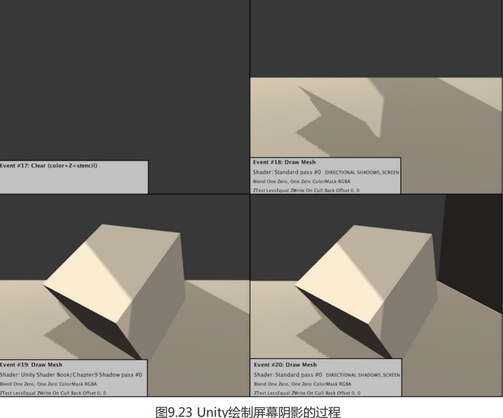

### 如何实现阴影

当一个光源发射的一条光线遇到一个不透明 物体时,这条光线就不可以再继续照亮其他物体(这里不考虑光线反射)。因此,这个物体就会向 它旁边的物体投射阴影,那些阴影区域的产生是因为光线无法到达这些区域。

在实时渲染中,我们最常使用的是一种名为 Shadow Map 的技术。这种技术理解起来非常简单,它会首先把摄像机的位置放在与光源重合的位置上,那么场景中该光源的阴影区域就是那些 摄像机看不到的地方。而Unity 就是使用的这种技术。

在前向渲染路径中,如果场景中最重要的平行光开启了阴影,Unity 就会为该光源计算它的阴影映射纹理(shadowmap)。这张阴影映射纹理本质上也是一张深度图,它记录了从该光源的位置出发、能看到的场景中距离它最近的表面位置(深度信息)。

那么,我们如何判定距离它最近的表面位置呢?一种方法是,先把摄像机放置到光源的位置上,然后按正常的渲染流程,即调用 Base Pass 和 Additional Pass 来更新深度信息,得到阴影映射纹理。但这种方法会对性能造成一定的浪费,因为我们实际上仅仅需要深度信息而已,而Base Pass 和 Additional Pass 中往往涉及很多复杂的光照模型计算。因此,Unity 选择使用一个额外的 Pass 来专门更新光源的阴影映射纹理,这个 Pass 就是 LightMode 标签被设置为 ShadowCaster 的Pass。这个 Pass 的渲染目标不是帧缓存,而是阴影映射纹理(或深度纹理)。 Unity首先把摄像机放置到光源的位置上,然后调用该 Pass,通过对顶点变换后得到光源空间下的位置,并据此来输出深度信息到阴影映射纹理中。因此,当开启了光源的阴影效果后,底层渲染引擎首先会在当前渲染物体的Unity Shader 中找到 LightMode 为 ShadowCaster 的 Pass,如果没有,它就会在 Fallback 指定的Unity Shader 中继续寻找,如果仍然没有找到,该物体就无法向其他物体投射阴影(但它仍然可以接收来自其他物体的阴影)。当找到了一个 LightMode 为 ShadowCaster 的 Pass 后,Unity 会使用该 Pass 来更新光源的阴影映射纹理。


如上图,假设有一个模拟太阳位置(朝向也相同)的摄像机，在可观察的视线范围内，物体表面各个点到摄像机的距离可以组合成一张深度图，它记录了从该光源的位置出发、能看到的场景中距离它最近的表面位置。这张深度图就叫做ShadowMap。


如下图就相当于光源位置朝向同步的摄像机记录的类似平面效果(深度图还稍有区别,只有深度信息,不是彩色),再以摄像机投射到此图上的位置为原点,做x,y横纵两条坐标轴,就反映出了光源空间下,各个位置离相机最近的物体点面的深度信息(深度就相当于z轴上的大小)


注意深度图是通过模拟太阳位置的摄像机获取到的，并非真正渲染场景的视角，真正渲染场景的视角，是B点所在位置的相机(下图)。


假设B观察到的三个点p1、p2、p3，在渲染的过程中，首先会把这三个点的顶点位置**变换到光源空间**下，这样就能得到它们在光源空间中的三维位置信息：sun(p1)、sun(p2)、sun(p3)，


我们知道,shadowMap实际上就是将首先看到的物体的深度信息映射到光源空间,使用sun(p1)、sun(p2)、sun(p3)的xy分量对ShadowMap进行纹理采样，实际上获得的应该是$P'_1,P'_2,P'_3$三个点的深度信息,因为他们的xy分量在屏幕空间中等同于sun(p1)、sun(p2)、sun(p3)的xy分量,只是深度不同罢了.

于是,我们再拿sun(p1)、sun(p2)、sun(p3)的实际深度(z分量),与在深度纹理采样的$P'_1,P'_2,P'_3$的深度对比,就能判断该点是否处于阴影中.

如sun(p2)、sun(p3)深度都大于$P'_2,P'_3$,他们的位置就处在阴影中,而sun(p1)跟$P'_1$同一个点,说明该位置是照亮.

在传统的阴影映射纹理的实现中,我们会在正常渲染的 Pass 中把顶点位置变换到光源空间下,以得到它在光源空间中的三维位置信息。然后,我们使用 xy 分量对阴影映射纹理进行采样, 得到阴影映射纹理中该位置的深度信息。如果该深度值小于该顶点的深度值(通常由z分量得到), 那么说明该点位于阴影中。

但在 Unity 5 中,Unity 使用了不同于这种传统的阴影采样技术,即屏幕空间的阴影映射技术(Screenspace Shadow Map)。屏幕空间的阴影映射原本是延迟渲染中产生阴影的方法。需要注意的是,并不是所有的平台 Unity 都会使用这种技术。因为,屏幕空间的阴影映射需要显卡支持 MRT,而有些移动平台不支持这种特性。

当使用了屏幕空间的阴影映射技术时,Unity 首先会通过调用 LightMode 为 ShadowCaster 的 Pass 来得到可投射阴影的光源的阴影映射纹理(跟光源同位置的摄像机渲染的深度纹理)以及摄像机(实际渲染画面的那台摄像机)的深度纹理。然后,根据光源的阴影映射纹理(跟光源同位置的摄像机渲染的纹理)和摄像机的深度纹理(实际渲染画面的那台摄像机渲染的屏幕空间深度图)来得到屏幕空间的阴影图。将摄像机深度图的各点位坐标转换到阴影映射纹理的坐标空间(光源空间)中去采样其深度, 如果摄像机的深度图中记录的表面深度大于转换到阴影映射纹理中的深度值,就说明该表面虽然是可见的,但是却处于该光源的阴影中。通过这样的方式,阴影图就包含了屏幕空间中所有有阴影的区域。如果我们想要一个物体接收来自其他物体的阴影,只需要在 Shader 中对阴影图进行采样。由于阴影图是屏幕空间下的,因此,我们首先需要把表面坐标从模型空间变换到屏幕空间中,然后使用这个坐标对阴影图进行采样即可。

---

### 不透明物体的阴影

1. 让物体投射阴影

首先在光源的 Light 组件中开启阴影,这里我们选择了软阴影(Soft Shadows)。

我们可以选择是否让一个物体投射或接收阴影。这是通过设置 Mesh Renderer 组件中的Cast Shadows 和 Receive Shadows 属性来实现的.


这里我们直接使用之前的ForwardRendering,建立材质附加到一个立方体上,这里我们发现,此shader并没有使用 LightMode 为ShadowCaster的Pass 来渲染阴影映射纹理和深度图,但正方体仍然可以向下面的平面投射阴影。秘密就在Fallback "Specular"这个语义.

我们为它的 Fallback 指定了一个用于回调 Unity Shader,即內置的Specular。虽然 Specular 本身也没有包含这 样一个Pass,但是由于它的Fallback 调用了 VertexLit,它会继续回调,并最终回调到內置的 VertexLit 我们可以在 Unity 内置的着色器里找到它: builin-shaders-xxx->DefaultResourcesExtra-> NormalVertexLit.shader。打开它,我们就可以看到“传说中”的LightMode 为 ShadowCaster 的 Pass了:

```
Pass {
	Name "ShadowCaster"
	Tags { "LightMode" = "ShadowCaster"}
	CGPROGRAM
	#pragma vertex vert
	#pragma fragment frag
	#pragma multi_compile_shadowcaster
	#include "UnityCG.cginc"
	struct v2f {
		V2F_SHADOW_CASTER;
	};
	v2f vert( appdata_base v)
	{
		v2f o;
		TRANSFER_SHADOW_CASTER_NORMALOFFSET(o)
		return o;
	}
	float4 frag( v2f i) : SV_Target
	{
	SHADOW_CASTER_FRAGMENT(i)
	}
	ENDCG
}

```

上面的代码非常短,尽管有一些宏和指令是我们之前没有遇到过的,但它们的用处实际上就 是为了把深度信息写入渲染目标中。在Unity 5中,这个Pass 的渲染目标可以是光源的阴影映射纹理,或是摄像机的深度纹理。

当然,我们可以不依赖 Fallback,而自行在 SubShader 中定义自己的 LightMode 为 ShadowCaster 的Pass。这种自定义的Pass 可以让我们更加灵活地控制阴影的产生。但由于这个Pass 的功能通常是可以在多个Unity Shader 间通用的,因此直接 Fallback 是一个更加方便的用法.

我们有时也在 Fallback 中使用内置的 Diffuse,虽然 Diffuse 本身也没有包 含这样一个 Pass,但是由于它的 Fallback 调用了 VertexLit,因此 Unity 最终还是会找到一个 LightMode 为 ShadowCaster 的 Pass,从而可以让物体产生阴影。

还有一个有意思的现象,就是右侧的平面并没有向最下面的平面投射阴影,尽管它 的 Cast Shadows 已经被开启了。在默认情况下,我们在计算光源的阴影映射纹理时会剔除掉物体 的背面。但对于内置的平面来说,它只有一个面,因此在本例中当计算阴影映射纹理时,由于右 侧的平面在光源空间下没有任何正面(frontface),因此就不会添加到阴影映射纹理中。我们可以 将 Cast Shadows 设置为 Two Sided 来允许对物体的所有面都计算阴影信息。


另外,由于正方体使用的Chapter9-ForwardRendering 并没有对阴影进行任何处理,因此它不会显示出右侧平面投射来的阴影。

2. 让物体接受阴影

   为了让正方体可以接收阴影,我们要对Chapter9-ForwardRendering进行改动;

   (1)首先,我们在Base Pass 中包含进一个新的内置文件:

   ```
   #include "AutoLight.cginc"
   ```

   因为,我们下面计算阴影时所用的宏都是在这个文件中声明的。

   (2)在顶点着色器的输出结构体v2f 中添加了一个内置宏 SHADOW_COORDS:

   ```
   struct v2f {
   	float4 pos : SV_POSITION;
   	float3 worldNormal : TEXCOORDO;
   	float3 worldPos : TEXCOORD1;
   	SHADOW_COORDS (2)
   	}
   ```

   这个宏的作用很简单,就是声明一个用于对阴影纹理采样的坐标。需要注意的是,这个宏的 参数需要是下一个可用的插值寄存器的索引值,在上面的例子中就是2。

   (3)然后,我们在顶点着色器返回之前添加另一个内置宏 TRANSFER_SHADOW:

   ```
   v2f vert (a2v v) {
   v2f o;
   // Pass shadow coordinates to pixel shader
   TRANSFER_SHADOW (o);
   return o;
   ```

   这个宏用于在顶点着色器中计算上一步中声明的阴影纹理坐标。

   (4)接着,我们在片元着色器中计算阴影值,这同样使用了一个内置宏 SHADOW ATTENUATION:

   ```
   // Use shadow coordinates to sample shadow map
   fixed shadow = SHADOW_ATTENUATION(i);
   ```

   

SHADOW_COORDS、TRANSFER_SHADOW 和SHADOW_ATTENUATION 是计算阴影 时的“三剑客”。这些内置宏帮助我们在必要时计算光源的阴影。我们可以在 AutoLight.cginc 中 找到它们的声明:

```
// Shadow helpers
//
//---- Screen space shadows
#if defined (SHADOWS_SCREEN)
	UNITY_DECLARE_SHADOWMAP(_ShadowMapTexture);
	#define SHADOW_COORDS (idx1) unityShadowCoord4_ShadowCoord: TEXCOORD##idx1;
	#if defined (UNITY_NO_SCREENSPACE_SHADOWS)
		#define TRANSFER_SHADOW(a) a._ShadowCoord = mul( unity_World2Shadow[0],
		mul(_Object2World, v.vertex) );
		inline fixed unitySampleShadow (unityShadowCoord4 shadowCoord)
		{
		...
		}
			
	#else // UNITY NO SCREENSPACE SHADOWS
		#define TRANSFER_SHADOW (a) a._ShadowCoord = ComputeScreenPos(a.pos);
		inline fixed unitySampleShadow (unityShadowCoord4 shadowCoord)
		{
			fixed shadow = tex2Dproj(_ShadowMapTexture, UNITY_PROJ_COORD(shadowCoord) ).r;
			return shadow;
		}
	#endif
	#define SHADOW_ATTENUATION(a) unitySampleShadow (a._ShadowCoord)
#endif
//---- Spot light shadows
#if defined (SHADOWS_DEPTH) && defined (SPOT)
	...
#endif
//---- Point light shadowS
#if defined (SHADOWS_CUBE)
	...
#endif
//---- Shadows off
#if !defined (SHADOWS_SCREEN) && !defined (SHADOWS_DEPTH) && !defined (SHADOWS_CUBE)
	#define SHADOW_COORDS(idx1)
	#define TRANSFER_SHADOW(a)
	#define SHADOW_ATTENUATION(a) 1.0
#endif

```

上面的代码看起来很多、很复杂,实际上只是 Unity 为了处理不同光源类型、不同平台而定义了多个版本的宏。在前向渲染中,宏 SHADOW_COORDS 实际上就是声明了一个名为_Shadow Coord 的阴影纹理坐标变量。而 TRANSFER_SHADOW 的实现会根据平台不同而有所差异。如果当前 平台可以使用屏幕空间的阴影映射技术(通过判断是否定义了 UNITY_NO_SCREENSPACE SHADOWS 来得到),TRANSFER_SHADOW 会调用内置的 ComputeScreenPos 函数来计算 ShadowCoord;如果该平台不支持屏幕空间的阴影映射技术,就会使用传统的阴影映射技术, TRANSFER_SHADOW会把顶点坐标从模型空间变换到光源空间后存储到_ShadowCoord 中。然后,SHADOW_ATTENUATION 负责使用 ShadowCoord 对相关的纹理进行采样,得到阴影信息。

注意到,上面内置代码的最后定义了在关闭阴影时的处理代码。可以看出,当关闭了阴影后, SHADOW_COORDS 和TRANSFER_SHADOW实际没有任何作用,而SHADOW_ATTENUATION 会直接等同于数值1。

**注意**:由于这些宏中会使用上下文变量来进行相关计算,例如TRANSFER_SHADOW 会使用 v.vertex 或 a.pos 来计算坐标,因此为了能够让这些宏正确工作,我们需要保证自定义的变量名和这些宏中使用的变量名相匹配。我们需要保证:a2f 结构体中的顶点坐标变量 名必须是vertex,顶点着色器的输出结构体v2f必须命名为v,且v2f中的顶点位置变量必须命名为pos

(5)在完成了上面的所有操作后,我们只需要把阴影值 shadow 和漫反射以及高光反射颜色相乘即可。


现在正方体也可以接收来自右侧平面的阴影了.

**注意**:上面的代码里我们只更改了 Base Pass 中的代码,使其可以得到阴影效果,而没 有对 Additional Pass 进行任何更改。大体上, Additional Pass 的阴影处理和Base Pass 是一样的。 本节实现的代码仅是为了解释如何让物体接收阴影,但不可以直接应用到项目中。

---

### 帧调试器查看阴影绘制过程

帧调试器,可以让我们直观的方式看到阴影一步步的绘制过程, Window -> Frame Debugger 中打开帧调试器。

可以看出,绘制该场景共需要花费20个渲染事件。这些渲染事件可以分为4个部分:UpdateDepthTexture,即更新摄像机的深度纹理;RenderShadowmap,即渲染得到平行光的阴影映射纹理;CollectShadows,即根据深度纹理和阴影映射纹理得到屏幕空间的阴影图;最后绘制渲染结果。


先来看第一个部分:更新摄像机的深度纹理,这是前4个渲染事件的工作。(单击这些事件查看它们的绘制结果)


我们可以发现, Unity 调用了 Shader: Unity Shader Book/Chapter9 Shadow pass #3 来更新深度纹理,即 Chapter9-Shadow 中的第三个 Pass。尽管 Chapter9-Shadow 中只定义了两个Pass,但正如我们之前所说,Unity 会在它的Fallback 中找到第三个Pass,即 LightMode 为 ShadowCaster 的 Pass 来更新摄像机的深度纹理。同样,在第二个部分,即渲染得到平行光的阴影映射纹理的过程中,Unity 也是调用了这个Pass 来得到光源的阴影映射纹理。


在第三个部分中,Unity 会根据之前两步的结果得到屏幕空间的阴影图,这张图已经包含了最终屏幕上所有有阴影区域的阴影。



在最后一个部分中,如果物体所使用的Shader包含了对这张阴影图的采样就会得到阴影效果。图 9.23 给出了这个部分 Unity 是如何一 步步绘制出有阴影的画面效果的。

