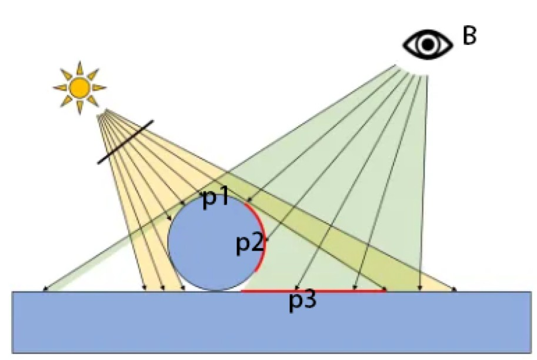

### 如何实现阴影

当一个光源发射的一条光线遇到一个不透明 物体时,这条光线就不可以再继续照亮其他物体(这里不考虑光线反射)。因此,这个物体就会向 它旁边的物体投射阴影,那些阴影区域的产生是因为光线无法到达这些区域。

在实时渲染中,我们最常使用的是一种名为 Shadow Map 的技术。这种技术理解起来非常简单,它会首先把摄像机的位置放在与光源重合的位置上,那么场景中该光源的阴影区域就是那些 摄像机看不到的地方。而Unity 就是使用的这种技术。

在前向渲染路径中,如果场景中最重要的平行光开启了阴影,Unity 就会为该光源计算它的阴影映射纹理(shadowmap)。这张阴影映射纹理本质上也是一张深度图,它记录了从该光源的位置出发、能看到的场景中距离它最近的表面位置(深度信息)。

那么,我们如何判定距离它最近的表面位置呢?一种方法是,先把摄像机放置到光源的位置上,然后按正常的渲染流程,即调用 Base Pass 和 Additional Pass 来更新深度信息,得到阴影映射纹理。但这种方法会对性能造成一定的浪费,因为我们实际上仅仅需要深度信息而已,而Base Pass 和 Additional Pass 中往往涉及很多复杂的光照模型计算。因此,Unity 选择使用一个额外的 Pass 来专门更新光源的阴影映射纹理,这个 Pass 就是 LightMode 标签被设置为 ShadowCaster 的Pass。这个 Pass 的渲染目标不是帧缓存,而是阴影映射纹理(或深度纹理)。 Unity首先把摄像机放置到光源的位置上,然后调用该 Pass,通过对顶点变换后得到光源空间下的位置,并据此来输出深度信息到阴影映射纹理中。因此,当开启了光源的阴影效果后,底层渲染引擎首先会在当前渲染物体的Unity Shader 中找到 LightMode 为 ShadowCaster 的 Pass,如果没有,它就会在 Fallback 指定的Unity Shader 中继续寻找,如果仍然没有找到,该物体就无法向其他物体投射阴影(但它仍然可以接收来自其他物体的阴影)。当找到了一个 LightMode 为 ShadowCaster 的 Pass 后,Unity 会使用该 Pass 来更新光源的阴影映射纹理。

如上图,假设有一个模拟太阳位置(朝向也相同)的摄像机，在可观察的视线范围内，物体表面各个点到摄像机的距离可以组合成一张深度图，它记录了从该光源的位置出发、能看到的场景中距离它最近的表面位置。这张深度图就叫做ShadowMap。

如下图就相当于光源位置朝向同步的摄像机记录的类似平面效果(深度图还稍有区别,只有深度信息,不是彩色),再以摄像机投射到此图上的位置为原点,做x,y横纵两条坐标轴,就反映出了光源空间下,各个位置离相机最近的物体点面的深度信息(深度就相当于z轴上的大小)

注意深度图是通过模拟太阳位置的摄像机获取到的，并非真正渲染场景的视角，真正渲染场景的视角，是B点所在位置的相机(下图)。

假设B观察到的三个点p1、p2、p3，在渲染的过程中，首先会把这三个点的顶点位置**变换到光源空间**下，这样就能得到它们在光源空间中的三维位置信息：sun(p1)、sun(p2)、sun(p3)，

我们知道,shadowMap实际上就是将首先看到的物体的深度信息映射到光源空间使用sun(p1)、sun(p2)、sun(p3)的xy分量对ShadowMap进行纹理采样，实际上获得的应该是$P'_1,P'_2,P'_3$三个点的深度信息,因为他们的xy分量在屏幕空间中等同于sun(p1)、sun(p2)、sun(p3)的xy分量,只是深度不同罢了.

于是,我们再拿sun(p1)、sun(p2)、sun(p3)的实际深度(z分量),与在深度纹理采样的$P'_1,P'_2,P'_3$的深度对比,就能判断该点是否处于阴影中.

如sun(p2)、sun(p3)深度都大于$P'_2,P'_3$,他们的位置就处在阴影中,而sun(p1)跟$P'_1$同一个点,说明该位置是照亮.

在传统的阴影映射纹理的实现中,我们会在正常渲染的 Pass 中把顶点位置变换到光源空间下,以得到它在光源空间中的三维位置信息。然后,我们使用 xy 分量对阴影映射纹理进行采样, 得到阴影映射纹理中该位置的深度信息。如果该深度值小于该顶点的深度值(通常由z分量得到), 那么说明该点位于阴影中。

但在 Unity 5 中,Unity 使用了不同于这种传统的阴影采样技术,即屏幕空间的阴影映射技术(Screenspace Shadow Map)。屏幕空间的阴影映射原本是延迟渲染中产生阴影的方法。需要注意的是,并不是所有的平台 Unity 都会使用这种技术。因为,屏幕空间的阴影映射需要显卡支持 MRT,而有些移动平台不支持这种特性。

当使用了屏幕空间的阴影映射技术时,Unity 首先会通过调用 LightMode 为 ShadowCaster 的 Pass 来得到可投射阴影的光源的阴影映射纹理(跟光源同位置的摄像机渲染的深度纹理)以及摄像机(实际渲染画面的那台摄像机)的深度纹理。然后,根据光源的阴影映射纹理(跟光源同位置的摄像机渲染的纹理)和摄像机的深度纹理(实际渲染画面的那台摄像机渲染的屏幕空间深度图)来得到屏幕空间的阴影图。将摄像机深度图的各点位坐标转换到阴影映射纹理的坐标空间(光源空间)中去采样其深度, 如果摄像机的深度图中记录的表面深度大于转换到阴影映射纹理中的深度值,就说明该表面虽然是可见的,但是却处于该光源的阴影中。通过这样的方式,阴影图就包含了屏幕空间中所有有阴影的区域。如果我们想要一个物体接收来自其他物体的阴影,只需要在 Shader 中对阴影图进行采样。由于阴影图是屏幕空间下的,因此,我们首先需 要把表面坐标从模型空间变换到屏幕空间中,然后使用这个坐标对阴影图进行采样即可。