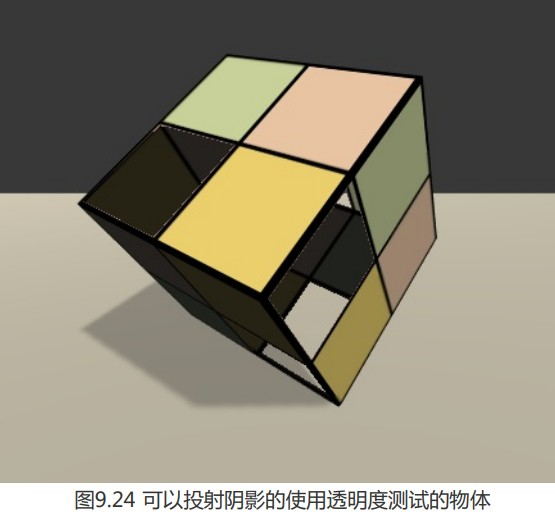
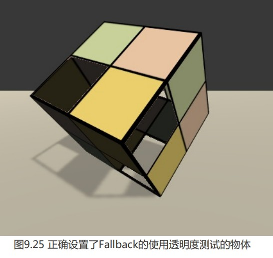
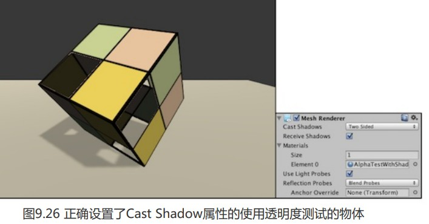
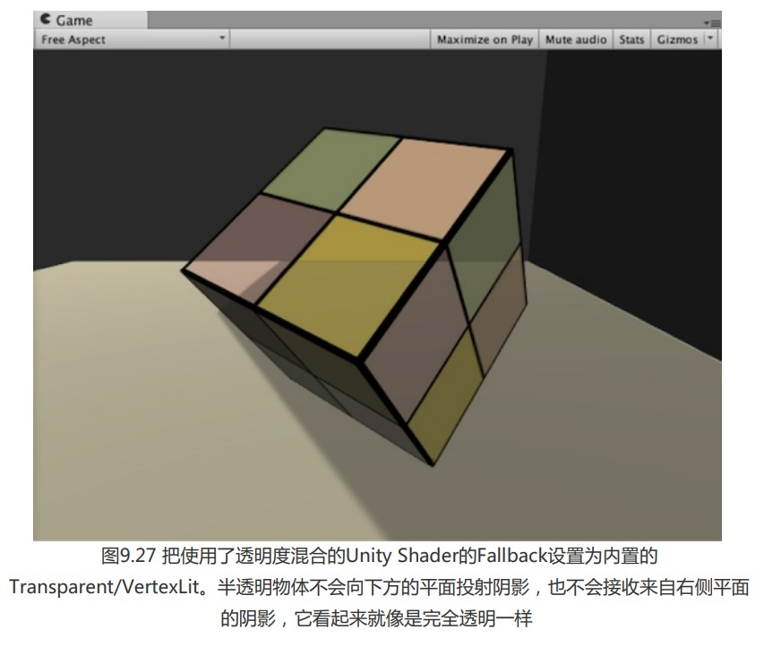
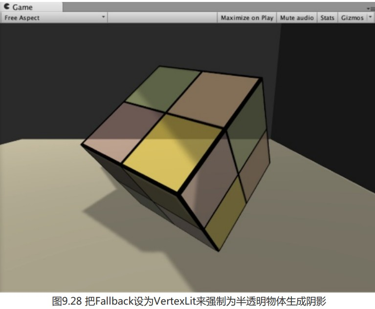

对于大多数不透明物体来说,把 Fallback 设为 VertexLit 就可以得到正确的阴影。但对于透 明物体来说,我们就需要小心处理它的阴影。透明物体的实现通常会使用透明度测试或透明度混 合,我们需要小心设置这些物体的 Fallback.

透明度测试的处理比较简单,但如果我们仍然直接使用 VertexLit、Diffuse、Specular 等作为 回调,往往无法得到正确的阴影。这是因为透明度测试需要在片元着色器中舍弃某些片元,而 VertexLit 中的阴影投射纹理并没有进行这样的操作。

Chapter9-AlphaTestWithShadow 使用了和8.3节透明度测试中几乎完全相同的代码,只是添加了关 于阴影的计算。

(1))首先包含进需要的头文件:

```
#include "Lighting.cginc"
#include "AutoLight.cginc"
```

(2)在v2f中使用内置宏 SHADOW_COORDS 声明阴影纹理坐标:

```
struct v2f {
	float4 pos : SV_POSITION;
	float3 worldNormal : TEXCOORD0;
	float3 worldPos : TEXCOORD1;
	float2 uv : TEXCOORD2;
	SHADOW_COORDS(3)
};
```

**注意,**由于我们已经占用了3个插值寄存器(使用 TEXCOORDO、TEXCOORD1 和 TEXCOORD2 修饰的变量),因此 SHADOW_COORDS 中传入的参数是3,这意味着,阴影纹理 坐标将占用第四个插值寄存器TEXCOORD3。

(3))然后,在顶点着色器中使用内置宏 TRANSFER_SHADOW 计算阴影纹理坐标后传递给片元着色器:

```
v2f vert(a2v v) {
	v2f o;
	...			 	
	// Pass shadow coordinates to pixel shader
	TRANSFER_SHADOW(o);
			 	
	return o;
}
```

(4))在片元着色器中,使用内置宏 UNITY_LIGHT_ATTENUATION 计算阴影和光照衰减:

```
fixed4 frag(v2f i) : SV_Target {
	...						 	
	// UNITY_LIGHT_ATTENUATION not only compute attenuation, but also shadow infos
	UNITY_LIGHT_ATTENUATION(atten, i, i.worldPos);
			 	
	return fixed4(ambient + diffuse * atten, 1.0);
}
```

(5)这次,我们更改它的Fallback,使用 VertexLit 作为它的回调 Shader

我们仍然使用 transparent_texture.psd 纹理,把它赋给新的材质后,就可以得到类似图 9.24 中 的效果。



可以发现,镂空区域出现了不正常的阴影,看起来就像这个正方体是一个普通的正方体一样。而这并不是我们想要得到的,我们希望有些光应该是可以通过这些镂空区域透过来 的,这些区域不应该有阴影。这是因为,我们使用的是内置的VertexLit 中提供的 ShadowCaster 来投射阴影,而这个 Pass 中并没有进行任何透明度测试的计算,因此,它会把整 个物体的深度信息渲染到深度图和阴影映射纹理中。

如果我们想要得到经过透明度测试后 的阴影效果,就需要提供一个有透明度测试功能的 ShadowCaster Pass。当然,我们可以自行编写一个这样的 Pass,但这里我们仍然选择使用内置的 Unity Shader 来减少代码量。

为了让使用透明度测试的物体得到正确的阴影效果,我们只需要在 Unity Shader 中更改一行代码,即把 Fallback 设置为Transparent/Cutout/VertexLit,可以在内置文件中找到该Unity Shader 的代码,它的ShadowCaster Pass 也计算了透明度测试, 因此会把裁剪后的物体深度信息写入深度图和阴影映射纹理中。

**注意**,由于 Transparent/Cutout/VertexLit 中计算透明度测试时,使用了名为_Cutoff 的属性来进行透明度测试,因此,这要求我们的 Shader 中也必须提供名为Cutoff的属性。否则,同样无法得到正确的阴影结果。



这样的结果仍然有一些问题,例如出现了一些不应该透过光的部分。出现这种情况的原因是,默认情况下把物体渲染到深度图和阴影映射纹理中仅考虑物体的正面。但对于本例的正方体来说,由于一些面完全背对光源,因此这些面的深度信息没有加入到阴影映射纹理的计算中。 为了得到正确的结果,我们可以将正方体的Mesh Renderer组件中的Cast Shadows 属性设置为 Two Sided,强制 Unity 在计算阴影映射纹理时计算所有面的深度信息。



---

### 透明度混合的阴影

想要为使用透明度混合的物体添加阴影是一件比较复杂的事情。事实上,所有内置的透明度混合的 Unity Shader,如 Transparent/VertexLit 等,都没有包含阴影投射的 Pass. 这意味着,这些半透明物体不会参与深度图和阴影映射纹理的计算,也就是说,它们不会向其他物体 投射阴影,同样它们也不会接收来自其他物体的阴影。我们使用了之前学习的透明度混合 + 阴影的方法来渲染一个正方体,它使用的Unity Shader 是 Chapter9-AlphaBlend With Shadow ,其使用了和8.4节透明度混合中几乎完全相同的代码,只是添加了关于阴影的计算,并且它的Fallback 是内置的 Transparent/VertexLit。图 9.27 显示了渲染结果。



Unity 会这样处理半透明物体是有它的原因的。由于透明度混合需要关闭深度写入,由此带来的问题也影响了阴影的生成。总体来说,要想为这些半透明物体产生正确的阴影,需要在每个光源空间下仍然严格按照从后往前的顺序进行渲染,这会让阴影处理变得非常复杂,而且也会影响性能。因此,在Unity中,所有内置的半透明 Shader是不会产生任何阴影效果的。当然,我们可以使用一些 dirty trick 来强制为半透明物体生成阴影,这可以通过把它们的 Fallback 设置为 VertexLit、Diffuse 这些不透明物体使用的 Unity Shader,这样 Unity 就会在它的Fallback 找到一个 阴影投射的Pass。然后,我们可以通过物体的Mesh Renderer 组件上的 Cast Shadows 和 Receive Shadows 选项来控制是否需要向其他物体投射或接收阴影。图9.28 显示了把Fallback 设为 VertexLit 并开启阴影投射和接收阴影后的半透明物体的渲染效果。



此时平面的阴影投射到了半透明的立方体上,但它不会再穿透立方体把阴 影投射到下方的平面上,这其实是不正确的。同时,立方体也可以把自身的阴影投射到下面的平面上。

