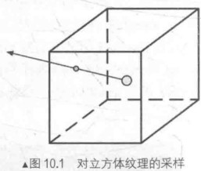
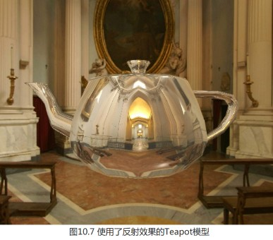
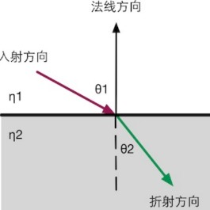
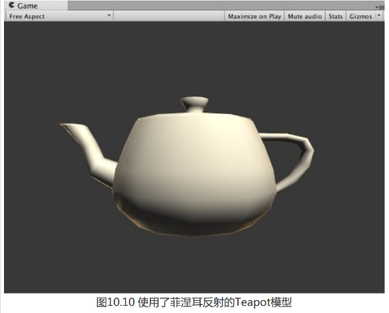

立方体纹理一共包含了6张图像,这些图像对应了一个立方体的6个面,立方体纹理的名称也由此而来。立方体的每个面表示沿着世界空间下的轴向(上、下、左、右、前、后)观察所得的图像。那么,我们如何对这样一种纹理进行采样呢?和之前使用二维纹理坐标不同,对立方体纹理采样我们需要提供一个三维的纹理坐标,这个三维纹理坐标表示了我们在世界空间下的一个3D方向。这个方向矢量从立方体的中心出发,当它向外部延伸时就会和立方体的6个纹理之一发生相交,而采样得到的结果就是由该交点计算而来的。

方向矢量对立方体纹理采样的过程如下图所示:



### 纹理优缺点以及适用场景

使用立方体纹理的好处在于,它的实现简单快速,而且得到的效果也比较好。

但它也有一些缺点,例如当场景中引入了新的物体、光源,或者物体发生移动时,我们就需要重新生成立方体纹理。除此之外,立方体纹理也仅可以反射环境,但不能反射使用了该立方体纹理的物体本身。这是因为,立方体纹理不能模拟多次反射的结果,例如两个金属球互相反射的情况.(事实上,Unity 5引入的全局光照系统允许实现这样的自反射效果,详见第19章)。

因此,想要得到令人信服的渲染结果,我们应该**尽量对凸面体而不要对凹面体使用立方体纹理**(因为凹面体会反射自身)。

---

### 天空盒

当我们在场景中使用了天空盒子时,整个场景就被包围在一个立方体内。这个立方体的每个面使用的技术就是立方体纹理映射技术.

在Window→Render→LightingSetting→Skybox中设置的天空盒,其会应用于该场景中的所有摄像机。如果我们希望某些摄像机可以使用不同的天空盒子,可以在摄像机组件设置ClearFlags来完成对场景默认天空盒子的覆盖。

###  创建用于环境映射的立方体纹理

除了天空盒子,立方体纹理最常见的用处是用于环境映射。通过这种方法,我们可以模拟出金属质感的材质。

创建用于环境映射的立方体纹理的方法有三种:第一种方法是直接由一些特殊布局的纹理创建;第二种方法是手动创建一个Cubemap资源,再把6张图赋给它;第三种方法是由脚本生成。

如果使用第一种方法,我们需要提供一张具有特殊布局的纹理,例如类似立方体展开图的交叉布局、全景布局等。然后,我们只需要把该纹理的Texture Type设置为Cubemap即可,Unity会为我们做好剩下的事情。在基于物理的渲染中,我们通常会使用一张HDR 图像来生成高质量
的Cubemap(详见第18章)。读者可在官方文档(http://docs.unity3d.com/Manual/class-Cubemap.html)中找到更多的资料。

第二种方法是Unity 5 之前的版本中使用的方法。我们首先需要在项目资源中创建一个Cubemap,然后把6张纹理拖曳到它的面板中。在Unity 5中,官方推荐使用第一种方法创建立方体纹理,这是因为第一种方法可以对纹理数据进行压缩,而且可以支持边缘修正、光滑反射(glossy reflection)和HDR等功能。

##### 脚本生成立方体纹理

前面两种方法都需要我们提前准备好立方体纹理的图像,它们得到的立方体纹理往往是被场景中的物体所共用的。但在理想情况下,**我们希望根据物体在场景中位置的不同,生成它们各自不同的立方体纹理**。这时,我们就可以在Unity 中使用脚本来创建。这是通过利用Unity 提供的Camera.RenderToCubemap 函数来实现的。Camera.RenderToCubemap 函数可以把从任意位置观察到的场景图像存储到6张图像中,从而创建出该位置上对应的立方体纹理。

在Unity的脚本手册(http://docs.unity3d.com/ScriptReference/Camera.RenderToCubemap.html)中给出了如何使用 Camera.RenderToCubemap函数来创建立方体纹理的代码。读者也可以在本书资源Assets/Editor/Chapter10/RenderCubemapWizard.cs 中找到相关代码。

其原理是,在renderFromPosition(由用户指定)位置处动态创建一个摄像机,并调用 Camera.RenderToCubemap 函数把从当前位置观察到的图像渲染到用户指定的立方体纹理cubemap中,完成后再销毁临时摄像机。由于该代码需要添加菜单栏条目,因此我们需要把它放在Editor文件夹下才能正确执行。

根据本书资源给出的编辑器工具,我们用其创建一个立方体纹理,

首先新建一个用于存储的立方体纹理(在Project视图下单击右键,选择Create→Legacy→Cubemap 来创建)。在本书资源中,该立方体纹理名为Cubemap_0。为了让脚本可以顺利将图像渲染到该立方体纹理中,我们需要在它的面板中勾选Readable选项。

然后在Unity菜单栏选择GameObject->Render into Cubemap,打开我们在脚本中实现的用于渲染立方体纹理的窗口,将场景中制动渲染位置的GameObject和创建的Cubemap_0分别拖曳到窗口中的Render From Position 和Cubemap选项,单击窗口中的Render!按钮,就可以把从该位置观察到的世界空间下的6张图像渲染到Cubemap_0中.

**注意**:需要在Cubemap的Face size选项设置的大小。Face size值越大,渲染出来的立方体纹理分辨率越大,效果可能更好,但需要占用的内存也越大,这可以由面板最下方显示的内存大小得到。

---

准备好了需要的立方体纹理后,我们就可以对物体使用环境映射技术。而环境映射最常见的应用就是反射和折射。

---

### 反射

使用了反射效果的物体通常看起来就像镀了层金属。想要模拟反射效果很简单,我们只需要
通过入射光线的方向和表面法线方向来计算反射方向,再利用反射方向对立方体纹理采样即可。

学习完本节后,我们可以得到类似图10.7中的效果。




首先我们替换掉Unity 5中场景默认的天空盒子,而把 10.1.1 节中创建的天空盒子材质拖曳到LightingSetting→ Skybox 选项中(本书资源中,该场景名为Scene_10_1_3。)

向场景中拖曳一个Teapot模型,并调整它的位置和 10.1.2 节中创建 Cubemap_0 时使用的空GameObject的位置相同。

之后我们来创建一个反射材质赋值给模型.

接下来创建反射shader(本书资源中,该Shader 名为 Chapter10-Reflection)

```
// Upgrade NOTE: replaced '_Object2World' with 'unity_ObjectToWorld'
// Upgrade NOTE: replaced 'mul(UNITY_MATRIX_MVP,*)' with 'UnityObjectToClipPos(*)'

Shader "Unity Shaders Book/Chapter 10/Reflection" {
	Properties {
		_Color ("Color Tint", Color) = (1, 1, 1, 1)
		_ReflectColor ("Reflection Color", Color) = (1, 1, 1, 1)//控制反射颜色
		_ReflectAmount ("Reflect Amount", Range(0, 1)) = 1//控制反射程度
		_Cubemap ("Reflection Cubemap", Cube) = "_Skybox" {}//环境映射纹理
	}
	SubShader {
		Tags { "RenderType"="Opaque" "Queue"="Geometry"}
		
		Pass { 
			Tags { "LightMode"="ForwardBase" }
			
			CGPROGRAM
			
			#pragma multi_compile_fwdbase
			
			#pragma vertex vert
			#pragma fragment frag
			
			#include "Lighting.cginc"
			#include "AutoLight.cginc"
			
			fixed4 _Color;
			fixed4 _ReflectColor;
			fixed _ReflectAmount;
			samplerCUBE _Cubemap;
			
			struct a2v {
				float4 vertex : POSITION;
				float3 normal : NORMAL;
			};
			
			struct v2f {
				float4 pos : SV_POSITION;
				float3 worldPos : TEXCOORD0;
				fixed3 worldNormal : TEXCOORD1;
				fixed3 worldViewDir : TEXCOORD2;
				fixed3 worldRefl : TEXCOORD3;
				SHADOW_COORDS(4)
			};
			
			v2f vert(a2v v) {
				v2f o;
				
				o.pos = UnityObjectToClipPos(v.vertex);
				
				o.worldNormal = UnityObjectToWorldNormal(v.normal);
				
				o.worldPos = mul(unity_ObjectToWorld, v.vertex).xyz;
				
				o.worldViewDir = UnityWorldSpaceViewDir(o.worldPos);
				
				// Compute the reflect dir in world space 使用cg的api,计算反射方向(物体反射到摄像机中的光线方向,可以由光路可逆的原则来反向求得。也就是说,我们可以计算视角方向关于顶点法线的反射方向来求得入射光线的方向。)
				o.worldRefl = reflect(-o.worldViewDir, o.worldNormal);
				
				TRANSFER_SHADOW(o);
				
				return o;
			}
			
			fixed4 frag(v2f i) : SV_Target {
				fixed3 worldNormal = normalize(i.worldNormal);
				fixed3 worldLightDir = normalize(UnityWorldSpaceLightDir(i.worldPos));		
				fixed3 worldViewDir = normalize(i.worldViewDir);		
				
				fixed3 ambient = UNITY_LIGHTMODEL_AMBIENT.xyz;
				
				fixed3 diffuse = _LightColor0.rgb * _Color.rgb * max(0, dot(worldNormal, worldLightDir));
				
				// Use the reflect dir in world space to access the cubemap 采样放射纹理
				fixed3 reflection = texCUBE(_Cubemap, i.worldRefl).rgb * _ReflectColor.rgb;
				
				UNITY_LIGHT_ATTENUATION(atten, i, i.worldPos);
				
				// Mix the diffuse color with the reflected color 混合反射和漫反射并于环境光照相加
				fixed3 color = ambient + lerp(diffuse, reflection, _ReflectAmount) * atten;
				
				return fixed4(color, 1.0);
			}
			
			ENDCG
		}
	}
	FallBack "Reflective/VertexLit"
}

```

在上面的计算中,我们选择在顶点着色器中计算反射方向。当然,我们也可以选择在片元着色器中计算,这样得到的效果更加细腻。但是,对于绝大多数人来说这种差别往往是可以忽略不计的,因此出于性能方面的考虑,我们选择在顶点着色器中计算反射方向。

---

### 折射

根据初中物理折射的定义:当光线从一种介质(例如空气)斜射入另一种介质(例如玻璃)时,传播方向一般会发生改变。当给定入射角时,我们可以使用斯涅尔定律(Snell's Law)来计算反射角。

当光从介质1沿着和表面法线夹角为$\theta _1$的方向斜射入介质2时,我们可以使用如下公式计算折射光线与法线的夹角$\theta _2$:
$$
\eta_1\sin \theta_1=\eta_2\sin \theta_2
$$
$\eta_1,\eta_2$分别是两个介质的折射率(index of refraction)。折射率是一项重要的物理常数,真空的折射率是1,而玻璃的折射率一般是1.5。

当得到折射方向后我们就会直接使用它来对立方体纹理进行采样,但这是不符合物理规律的。对一个透明物体来说,一种更准确的模拟方法需要计算两次折射 -- 一次是当光线进入它的内部时,而另一次则是从它内部射出时。但是,想要在实时渲染中模拟出第二次折射方向是比较复杂的,而且仅仅模拟一次得到的效果从视觉上看起来“也挺像那么回事的”。正如我们之前提到的 -- 图形学第一准则“如果它看起来是对的,那么它就是对的”。因此,在实时渲染中
我们通常仅模拟第一次折射。



```
// Upgrade NOTE: replaced '_Object2World' with 'unity_ObjectToWorld'
// Upgrade NOTE: replaced 'mul(UNITY_MATRIX_MVP,*)' with 'UnityObjectToClipPos(*)'

Shader "Unity Shaders Book/Chapter 10/Refraction" {
	Properties {
		_Color ("Color Tint", Color) = (1, 1, 1, 1)
		_RefractColor ("Refraction Color", Color) = (1, 1, 1, 1)//折射颜色
		_RefractAmount ("Refraction Amount", Range(0, 1)) = 1//折射强度
		_RefractRatio ("Refraction Ratio", Range(0.1, 1)) = 0.5//不同介质透射比
		_Cubemap ("Refraction Cubemap", Cube) = "_Skybox" {}
	}
	SubShader {
		Tags { "RenderType"="Opaque" "Queue"="Geometry"}
		
		Pass { 
			Tags { "LightMode"="ForwardBase" }
		
			CGPROGRAM
			
			#pragma multi_compile_fwdbase	
			
			#pragma vertex vert
			#pragma fragment frag
			
			#include "Lighting.cginc"
			#include "AutoLight.cginc"
			
			fixed4 _Color;
			fixed4 _RefractColor;
			float _RefractAmount;
			fixed _RefractRatio;
			samplerCUBE _Cubemap;
			
			struct a2v {
				float4 vertex : POSITION;
				float3 normal : NORMAL;
			};
			
			struct v2f {
				float4 pos : SV_POSITION;
				float3 worldPos : TEXCOORD0;
				fixed3 worldNormal : TEXCOORD1;
				fixed3 worldViewDir : TEXCOORD2;
				fixed3 worldRefr : TEXCOORD3;
				SHADOW_COORDS(4)
			};
			//顶点着色器计算折射方向
			v2f vert(a2v v) {
				v2f o;
				o.pos = UnityObjectToClipPos(v.vertex);
				
				o.worldNormal = UnityObjectToWorldNormal(v.normal);
				
				o.worldPos = mul(unity_ObjectToWorld, v.vertex).xyz;
				
				o.worldViewDir = UnityWorldSpaceViewDir(o.worldPos);
				
				// Compute the refract dir in world space 计算折射方向
				//参数1为入射光线方向(必须为归一化矢量),参数2为表面法线,同样需要归一化,参数3为折射率比值(入射光所在介质的折射率/折射光线所在介质的折射率)
				//如果光是从空气射到玻璃表面,那么这个参数应该是空气的折射率和玻璃的折射率之间的比值,即1/1.5
				o.worldRefr = refract(-normalize(o.worldViewDir), normalize(o.worldNormal), _RefractRatio);
				
				TRANSFER_SHADOW(o);
				
				return o;
			}
			//片元着色器用折射方向对立方体纹理采样
			fixed4 frag(v2f i) : SV_Target {
				fixed3 worldNormal = normalize(i.worldNormal);
				fixed3 worldLightDir = normalize(UnityWorldSpaceLightDir(i.worldPos));
				fixed3 worldViewDir = normalize(i.worldViewDir);
								
				fixed3 ambient = UNITY_LIGHTMODEL_AMBIENT.xyz;
				
				fixed3 diffuse = _LightColor0.rgb * _Color.rgb * max(0, dot(worldNormal, worldLightDir));
				
				// Use the refract dir in world space to access the cubemap  折射方向对立方体纹理采样
				//i.worldRefr无需归一化,因为对立方体纹理的采样只需要提供方向
				fixed3 refraction = texCUBE(_Cubemap, i.worldRefr).rgb * _RefractColor.rgb;
				
				UNITY_LIGHT_ATTENUATION(atten, i, i.worldPos);
				
				// Mix the diffuse color with the refract color 漫反射混合折射+环境光
				fixed3 color = ambient + lerp(diffuse, refraction, _RefractAmount) * atten;
				
				return fixed4(color, 1.0);
			}
			
			ENDCG
		}
	} 
	FallBack "Reflective/VertexLit"
}

```

---

### 菲涅尔反射

在实时渲染中,我们经常会使用菲涅耳反射(Fresnel reflection)来根据视角方向控制反射程度。通俗地讲,菲涅耳反射描述了一种光学现象,即当光线照射到物体表面上时,一部分发生反射,一部分进入物体内部,发生折射或散射。被反射的光和入射光之间存在一定的比率关系,这个比率关系可以通过菲涅耳等式进行计算。一个经常使用的例子是,当你站在湖边,直接低头看脚边的水面时,你会发现水几乎是透明的,你可以直接看到水底的小鱼和石子;但是,当你抬头看远处的水面时,会发现几乎看不到水下的情景,而只能看到水面反射的环境。这就是所谓的菲涅耳效果。事实上,不仅仅是水、玻璃这样的反光物体具有菲涅耳效果,几乎任何物体都或多或少包含了菲涅耳效果,这是基于物理的渲染中非常重要的一项高光反射计算因子(详见第18章)。读者可以在 JohnHable 的一篇非常有名的文章 Everything Has Fresnel(http://filmicgames.com/archives/557)中看到现实生活中各种物体的菲涅耳效果。

真实世界的菲涅耳等式是非常复杂的,但在实时渲染中,我们通常会使用一些近似公式来计算。其中一个著名的近似公式就是Schlick 菲涅耳近似等式:
$$
F_{Empricial}(v,n)=max(0,min(1,bias+scale\times(1-v\cdot n)^{power}))
$$
其中,bias、scale和power是控制项。使用上面的菲涅耳近似等式,我们可以在边界处模拟反射光强和折射光强/漫反射光强之间的变化。在许多车漆、水面等材质的渲染中,我们会经常使用菲涅耳反射来模拟更加真实的反射效果。



```
// Upgrade NOTE: replaced '_Object2World' with 'unity_ObjectToWorld'
// Upgrade NOTE: replaced 'mul(UNITY_MATRIX_MVP,*)' with 'UnityObjectToClipPos(*)'

Shader "Unity Shaders Book/Chapter 10/Fresnel" {
	Properties {
		_Color ("Color Tint", Color) = (1, 1, 1, 1)
		_FresnelScale ("Fresnel Scale", Range(0, 1)) = 0.5 //菲尼尔强度
		_Cubemap ("Reflection Cubemap", Cube) = "_Skybox" {} //反射的cubemap
	}
	SubShader {
		Tags { "RenderType"="Opaque" "Queue"="Geometry"}
		
		Pass { 
			Tags { "LightMode"="ForwardBase" }
		
			CGPROGRAM
			
			#pragma multi_compile_fwdbase
			
			#pragma vertex vert
			#pragma fragment frag
			
			#include "Lighting.cginc"
			#include "AutoLight.cginc"
			
			fixed4 _Color;
			fixed _FresnelScale;
			samplerCUBE _Cubemap;
			
			struct a2v {
				float4 vertex : POSITION;
				float3 normal : NORMAL;
			};
			
			struct v2f {
				float4 pos : SV_POSITION;
				float3 worldPos : TEXCOORD0;
  				fixed3 worldNormal : TEXCOORD1;
  				fixed3 worldViewDir : TEXCOORD2;
  				fixed3 worldRefl : TEXCOORD3;
 	 			SHADOW_COORDS(4)
			};
			//顶点着色器中计算世界空间下的法线方向、视角方向和反射方向
			v2f vert(a2v v) {
				v2f o;
				o.pos = UnityObjectToClipPos(v.vertex);
				
				o.worldNormal = UnityObjectToWorldNormal(v.normal);
				
				o.worldPos = mul(unity_ObjectToWorld, v.vertex).xyz;
				
				o.worldViewDir = UnityWorldSpaceViewDir(o.worldPos);
				
				o.worldRefl = reflect(-o.worldViewDir, o.worldNormal);
				
				TRANSFER_SHADOW(o);
				
				return o;
			}
			//片元着色器中计算菲涅耳反射,并使用结果值混合漫反射光照和反射光照
			fixed4 frag(v2f i) : SV_Target {
				fixed3 worldNormal = normalize(i.worldNormal);
				fixed3 worldLightDir = normalize(UnityWorldSpaceLightDir(i.worldPos));
				fixed3 worldViewDir = normalize(i.worldViewDir);
				
				fixed3 ambient = UNITY_LIGHTMODEL_AMBIENT.xyz;
				
				UNITY_LIGHT_ATTENUATION(atten, i, i.worldPos);
				
				fixed3 reflection = texCUBE(_Cubemap, i.worldRefl).rgb;
				
				fixed fresnel = _FresnelScale + (1 - _FresnelScale) * pow(1 - dot(worldViewDir, worldNormal), 5);
				
				fixed3 diffuse = _LightColor0.rgb * _Color.rgb * max(0, dot(worldNormal, worldLightDir));
				
				fixed3 color = ambient + lerp(diffuse, reflection, saturate(fresnel)) * atten;
				
				return fixed4(color, 1.0);
			}
			
			ENDCG
		}
	} 
	FallBack "Reflective/VertexLit"
}

```


上面的代码中,我们使用Schlick 菲涅耳近似等式来计算fresnel变量,并使用它来混合漫反射光照和反射光照。一些实现也会直接把fresnel和反射光照相乘后叠加到漫反射光照上,模拟边缘光照的效果。