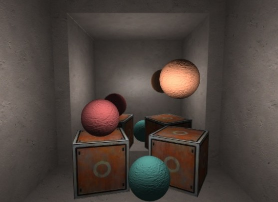
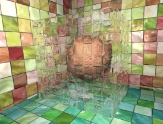
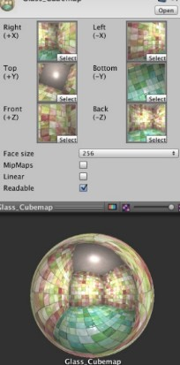

之前的渲染流程里,一个摄像机的渲染结果会输出到颜色缓冲中,并显示到我们的屏幕上。

现代的GPU允许我们把整个三维场景渲染到一个中间缓冲中,即渲染目标纹理(Render Target Texture, RTT),而不是传统的帧缓冲或后备缓冲(back buffer)。与之相关的是多重渲染目标 (Multiple Render Target, MRT),这种技术指的是GPU允许我们把场景同时渲染到多个渲染目标纹理中,而**不再需要为每个渲染目标纹理单独渲染完整的场景**。延迟渲染就是使用多重渲染目标的一个应用。

Unity为渲染目标纹理定义了一种专门的纹理类型——渲染纹理(Render Texture)。在Unity中使用渲染纹理通常有两种方式:

一种方式是在Project 目录下创建一个渲染纹理,然后把某个摄像机的渲染目标设置成该渲染纹理,这样一来该摄像机的渲染结果就会实时更新到渲染纹理中, 而不会显示在屏幕上。使用这种方法,我们还可以选择渲染纹理的分辨率、滤波模式等纹理属性。 

另一种方式是在屏幕后处理时使用 GrabPass 命令或 OnRenderImage 函数来获取当前屏幕图像, **Unity会把这个屏幕图像放到一张和屏幕分辨率等同的渲染纹理中**,下面我们可以在自定义的Pass中把它们当成普通的纹理来处理,从而实现各种屏幕特效。我们将依次学习这两种方法在Unity中的实现(OnRenderImage 函数会在第12章中讲到)。

###  镜子效果

在本节中,我们将学习如何使用渲染纹理来模拟镜子效果



首先建几堵墙做一个密闭空间,放置几个模型,添加三盏点光源照亮整个空间,最后创建一个四边形(Quad),调整它的位置和大小,它将作为镜子,为其创建赋予材质(在本书资源中, 该 Shader 名为 Chapter10-Mirror)

为了得到从镜子出发观察到的场景图像,我们还需要创建一个摄像机,并调整它的位置、裁剪平面、视角等,使得它的显示图像是我们希望的镜子图像。由于这个摄像机不需要 直接显示在屏幕上,而是用于渲染到纹理。因此我们创建一个Rebder Texture 赋予到该摄像机的Target Texture上;

镜子实现的原理很简单,它使用一个渲染纹理作为输入属性,并把该渲染纹理在水平方向上翻转 后直接显示到物体上即可

```
// Upgrade NOTE: replaced 'mul(UNITY_MATRIX_MVP,*)' with 'UnityObjectToClipPos(*)'

Shader "Unity Shaders Book/Chapter 10/Mirror" {
	Properties {
		_MainTex ("Main Tex", 2D) = "white" {}//用来获得镜子摄像机渲染得到的渲染纹理
	}
	SubShader {
		Tags { "RenderType"="Opaque" "Queue"="Geometry"}
		
		Pass {
			CGPROGRAM
			
			#pragma vertex vert
			#pragma fragment frag
			
			sampler2D _MainTex;
			
			struct a2v {
				float4 vertex : POSITION;
				float3 texcoord : TEXCOORD0;
			};
			
			struct v2f {
				float4 pos : SV_POSITION;
				float2 uv : TEXCOORD0;
			};
			
			v2f vert(a2v v) {//顶点着色器中计算纹理坐标
				v2f o;
				o.pos = UnityObjectToClipPos(v.vertex);
				
				o.uv = v.texcoord;
				// Mirror needs to filp x x分量的纹理坐标实现镜子左右相反效果
				o.uv.x = 1 - o.uv.x;
				
				return o;
			}
			
			fixed4 frag(v2f i) : SV_Target {
				return tex2D(_MainTex, i.uv);
			}
			
			ENDCG
		}
	} 
 	FallBack Off
}
```

保存后返回场景,并把我们创建的RenderTexture 渲染纹理拖曳到材质的 Main Tex 属性中,就可以得到上图镜子的效果。

上面的实现中,我们把渲染纹理的分辨率大小设置为256×256。有时,这样的分辨率会使 图像模糊不清,此时我们可以使用更高的分辨率或更多的抗锯齿采样等。但需要注意的是,更高 的分辨率会影响带宽和性能,我们应当尽量使用较小的分辨率。

###  玻璃效果

Unity 中,我们还可以在 Unity Shader 中使用一种特殊的 Pass 来完成获取屏幕图像的目的,这就是 GrabPass。当我们在 Shader 中定义了一个 GrabPass 后,Unity 会把当前屏幕的图像绘制在一张纹理中,以便我们在后续的 Pass 中访问它。我们通常会使用 GrabPass 来实现诸如玻璃等透明材质的模拟,与使用简单的透明混合不同,使用 GrabPass 可以让我们对该物体后面的图像进行 更复杂的处理,例如使用法线来模拟折射效果,而不再是简单的和原屏幕颜色进行混合。

需要注意的是,在使用 GrabPass 的时候,我们需要额外小心物体的渲染队列设置。正如之前 所说,GrabPass 通常用于渲染透明物体,尽管代码里并不包含混合指令,但我们往往仍然需要把物体的渲染队列设置成透明(即"Queue"="Transparent")。这样才可以保证当渲染该物体时, 所有的不透明物体都已经被绘制在屏幕上,从而获取正确的屏幕图像。

本节中,我们将会使用 GrabPass 来模拟一个玻璃效果。这种效果的实现非常简单,我们首先使用一张法线纹理来修改模型的法线信息,然后使用了 10.1节介绍的反射方法,通过一个 Cubemap 来**模拟玻璃的反射**,而在**模拟折射**时,则使用了 GrabPass 获取玻璃后面的屏幕图像,并使用切线空间下的法线对屏幕纹理坐标偏移后,再对屏幕图像进行采样来模拟近似的折射效果。



构建了一个由6面墙围成的封闭房间,并在房间中放置了一个立方体和一个球体,其中球体位于立方体内部,这是为了模拟玻璃对内部物体的折射效果。我们需要给立方体制作一个玻璃材质.(在本书资源中,该Shader 名为 Chapter10-Glass Refraction)

为了得到本场景适用的环境映射纹理,我们使用了10.1.2节中实现的创建立方体纹理的脚本(通过 Gameobject → Render into Cubemap 打开编辑窗口)来创建它(本书资源中,该Cubemap 名为 Glass_Cubemap)



```
// Upgrade NOTE: replaced '_Object2World' with 'unity_ObjectToWorld'
// Upgrade NOTE: replaced 'mul(UNITY_MATRIX_MVP,*)' with 'UnityObjectToClipPos(*)'

Shader "Unity Shaders Book/Chapter 10/Glass Refraction" {
	Properties {
		_MainTex ("Main Tex", 2D) = "white" {}//玻璃材质纹理
		_BumpMap ("Normal Map", 2D) = "bump" {}//玻璃法线纹理
		_Cubemap ("Environment Cubemap", Cube) = "_Skybox" {}//反射环境纹理
		_Distortion ("Distortion", Range(0, 100)) = 10//控制模拟折射时图像的扭曲程度
		_RefractAmount ("Refract Amount", Range(0.0, 1.0)) = 1.0//混合折射反射比例,0时只包含反射效果,1时,该玻璃只包括折射效果。

	}
	SubShader {
		// We must be transparent, so other objects are drawn before this one.定义渲染队列
//将渲染队列设置成 Transparent,而在后面的 Render Type 被设置为了 Opaque
//这两者看似矛盾,但实际上服务于不同的需求。我们在之前说过,把Queue设置成 Transparent 可以确保该物体渲染时,其他所有不透明物体都已经被渲染到屏幕上了,否则就可能无法正确得到“透过玻璃看到的图像”。
//而设置 RenderType 则是为了在使用着色器替换(Shader Replacement)时,该物体可以在需要时被正确渲染。这通常发生在我们需要得到摄像机的深度和法线纹理时,这将会在第13章中学到。
		Tags { "Queue"="Transparent" "RenderType"="Opaque" }
		
//GrabPass 支持两种形式。
//第一种是直接使用 GrabPass { },然后在后续的 Pass 中直接使用_GrabTexture来访问屏幕图像。但是,当场景中有多个物体都使用了这样的形式来抓取屏幕时,这种方法的性能消耗比较大,
//因为对于每一个使用它的物体,Unity 都会为它单独进行一次昂贵的屏幕抓取操作。
//但这种方法可以让每个物体得到不同的屏幕图像,这取决于它们的渲染队列及渲染它们时当前的屏幕缓冲中的颜色。
//第二种是使用 GrabPass { "TextureName" },正如本节中的实现,我们可以在后续的 Pass 中使用TextureName 来访问屏幕图像。
// Unity 只会在每一帧时为第一个使用名为 TextureName 的纹理的物体执行一次抓取屏幕的操作,
//而这个纹理同样可以在其他 Pass 中被访问。
//这种方法更高效,因为不管场景中有多少物体使用了该命令,每一帧中 Unity 都只会执行一次抓取工作,但这也意味着所有物体都会使用同一张屏幕图像。不过,在大多数情况下这已经足够了。

		// This pass grabs the screen behind the object into a texture.GrabPass 来获取屏幕图像
		// We can access the result in the next pass as _RefractionTex
		GrabPass { "_RefractionTex" }
		
		Pass {	//定义渲染玻璃的pass	
			CGPROGRAM
			
			#pragma vertex vert
			#pragma fragment frag
			
			#include "UnityCG.cginc"
			
			sampler2D _MainTex;
			float4 _MainTex_ST;
			sampler2D _BumpMap;
			float4 _BumpMap_ST;
			samplerCUBE _Cubemap;
			float _Distortion;
			fixed _RefractAmount;
			sampler2D _RefractionTex;//GrabPass 时指定的纹理名称。
			float4 _RefractionTex_TexelSize;//获取GrabPass 纹理的纹素大小
			
			struct a2v {
				float4 vertex : POSITION;
				float3 normal : NORMAL;
				float4 tangent : TANGENT; 
				float2 texcoord: TEXCOORD0;
			};
			
			struct v2f {
				float4 pos : SV_POSITION;
				float4 scrPos : TEXCOORD0;
				float4 uv : TEXCOORD1;
				float4 TtoW0 : TEXCOORD2;  
			    float4 TtoW1 : TEXCOORD3;  
			    float4 TtoW2 : TEXCOORD4; 
			};
//在进行了必要的顶点坐标变换(UnityObjectToClipPos)后,我们通过调用内置的ComputeGrabScreenPos 函数来得到对应被抓取的屏幕图像的采样坐标。
//可以在 UnityCG.cginc 文件中找到它的声明,它的主要代码和 ComputeScreenPos 基本类似,最大的不同是针对平台差异造成的采样坐标问题(详见5.6.1节)进行了处理
//接着,我们计算了 MainTex 和_BumpMap 的采样坐标,并把它们分别存储在一个float4 类型变量的xy 和zw 分量中。
//由于我们需要在片元着色器中把法线方向从切线空间(由法线纹理采样得到)变换到世界空间下,以便对 Cubemap 进行采样
//因此,我们需要在这里计算该顶点对应的从切线空间到世界空间的变换矩阵,并把该矩阵的每一行分别存储在TtoWO、Tto W1和TtoW2 的xyz 分量中。
//这里面使用的数学方法就是,得到切线空间下的3个坐标轴(xyz 轴分别对应了副切线、切线和法线的方向)在世界空间下的表示,再把它们依次按列组成一个变换矩阵即可。
//toW0 等值的w轴同样被利用起来,用于存储世界空间下的顶点坐标。

			v2f vert (a2v v) {
				v2f o;
				o.pos = UnityObjectToClipPos(v.vertex);
				
				o.scrPos = ComputeGrabScreenPos(o.pos);//调用内置函数得到顶点对应被抓去屏幕图像的采样坐标
				
				o.uv.xy = TRANSFORM_TEX(v.texcoord, _MainTex);//计算玻璃材质采样坐标,存储在xy分量
				o.uv.zw = TRANSFORM_TEX(v.texcoord, _BumpMap);//计算玻璃法线纹理采样坐标,存储在zw分量
				
				float3 worldPos = mul(unity_ObjectToWorld, v.vertex).xyz;  
				fixed3 worldNormal = UnityObjectToWorldNormal(v.normal);  
				fixed3 worldTangent = UnityObjectToWorldDir(v.tangent.xyz);  
				fixed3 worldBinormal = cross(worldNormal, worldTangent) * v.tangent.w; 
				
				o.TtoW0 = float4(worldTangent.x, worldBinormal.x, worldNormal.x, worldPos.x);  
				o.TtoW1 = float4(worldTangent.y, worldBinormal.y, worldNormal.y, worldPos.y);  
				o.TtoW2 = float4(worldTangent.z, worldBinormal.z, worldNormal.z, worldPos.z);  
				
				return o;
			}
//首先通过TtoW0等变量的w分量得到世界坐标,并用该值得到该片元对应的视角方向。
//随后,对法线纹理进行采样,得到切线空间下的法线方向。
//我们使用该值和_Distortion 属性以及_RefractionTex_TexelSize 来对屏幕图像的采样坐标进行偏移,模拟折射效果。
//_Dstortion 值越大,偏移量越大,玻璃背后的物体看起来变形程度越大。
//在这里,我们选择使用切线空间下的法线方向来进行偏移,是因为该空间下的法线可以反映顶点局部空间下的法线方向。
//随后,对 scrPos 透视除法得到真正的屏幕坐标(原理可参见4.9.3 节),再使用该坐标对抓取的屏幕图像RefractionTex 进行采样,得到模拟的折射颜色。
//之后,我们把法线方向从切线空间变换到了世界空间下(使用变换矩阵的每一行,即Tto WO、TtoW1 和 TtoW2,分别和法线方向点乘,构成新的法线方向),并据此得到视角方向相对于法线方向的反射方向。
//随后,使用反射方向对 Cubemap 进行采样,并把结果和主纹理颜色相乘后得到反射颜色。
//最后,我们使用_RefractAmount 属性对反射和折射颜色进行混合,作为最终的输出颜色。

			fixed4 frag (v2f i) : SV_Target {		
				float3 worldPos = float3(i.TtoW0.w, i.TtoW1.w, i.TtoW2.w);
				fixed3 worldViewDir = normalize(UnityWorldSpaceViewDir(worldPos));
				
				// Get the normal in tangent space
				fixed3 bump = UnpackNormal(tex2D(_BumpMap, i.uv.zw));	
				
				// Compute the offset in tangent space
				float2 offset = bump.xy * _Distortion * _RefractionTex_TexelSize.xy;
				i.scrPos.xy = offset * i.scrPos.z + i.scrPos.xy;
				fixed3 refrCol = tex2D(_RefractionTex, i.scrPos.xy/i.scrPos.w).rgb;
				
				// Convert the normal to world space
				bump = normalize(half3(dot(i.TtoW0.xyz, bump), dot(i.TtoW1.xyz, bump), dot(i.TtoW2.xyz, bump)));
				fixed3 reflDir = reflect(-worldViewDir, bump);
				fixed4 texColor = tex2D(_MainTex, i.uv.xy);
				fixed3 reflCol = texCUBE(_Cubemap, reflDir).rgb * texColor.rgb;
				
				fixed3 finalColor = reflCol * (1 - _RefractAmount) + refrCol * _RefractAmount;
				
				return fixed4(finalColor, 1);
			}
			
			ENDCG
		}
	}
	
	FallBack "Diffuse"
}
```

###  渲染纹理 vs. Grab Pass

尽管 GrabPass 和 10.2.1节中使用的渲染纹理 + 额外摄像机的方式都可以抓取屏幕图像,但它们之间还是有一些不同的。GrabPass的好处在于实现简单,我们只需要在Shader中写几行代码就可以实现抓取屏幕的目的。而要使用渲染纹理的话,我们首先需要创建一个渲染纹理和一个额外的摄像机,再把该摄像机的Render Target设置为新建的渲染纹理对象,最后把该渲染纹理传递给相应的Shader。

但从效率上来讲,使用渲染纹理的效率往往要好于GrabPass,尤其在移动设备上。使用渲染纹理我们可以自定义渲染纹理的大小,尽管这种方法需要把部分场景再次渲染一遍,但我们可以通过调整摄像机的渲染层来减少二次渲染时的场景大小,或使用其他方法来控制摄像机是否需要开启。

而使用 GrabPass 获取到的图像分辨率和显示屏幕是一致的,这意味着在一些高分辨率的设备上可能会造成严重的带宽影响。而且在移动设备上,GrabPass 虽然不会重新渲染场景,但它往往需要CPU直接读取后备缓冲(back buffer)中的数据,破坏了CPU和GPU之间的并行性,这 是比较耗时的,甚至在一些移动设备上这是不支持的。

unity 5 中,引入了命令缓冲(Command Buffers)来允许我们扩展Unity的渲染流水线。使用命令缓冲我们也可以得到类似抓屏的效果,它可以在不透明物体渲染后把当前的图像复制到一个临时的渲染目标纹理中,然后在那里进行一些额外的操作,例如模糊等,最后把图像传递给需要使用它的物体进行处理和显示。除此之外,命令缓冲还允许我们实现很多特殊的效果,读者可以在 Unity 官方手册的图像命令缓冲一文(Manual/GraphicsCommandBuffers.)找到相关内容,unity还提供了一个示例工程供我们学习
