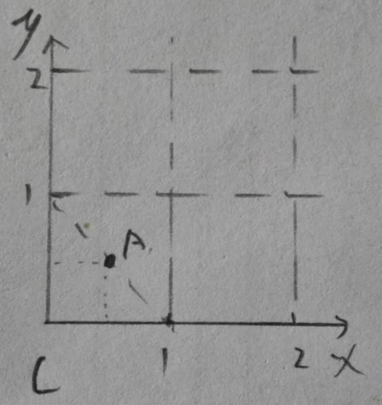
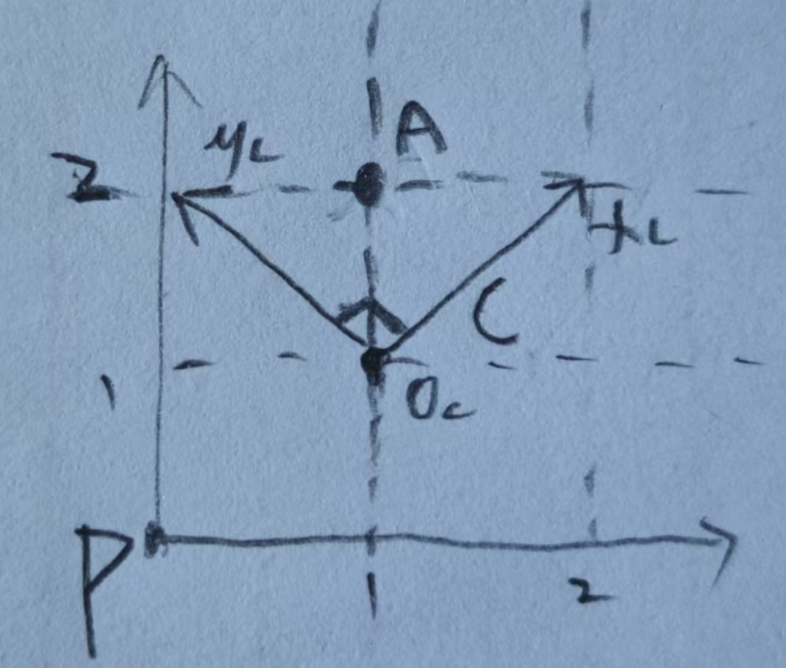

整理自UnityShader入门精要(冯乐乐),4.6节

---

已知在一个坐标空间C中,存在一点A(0.5,0.5)

而空间C在其父级空间P下的相对关系如上图.

现在我们想知道点$A(x_A,y_A)=(0.5,0.5)$在父级空间P下的坐标是多少?

根据上图,我们能知道,空间C的原点在空间P下的相对位置$O_c$=(1,1)

空间C的坐标轴x,y在空间P下的向量表示为$x_c=(1,1),y_c=(-1,1)$.(注意矩阵空间中的向量都是基于原点与方向的关系求得,也就是说,要将这些向量平移到父空间的原点来看)

那么点A在空间P下的坐标就是:$O_c+x_A \times x_c+y_A \times y_c=(1,1)+0.5\times(1,1)+0.5\times(-1,1)=(1,2)$

我们将其逐步转换为矩阵形式:
$$
O_c+x_A \times x_c+y_A \times y_c\\
=(x_{o_c},y_{o_c})+x_A(x_{x_c},y_{x_c})+y_A(x_{y_c},y_{y_c})\\
=(x_{o_c},y_{o_c})+\begin{bmatrix} x_{x_c}&x_{y_c}\\ y_{x_c}&y_{y_c}\\ \end{bmatrix} 
\begin{bmatrix} x_A\\ y_A\\ \end{bmatrix} \\
最后将位移合并到矩阵
=\begin{bmatrix} x_{x_c}&x_{y_c}&x_{o_c}\\ y_{x_c}&y_{y_c}&y_{o_c}\\0&0&1 \end{bmatrix} 
\begin{bmatrix} x_A\\ y_A\\1 \end{bmatrix}
$$
因此,最终得到的空间C到父级空间P变换矩阵为
$$
M_{c\rightarrow p}=\begin{bmatrix} x_{x_c}&x_{y_c}&x_{o_c}\\ y_{x_c}&y_{y_c}&y_{o_c}\\0&0&1 \end{bmatrix}
$$
可以看出,变换矩阵$M_{c\rightarrow p}$本质上就是将C空间的坐标轴(基向量)在P空间下表示的向量按列依次放入矩阵,c的原点在p空间下表示的坐标放入最后一列,再用0,1补充最后一行构成方阵即可.

另外,如果涉及缩放,三个坐标轴向量很可能不是单位向量.

**强调**:向量空间中的向量均是基于原点,没有位置参数,因此向量的计算不需要考虑位移变换 (如计算光照方向或法线方向),我们则可以去掉最后一行一列,此时的变换矩阵为(三维空间则是3x3矩阵):
$$
\begin{bmatrix} x_{x_c}&x_{y_c}\\ y_{x_c}&y_{y_c}\\ \end{bmatrix}
$$
而父空间P到子空间C的变换矩阵,就是其逆矩阵:$M_{p\rightarrow c}=M_{c\rightarrow p}^{-1}$,因为两个方向的变换是互逆的两个过程

**特别的**当变换矩阵为正交矩阵(满足方阵,且组合的向量两两垂直,均为单位向量,长度为1)时,$M_{p\rightarrow c}=M_{c\rightarrow p}^{T}=M_{c\rightarrow p}^{-1}$;

此时$M_{p\rightarrow c}$的每行就是P空间的坐标轴,在C空间下的表示.当然上面的示例不满足正交条件,但如果在日常空间转换的情况下,我们用到的诸如世界空间,模型空间等,坐标轴均为单位矢量,且相互垂直,均满足正交的条件,就能直接通过转置矩阵求得逆变换矩阵.
