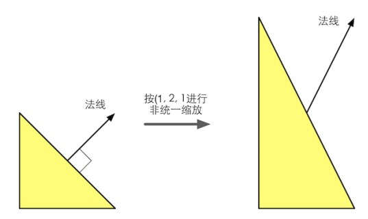

通常情况下我们想把模型空间的顶点或其他方向矢量,变换到其它空间,都会有一个通用的4X4或3X3的变换矩阵$M_{A\rightarrow B}$,将其从A空间变换到B空间;

首先说说与法线对应的另一个方向矢量,切线,由于切线是由两个顶点的差值计算,可以直接用变换顶点的矩阵直接进行变换:
$$
T_B=M_{A\rightarrow B}T_A
$$
$T_A,T_B分别为A空间和B空间下的切线矢量$;

但如果用$M_{A\rightarrow B}$变换法线,可能会有以下问题

如图,如果模型做出了一个非统一的缩放变换,可能会导致模型某个面角度变化,从而导致得到的法线不再垂直表面;

那么应该如何变换法线?

首先我们知道同一个顶点的切线$T_A$与法线$N_A$必垂直,即$T_A\cdot N_A=0$;

切线变换为:$T_B=M_{A\rightarrow B}T_A$

设法线的变换矩阵为G,则:
$$
(M_{A\rightarrow B}T_A)\cdot(GN_A)=(M_{A\rightarrow B}T_A)^T(GN_A)=T_A^TM_{A\rightarrow B}^T(GN_A)=T_A^T(M_{A\rightarrow B}^TG)N_A=0
$$
只要满足:$M_{A\rightarrow B}^TG=I(单位阵)$,即可成立,所以$G=(M_{A\rightarrow B}^T)^{-1}=(M_{A\rightarrow B}^{-1})^T$

也就是说,原变换矩阵的逆转置矩阵就是正确变换法线的矩阵.

需要说明,如果变换矩阵为正交矩阵时,$M_{A\rightarrow B}^{-1}=M_{A\rightarrow B}^T$,此时$G=M_{A\rightarrow B}$